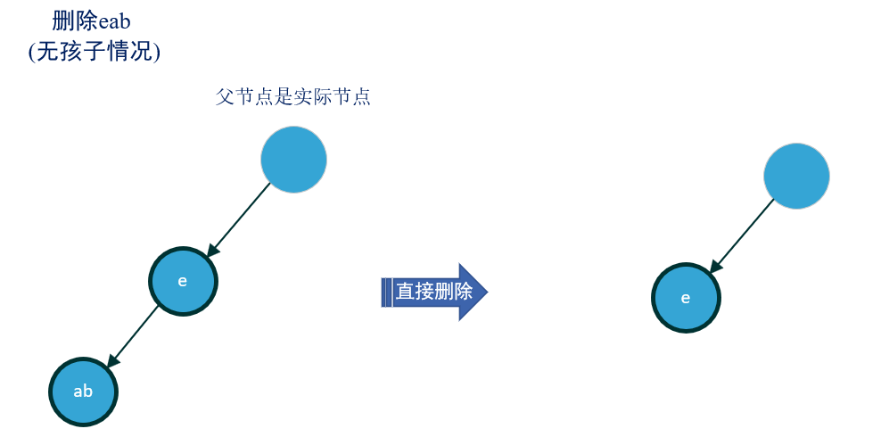

## [压缩字典树 Patricia Trie/Compact Trie](#)

**介绍**：也称**后缀树**，压缩字典树在字典树的基础之上做了一些优化，在数据较为稀疏的情况下，可以使用这个方式！**Patricia Trie** 是 **Trie** 的一种简单变体，如果一个非根节点仅有一个子节点，则将其子节点与该节点合并，通过合并具有相同前缀的节点来减少存储空间，并提高搜索效率，具有两种变体：**基于字符比较的后缀树** 和 **采用的是二进制位比较的基数树**。

**优点：**

* 减少了中间节点，在数据较为稀疏的情况下，避免严重的空间浪费。


或者如下例子：


当然压缩也会变化！随着数据的增加！


### API

*  查找给定字符串的最长前缀
* 查找以给定字符串为前缀的所有键
  * 这句话的意思是，在一个字符串列表中，找到所有字符串中公共的最长的前缀部分。例如，如果给定字符串列表为 ["apple", "app", "application", "aptitude"]，那么最长的公共前缀将是 "app"。
* 查找给定文本中包含的键


### 节点定义

定义如下字段

```cpp
struct patricia_node {
    //是否是叶子节点
    bool leaf {true};
    //部分key,共同前缀
    std::string sub_key;
    //节点完整 字符串 key
    std::string key;
    //子节点
    std::unordered_map<char, patricia_node*> children;
    //节点的计数
    uint32_t count {0};

    patricia_node() = default;
    patricia_node(patricia_node &&other) noexcept;
    patricia_node(const patricia_node& other) = default;
    auto operator=(const patricia_node&other) -> patricia_node &;
    auto operator=(patricia_node &&other) noexcept -> patricia_node &;

    ~patricia_node() = default;
};
```

如何需要将其定义为HashPatriciaTrieMap用来当做一种数据存储方式可以如下定义：

```cpp
template<typename Value_Type>
struct patricia_node {
    //是否是叶子节点
    bool leaf {true};
    //部分key,共同前缀
    std::string sub_key;
    //节点完整 字符串 key
    std::string key;
    //值类型
    Value_Type value;
    //子节点
    std::unordered_map<char, patricia_node*> children;
    //节点的计数
    uint32_t count {0};

    patricia_node() = default;
    patricia_node(patricia_node &&other) noexcept;
    patricia_node(const patricia_node& other) = default;
    auto operator=(const patricia_node&other) -> patricia_node &;
    auto operator=(patricia_node &&other) noexcept -> patricia_node &;

    ~patricia_node() = default;
};
```


### 后缀树的定义

```cpp
/* 压缩字典树 */
class patricia_trie {
private:
    patricia_node *root; //根节点

    auto trie_free(patricia_node * node)-> void;

    auto delete_helper(const std::string& word, bool true_remove_false_erase) -> bool;

public:
    patricia_trie();

    patricia_trie(const patricia_trie &other) = delete; //不允许拷贝

    patricia_trie(patricia_trie &&other) noexcept;

    auto operator=(patricia_trie &&other) noexcept -> patricia_trie &;

    ~patricia_trie();

    auto operator=(const patricia_trie &other) -> patricia_trie & = delete; //不允许复制

    /* 插入一个字符串 */
    auto insert(const std::string &word) -> void;
    /* 查找字符串 */
    [[nodiscard]] auto search(const std::string &word) const -> std::tuple<bool, uint32_t>;
    /* 删除字符串, 返回是否删除成功，不成功，说明没有找到 */
    auto erase(const std::string &word) -> bool;
    /* 删除字符串,如果计数器为1才会真真删除，否则计数器减一 返回是否删除成功，不成功，说明没有找到 */
    auto remove(const std::string &word) -> bool;
};
```


### put/insert方法

总共分为四种情况：


插入实现：

```cpp
    void patricia_trie::insert(const std::string &word) {
        if (root == nullptr) {
            throw std::runtime_error("The move constructor or operator has already been called");
        }
        patricia_node *node = root;
        auto last = word.size() - 1;
        for(size_t i = 0; i < word.size(); i++){
            //没有找到下一层对应节点，则直接建立这个节点
            auto node_iterator = node->children.find(word[i]);
            //如果改变map，迭代器会失效哦
            if( node_iterator == node->children.end()){
                //由于需要向下延伸，则其父节点不再是叶子节点
                node->leaf = false;
                patricia_node* new_node = new patricia_node();
                new_node->sub_key = word.substr(i);
                new_node->key = word;
                //计数点 +1
                new_node->count++;
                node->children[word[i]] = new_node;
                return; //可以直接撤了
            }
            auto* node_next = node_iterator->second;
            //此时node为父节点
            char child_key = word[i];
            auto subLast = node_next->sub_key.size() - 1;
            // 与子节点进行字符串比较
            // i 指向新key
            // j 指向 node的 sub_key
            for(int j = 0; j <= subLast; j++, i++){
                //具有相同的前缀，则继续向下比较
                if (node_next->sub_key[j] == word[i]){
                    //到最后都相等
                    if (i == last){
                        // 新键比较到最后一个字符，还是一样的
                        if (j == subLast){
                            //内容一致、长度一直，计算器 + 1 即可
                            node_next->count++;
                            /*  插入 abc
                             *        原来                 现在
                             *       (head)             (head)
                             *   abc                  abc
                             * */
                        }else{
                            /*  插入 ab
                             *        原来                 现在
                             *       (head)             (head)
                             *   abc                  ab
                             *                     c
                             * */
                            // 新增键短，例如 abc插入 ab 变成：ab,c
                            patricia_node* child = new patricia_node();
                            //child 为 c 节点
                            child->leaf = true;
                            child->count = node->children[child_key]->count;
                            child->sub_key = node->children[child_key]->sub_key.substr(j + 1);
                            child->key = node_next->key;

                            patricia_node* ab_node = node->children[child_key];
                            //abc node 转变为 ab 节点
                            ab_node->children[child->sub_key[0]] = child;
                            ab_node->key = word;
                            ab_node->sub_key = ab_node->sub_key.substr(0,j + 1);
                            ab_node->count = 1;
                            ab_node->leaf = false;
                        }
                        return;
                    }
                    //新增键较长，直接下一个孩子节点例如 abc，新增 abcdefg
                    if (j == subLast) {
                        /*  插入 abcd
                         *        原来                 现在
                         *       (head)             (head)
                         *   abc                  abc
                         *                     d
                         * */
                        break;
                        //交给下一层来处理
                    }
                }else{
                    //不具有相同的前缀，则需要分裂、建立新的子节点
                    /* 插入 aqqff
                     *         原来                  现在
                     *       (head)                (head)
                     *   abc                     a
                            *               bc      qqff
                     * */
                    // 新增相同前缀分支 a
                    patricia_node* child = new patricia_node();
                    child->leaf = false;
                    child->count = 0;
                    child->sub_key = node_next->sub_key.substr(0, j);

                    // 新增相同前缀分支 qqff
                    patricia_node* child_child = new patricia_node();
                    child_child->leaf = true;
                    child_child->count = 1;
                    child_child->sub_key = word.substr(i);
                    child_child->key = word;

                    //child 成为父节点
                    node->children[child_key] = child;
                    //旧 abc
                    patricia_node *old = node_next;
                    old->sub_key = old->sub_key.substr(j);

                    child->children[old->sub_key[0]] = old;
                    child->children[child_child->sub_key[0]] = child_child;
                    return;
                }
            }
            //去到下一层
            node = node->children[child_key];
        }
    }
```


### search 查找实现

这个逻辑就简单多了

```cpp
auto patricia_trie::search(const std::string &word) const -> std::tuple<bool, uint32_t> {
    if (root == nullptr) {
        throw std::runtime_error("The move constructor or operator has already been called");
    }
    patricia_node *node = root;
    auto last = word.size() - 1;
    for(size_t i = 0; i < word.size(); i++){
        //没有找到下一层对应节点，则直接建立这个节点
        auto child_iterator = node->children.find(word[i]);
        //如果改变map，迭代器会失效哦
        if( child_iterator == node->children.end()){
            return {false, 0}; //可以直接撤了
        }
        patricia_node* child_node = child_iterator->second;
        std::string & sub_key = child_node->sub_key;
        auto last_sub_key = sub_key.size() - 1;
        //如果找到了，需要进行前缀匹配
        for(size_t j = 0; j <= last_sub_key; j++, i++){
            if (sub_key[j] == word[i]){
                if (i == last){
                    if (j == last_sub_key){
                        //内容一致、长度一直
                        return {child_node->count > 0, child_node->count};
                    }
                    return {false, 0};
                }
                //新增键较长，直接下一个孩子节点例如 abc，新增 abcdefg
                if (j == last_sub_key) {
                    break;
                }
            }else{
                return {false, 0}; //没找到
            }
        }
        node = child_node;
    }
    return {node->count > 0, node->count};
}
```


### [remove/erase 删除逻辑](#)

可以细分为许多种情况，根据操作又可以分为两种情况。

* 前缀节点：不实际存储key，只是其他key的一部分，如图二所示，节点`c`就是前缀节点，是`ed`和`dv`的共同前缀。
* 实际节点：实际存储key，如图一下所示，存储了 `ab`、`abc`。


#### 1. 待删除节点具有单个孩子节点

这种情况又可以细分为两种情况，孩子节点是**前缀节点**或**实际节点**。但是两者的操作是一致：利用孩子节点替代自身，但是将节点存储的前缀进行修改。。

**图一**


**图二**


#### 2. 待删除节点具有多个孩子节点

有多个孩子节点则很简单的，只需要改变节点的性质即可，**实际节点**直接转变为**前缀节点**

**图三**


#### 3. 待删除节点不具有孩子节点

又分为许多种情况，只需要考虑父节点是**前缀节点**或**实际节点**，如果是前缀节点，又需要考虑兄弟节点有多少个。

**3.1** 如果直属于根节点，那么删除即可。

**图四**


**3.2** 如果父节点是实际节点，那么直接删除即可。

然后需要判断父节点还剩下几个儿子节点，如果没有儿子节点，那么父节点变为叶子节点。

**图五**



**3.3** 父节点是前缀节点、只有一个兄弟节点、兄弟节点为实节点

此时需要先删除节点，再删除父节点，然后再合并为ecc，代替父节点的位置。

**图六**


**3.4** 父节点是前缀节点、只有一个兄弟节点、兄弟节点为前缀节点

此时需要先删除节点，再删除父节点，然后再合并

**图七**


**3.5** 父节点是前缀节点、有两个以上的兄弟节点(不管兄弟节点类型)

**图八**


#### 4. 代码实现

```cpp
auto patricia_trie::delete_helper(const std::string &word, bool true_remove_false_erase) -> bool {
    if (root == nullptr) {
        throw std::runtime_error("The move constructor or operator has already been called");
    }
    patricia_node *node = root;
    auto last = word.size() - 1;
    //stk 使用栈来代替递归操作
    std::stack<patricia_node*> stk;
    for(size_t i = 0; i <= last; i++){
        auto child_node_iterator = node->children.find(word[i]);
        if (child_node_iterator == node->children.end()){
            //没找到，直接结束
            return false;
        }
        patricia_node* child_node = child_node_iterator->second;
        //如果找到了，需要进行前缀匹配
        std::string& sub_key = child_node->sub_key;
        auto sub_key_last = sub_key.size() - 1;

        for(size_t j = 0; j <= sub_key_last; j++, i++){
            if (sub_key[j] == word[i]){
                if (i == last){
                    if (j == sub_key_last){
                        //当前节点就是需要删除的节点
                        break;
                    }
                    //如果 j 没有结束，没有找到，说明不是要删除的节点
                    return false;
                }
                if (j == sub_key_last){
                    break; // 到下一层去
                }
            }else{
                //没找到，直接结束
                return false;
            }
        }
        stk.push(node);
        node = child_node;
    }
    //此时 node 是需要删除的节点
    node->count--;
    if (true_remove_false_erase){
        //没必要删除
        if (node->count > 0) {
            return true;
        };
    }
    patricia_node* parent_node = stk.top();
    stk.pop();
    size_t child_size = node->children.size();
    if (child_size == 0){
        //如果直属于根节点，那么删除即可
        if (parent_node == root){
            root->children.erase(node->sub_key[0]);
            delete node;
            return true;
        }
        //如果父节点是实际节点，那么直接删除即可。
        if (parent_node->count > 0){
            //说明是实际节点
            parent_node->children.erase(node->sub_key[0]);
            parent_node->leaf = parent_node->children.empty();
            delete node;
            return true;
        }
        //现在 parent_node->count == 0
        parent_node->children.erase(node->sub_key[0]);
        delete node; //释放当前节点
        size_t parent_child_size = parent_node->children.size();
        //父节点是前缀节点、只有一个兄弟节点、兄弟节点为实节点 or 前缀节点
        if (parent_child_size == 1){
            //获得兄弟节点
            patricia_node *brother = parent_node->children.begin()->second;
            //合并操作
            //爷爷节点指向兄弟  兄弟 变 父亲
            patricia_node* grand_parent_node = stk.top(); //爷节点
            brother->sub_key = parent_node->sub_key + brother->sub_key; //合并

            grand_parent_node->children[brother->sub_key[0]] = brother;
            delete parent_node;
        }else if (parent_child_size >= 2){
            //父节点是前缀节点、有两个以上的兄弟节点(不管兄弟节点类型),只需要删除即可
        }
    }
    else if (child_size == 1){
        // 单亲节点
        // child_node 是当前节点的子节点
        patricia_node* child_node = node->children.begin()->second;
        child_node->sub_key = node->sub_key + child_node->sub_key;

        parent_node->children[child_node->sub_key[0]] = child_node;
        delete node; //释放当前节点
    }else{ //child_size >= 2
        node->count = 0;
        node->key.clear();
    }
    return true;
}
```


参考：https://zhuanlan.zhihu.com/p/444061702