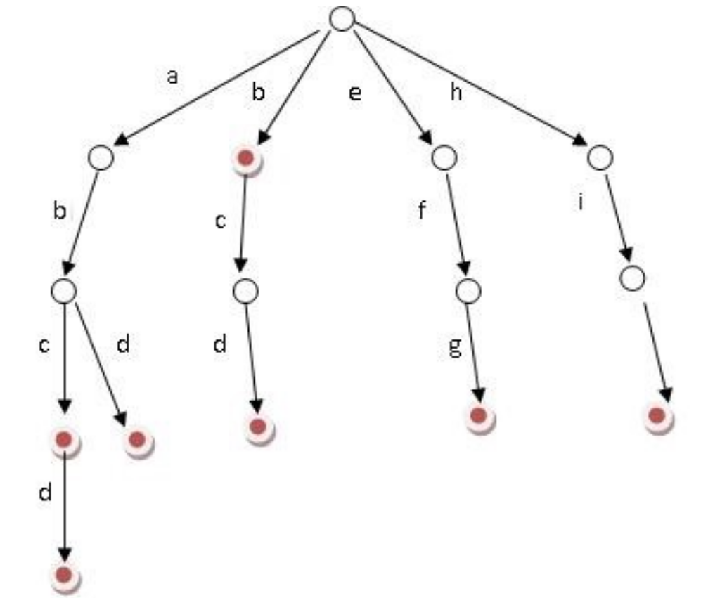
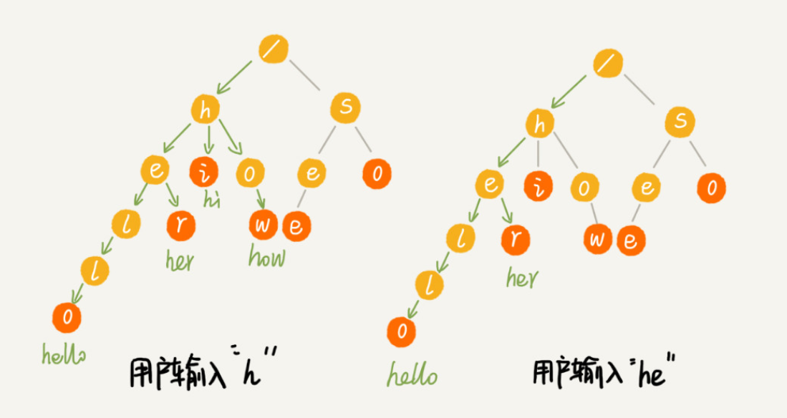

## [Trie 字典树(前缀树)](#)

**介绍**：Trie，又称字典树、单词查找树或键树，是一种树形结构，是一种哈希树的变种。典型应用是用于统计，排序和保存大量的字符串（但不仅限于字符串），所以经常被搜索引擎系统用于文本词频统计。

* **优点**：**利用字符串的公共前缀来减少查询时间**，**最大限度地减少无谓的字符串比较**，查询效率比哈希树高。
* **核心思想**: 是空间换时间。利用字符串的公共前缀来降低查询时间的开销以达到提高效率的目的。


**前缀树的3个基本性质：**

1. 根节点不包含字符，除根节点外每一个节点都只包含一个字符。
2. 从根节点到某一节点，路径上经过的字符连接起来，为该节点对应的字符串。
3. 每个节点的所有子节点包含的字符都不相同。

如下所示一共存储了：`abcd`,`abd`,`bcd`,`efg`,`hix`,`b` 6个字符串。




### 基本特点：

1. **结点的表示：** 字典树的每个结点代表一个字符，从根结点到某一结点的路径表示一个字符串。
2. **根结点：** 树的根结点对应空字符串，每个结点有若干个子结点，每个子结点对应字符串的一个字符。
3. **路径：** 从根结点到任意一个结点，沿途经过的字符连接起来，即为该结点对应的字符串。
4. **标记结束点：** 通常，一个结点可能对应一个字符串的结束位置，用一个标记来表示。




### 字典树常见的一些 API：：

1. **Insert 插入：**

   - 插入一个键值对到字典树中。

   ```cpp
   void insert(const std::string& key, const ValueType& value);
   ```

2. **Search 查询：**

   - 查询给定键是否存在，并返回相应的值。

   ```cpp
   ValueType search(const std::string& key);
   ```

   - 返回是否存在以给定前缀开头的键。

   ```cpp
   bool startsWith(const std::string& prefix);
   ```

3. **Delete 删除：**

   - 从字典树中删除给定键。

   ```cpp
   void remove(const std::string& key);
   ```

4. **Update 更新：**

   - 更新字典树中给定键的值。

   ```cpp
   void update(const std::string& key, const ValueType& new_value);
   ```

5. **Traversal 遍历：**

   - 遍历字典树的所有键值对，执行指定的操作。

   ```cpp
   void traverse(std::function<void(const std::string&, const ValueType&)> operation);
   ```

6. **Count 统计：**

   - 获取字典树中键的总数。

   ```cpp
   size_t size();
   ```

7. **Clear 清空：**

   - 清空字典树，删除所有键值对。

   ```cpp
   void clear();
   ```

这些 API 提供了一套基本的字典树操作，使用户可以方便地执行插入、查询、删除、更新等操作。具体实现时，你还可以根据需要添加其他辅助方法，如前缀匹配、最长公共前缀查找等。在设计 API 时，考虑到字典树的用途和用户需求，提供清晰、简洁的接口是很重要的。


### 应用场景：

1. **自动补全和拼写检查：** 字典树可以用于实现自动补全和拼写检查功能，因为它能够高效地查找以某个前缀开头的所有单词。
2. **IP 路由查找：** 字典树可以用于高效地进行 IP 路由查找，尤其是用于 IPv4 和 IPv6 地址的前缀匹配。
3. **字符串匹配：** 字典树可用于高效地进行字符串匹配操作，例如模式匹配和字符串搜索。
4. **编译器中的符号表：** 字典树可以用于实现编程语言编译器中的符号表，快速查找标识符。


### CPP 代码实现

#### 节点定义：

```cpp
struct TrieNode{
    std::unordered_map<unsigned char, TrieNode*> children;
    bool is_leaf{true};
    std::string value;
    uint32_t count{0}; //字符串插入了多少次数

    TrieNode() = default;
    TrieNode(const TrieNode& other) = default;
    TrieNode(TrieNode &&other) noexcept
    :children(std::move(other.children)), is_leaf(other.is_leaf), value(std::move(other.value)), count(other.count)
    {

    }

    auto operator=(const TrieNode &other) -> TrieNode & {
        if (this!= &other) {
            children = other.children;
            is_leaf = other.is_leaf;
            value = other.value;
            count = other.count;
        }
    };

    auto operator=(TrieNode &&other)  noexcept -> TrieNode & {
        if (this!= &other) {
            children = std::move(other.children);
            is_leaf = other.is_leaf;
            value = std::move(other.value);
            count = other.count;
        }
        return *this;
    };

    ~TrieNode() = default;
};
```

#### API实现

```cpp
/* 字典树 */
class Trie{
private:
    TrieNode *root; //根节点

    auto trie_free(TrieNode * node)-> void {
        if (node != nullptr){
            for(auto &child : node->children){
                trie_free(child.second);
            }
            delete node;
        }
    }

    auto delete_helper(const std::string& word, bool true_remove_false_erase) -> bool{
        if (root == nullptr) {
            throw std::runtime_error("The move constructor or operator has already been called");
        }
        TrieNode *head = root;
        std::stack<TrieNode*> stk;
        for(auto key : word){
            if(head->children.find(key) == head->children.end()){
                return false;
            }
            //压栈，用于返回的时候找到父节点，避免递归调用
            stk.push(head);
            head = head->children[key];
        }
        // 没有找到
        if (head->count == 0){
            return false;
        }
        head->count--;
        if (true_remove_false_erase){
            //没必要删除
            if (head->count > 0) {
                return true;
            };
        }
        if (!head->is_leaf) {
            // 情况：字典树中存储有：abc、ab
            // 此时删除 ab, 由于 abc 的存在不可以删除ab路径
            return true;
        };
        auto last = word.rbegin();
        //已经是叶子节点了，需要删除节点
        while (!stk.empty()){
            TrieNode* parent = stk.top();
            stk.pop();
            parent->children.erase(*last);
            last++;

            //判断是否需要继续向上删除
            if (!parent->children.empty() || parent->count > 0){
                parent->is_leaf = true;
                break;
                //不能再删除了
            }
        }
        return true;
    }

    auto size_helper(bool true_all_false_no_repeat) -> uint32_t{
        if (root == nullptr) {
            throw std::runtime_error("The move constructor or operator has already been called");
        }
        uint32_t key_count = 0;
        //层次遍历
        std::queue<TrieNode*> layer;
        layer.push(root);

        while (!layer.empty()){
            auto len = layer.size();
            for (int i = 0; i < len; i++) {
                TrieNode *node = layer.front();
                layer.pop();
                if(node->count > 0) {
                    if (true_all_false_no_repeat){
                        key_count += node->count;
                    }else{
                        key_count++;
                    }
                }
                for (auto &child : node->children) {
                    layer.push(child.second);
                }
            }
        }
        return key_count;
    }
public:

    Trie():root(new TrieNode()){

    };
    Trie(Trie &&other) noexcept
    :root(other.root)
    {
        other.root = nullptr;
    }

    auto insert(const std::string &word)->void {
        if (root == nullptr) {
            throw std::runtime_error("The move constructor or operator has already been called");
        }
        TrieNode *ptr = root;
        for(auto key : word){
            //没有找到下一层对应节点，则直接建立这个节点
            if(ptr->children.find(key) == ptr->children.end()){
                //有了下一层节点就不是叶节点了
                ptr->is_leaf = false;
                ptr->children[key] = new TrieNode {};
                ptr->children[key]->is_leaf = false;
            }
            //去到下一层
            ptr = ptr->children[key];
        }
        if (ptr->value.empty()) {
            ptr->value = word;
        }
        //有子节点，说明非叶子节点
        if (ptr->children.empty()){
            ptr->is_leaf = true;
        }
        ptr->count++;
    };

    auto search(const std::string &word) -> bool{
        if (root == nullptr) {
            throw std::runtime_error("The move constructor or operator has already been called");
        }
        TrieNode *ptr = root;
        for(auto key : word){
            if(ptr->children.find(key) == ptr->children.end()){
                return false;
            }
            ptr = ptr->children[key];
        }
        return ptr->count > 0;
    }

    //删除某个键,如果某个键插入了多次，只减少插入次数
    auto remove(const std::string& word) -> bool{
        return delete_helper(word, true);
    }

    //删除某个键，无论出现了多少次，统统删除
    auto erase(const std::string& word) -> bool{
        return delete_helper(word, false);
    }

    //返回当前树中键的数量（不包括重复key）
    auto size() -> uint32_t{
        return size_helper(false);
    }
    //返回当前树中键的数量（不包括重复key）
    auto all_size() -> uint32_t{
        return size_helper(true);
    }

    auto clear() -> void  {
        trie_free(root);
        root = new TrieNode();
    }

    auto get_string_count(const std::string &word) -> uint32_t{
        if (root == nullptr) {
            root = new TrieNode();
        }
        TrieNode *ptr = root;
        for(auto key : word){
            if(ptr->children.find(key) == ptr->children.end()){
                return 0;
            }
            ptr = ptr->children[key];
        }
        return ptr->count;
    }

    ~Trie(){
        //释放树中的各个节点
        trie_free(root);
        root = nullptr;
    }
};
```

#### 测试代码：

```cpp
//测试代码
Trie trie;
trie.insert("abc");
trie.insert("abc");
trie.insert("abc");
trie.insert("abc");
trie.insert("ab");
trie.insert("a");
trie.insert("bbc");

std::cout << std::boolalpha << "find result     : " << trie.search("") << "\n";
std::cout << std::boolalpha << "find result bbc : " << trie.search("bbc") << "\n";
std::cout << std::boolalpha << "find result bb  : " << trie.search("bb") << "\n";

std::cout << std::boolalpha << "size: " << trie.size() << "\n";
std::cout << std::boolalpha << "all size: " << trie.all_size() << "\n";

trie.remove("abc");

std::cout << std::boolalpha << "all size: " << trie.all_size() << "\n";

trie.remove("ab");
std::cout << std::boolalpha << "size: " << trie.size() << "\n";
```


### TrieMap

根据字典树的性质，我们可以将其构造位一个hash字典

```cpp
template <typename V>
class TrieMap {
public:
    // 在 Map 中添加 key
    void put(string key, V val);

    // 删除键 key 以及对应的值
    void remove(string key);

    // 搜索 key 对应的值，不存在则返回 null
    // get("the") -> 4
    // get("tha") -> null
    V get(string key);

    // 判断 key 是否存在在 Map 中
    // containsKey("tea") -> false
    // containsKey("team") -> true
    bool containsKey(string key);

    // 在 Map 的所有键中搜索 query 的最短前缀
    // shortestPrefixOf("themxyz") -> "the"
    string shortestPrefixOf(string query);

    // 在 Map 的所有键中搜索 query 的最长前缀
    // longestPrefixOf("themxyz") -> "them"
    string longestPrefixOf(string query);

    // 搜索所有前缀为 prefix 的键
    // keysWithPrefix("th") -> ["that", "the", "them"]
    vector<string> keysWithPrefix(string prefix);

    // 判断是和否存在前缀为 prefix 的键
    // hasKeyWithPrefix("tha") -> true
    // hasKeyWithPrefix("apple") -> false
    bool hasKeyWithPrefix(string prefix);

    // 通配符 . 匹配任意字符，搜索所有匹配的键
    // keysWithPattern("t.a.") -> ["team", "that"]
    vector<string> keysWithPattern(string pattern);

    // 通配符 . 匹配任意字符，判断是否存在匹配的键
    // hasKeyWithPattern(".ip") -> true
    // hasKeyWithPattern(".i") -> false
    bool hasKeyWithPattern(string pattern);

    // 返回 Map 中键值对的数量
    int size();
};
```