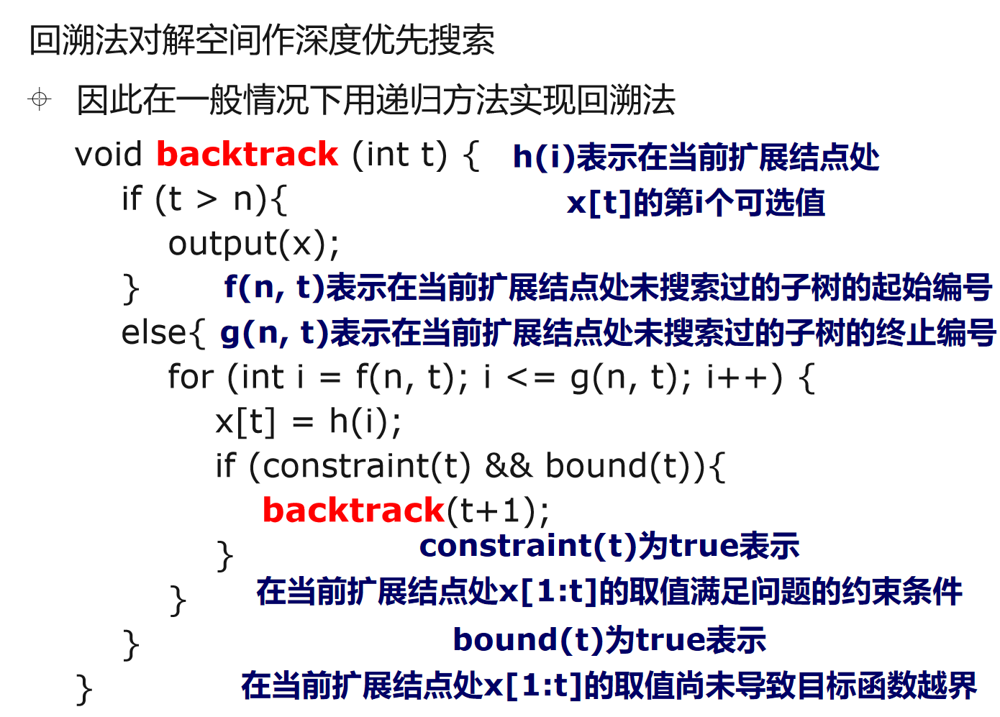

### [回溯法 Backtracking Algorithm Paradigm](#)

**介绍**：深度优先搜索（回溯法），在缺乏解决问题的有效模型时，搜索却是一种行之有效的解决问题的基本方法。

----

**基本思想**：将n元问题P的状态空间E表示成一棵高为n的带权有序树T，把在E中求问题P的解转化为在T中搜索问题P的解

**解题方法**：按选优条件对T进行深度优先搜索，以达到目标

从根结点出发深度优先搜索解空间树

当探索到某一结点时，要先判断该结点是否包含问题的解如果包含，就从该结点出发继续按深度优先策略搜索否则逐层向其祖先结点回溯（退回一步重新选择）满足回溯条件的某个状态的点称为“回溯点”

**算法结束条件**：

* 求所有解：回溯到根，且根的所有子树均已搜索完成
* 求任一解：只要搜索到问题的一个解就可以结束


基本概念

* 扩展结点：一个正在产生子结点的结点称为扩展结点
* 活结点：一个自身已生成但其子结点尚未全部生成的结点
* 死结点：一个所有子结点已经产生的结点称做死结点


#### 主要有三种情况：排列、组合、子集

**无论是排列、组合还是子集问题，简单说无非就是让你从序列 `nums` 中以给定规则取若干元素，主要有以下几种变体**：

**形式一、元素无重不可复选，即 `nums` 中的元素都是唯一的，每个元素最多只能被使用一次，这也是最基本的形式**。

以组合为例，如果输入 `nums = [2,3,6,7]`，和为 7 的组合应该只有 `[7]`。

**形式二、元素可重不可复选，即 `nums` 中的元素可以存在重复，每个元素最多只能被使用一次**。

以组合为例，如果输入 `nums = [2,5,2,1,2]`，和为 7 的组合应该有两种 `[2,2,2,1]` 和 `[5,2]`。 

解决：使用 visited 数组来记录是否选中、是否排序

**形式三、元素无重可复选，即 `nums` 中的元素都是唯一的，每个元素可以被使用若干次**。

以组合为例，如果输入 `nums = [2,3,6,7]`，和为 7 的组合应该有两种 `[2,2,3]` 和 `[7]`。

当然，也可以说有第四种形式，即元素可重可复选。但既然元素可复选，那又何必存在重复元素呢？元素去重之后就等同于形式三，所以这种情况不用考虑。


#### 通用算法框架

回溯法对解空间作深度优先搜索


因此在**一般情况下**用递归方法实现回溯法

```cpp
// n 用来控制递归深度.即解空间树的高度
// t 表示递归深度即当前扩展结点在解空间树中的深度
void backtrack (int t) {
    if (t > n){  //t > n 表示已搜索到一个叶结点
        output(x);  //Output(x) 对可行解进行处理：记录或输出

    }
    else{
        for (int i = f(n, t); i <= g(n, t); i++) {
            
        }
    }
}

```





第一类解空间树：子集树

第二类解空间树：排列树


result = []
def backtrack(路径, 选择列表):
    if 满足结束条件:
        result.add(路径)
        return
    

    result = []
    def backtrack(路径, 选择列表):
        if 满足结束条件:
            result.add(路径)
            return
        
        for 选择 in 选择列表:
            做选择
            backtrack(路径, 选择列表)
            撤销选择