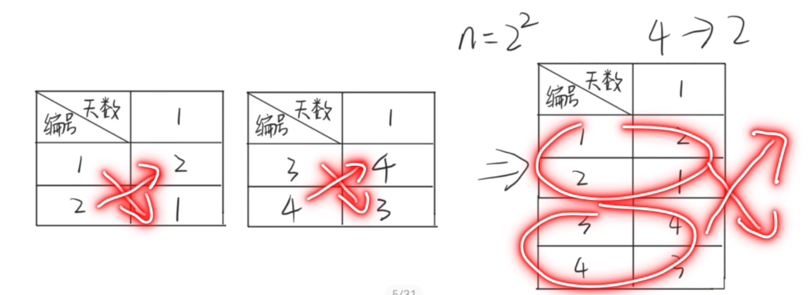
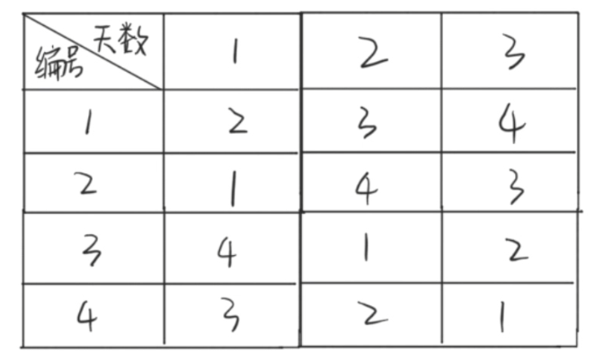

### [分治法 divide-and-conquer](#)

**算法思想**：将要求解的较大规模的问题分割成k个更小规模的子问题，求解小问题，再将求出的小规模的问题的解合并为一个更大规模的问题的解，自底向上逐步求出原来问题的解。

----


### 1. 概述

**平衡(balancing)子问题**：实践表明，在用分治法设计算法时，最好使子问题的规模大致相同，即：将一个问题分成大小相等的k个子问题。这种使子问题规模大致相等的做法是出自一种**平衡(balancing)子问题**的思想，它几乎总是比子问题规模不等的做法要好。

分治模式在每一层递归上都有三个步骤

分解（Divide)：将一个难以直接解决的大问题，分割成一些规模较小的子问题，这些子问题互相独立，且与原问题相同

求解（Conquer）：递归求解子问题，若问题足够小则直接求解

合并（Combine）：将各子问题的解合并得到原问题的解


#### 1.1 分治法所能解决的问题一般具有以下四个特征：

* 该问题的规模缩小到一定的程度就可以容易地解决
* 该问题可以分解为若干个规模较小的相同问题 --- 该问题具有**最优子结构性质**： `当一个问题的最优解包含其子问题的最优解时，称此问题具有最优子结构性质`。
* 利用子问题的解可以合并得到原始问题的解
  * 能否利用分治法完全取决于问题是否具有这条特征
  * 如果具备了前两条特征，而不具备第三条特征，则可以考虑贪心算法或动态规划
* 该问题所分解出的各个子问题是相互独立的
  * 则采用分治法需要重复地求解公共的子问题，此时虽然也可用分治法，但一般用动态规划较好


### 2. 例子


#### 2.1 BinarySearch 二分查找

建立在查找表已经有序的基础上，时间复制度为 O(log2n)，仅适用于**有序**的**顺序表**。

```cpp
int search(vector<int>& nums, int target) {
    int left = 0, right = nums.size() - 1;
    while (left <= right){
        int mid = (left + right) / 2 ;
        if (target == nums[mid]) return mid;
        if (nums[mid] > target ) right = mid - 1;
        if (nums[mid] < target ) left = mid + 1;
    }
    return -1;
}
```


#### 2.2 棋盘覆盖问题

在一个2^k×2^k 个方格组成的棋盘中，有一个方格与其它不同，称该方格为特殊方格，且称该棋盘为一特殊棋盘


#### 2.3 快速排序


#### 2.4 归并排序


#### 2.5 线性时间选择


#### 2.6 循环赛日程表问题

设计一个满足以下要求的比赛日程表： https://www.bilibili.com/video/BV1e84y1T7U6/

* 有n = 2^k个选手，每个选手必须与其他n-1个选手各赛一次
* 每个选手一天只能赛一次
* 循环赛一共进行n-1天

按此要求将比赛日程表设计成有n行和 n-1 列的一个表。在表中的第i行，第j列处填入第**i**个**选手**在 **第j天**所遇到的**选手**


1. 按分治策略，我们可以将所有的选手分为两半，则n个选手的比赛日程表可以通过n/2个选手的比赛日程表来决定。
2. 递归地用这种一分为二的策略对选手进行划分，直到只剩下两个选手时，比赛日程表的制定就变得很简单。
3. 合并怎么合并呢？将分解后的两个小组当做两个选手进行比赛。
4. 这时只要让这两个选手进行比赛就可以了。


合并方法：



