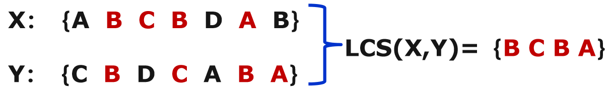
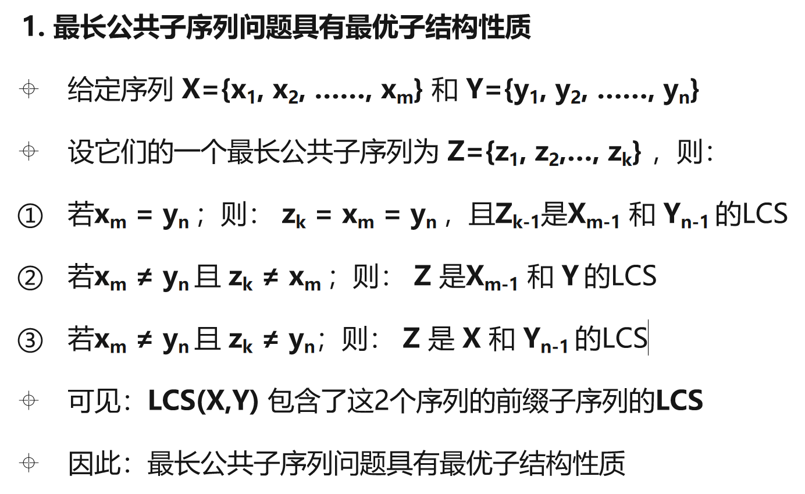
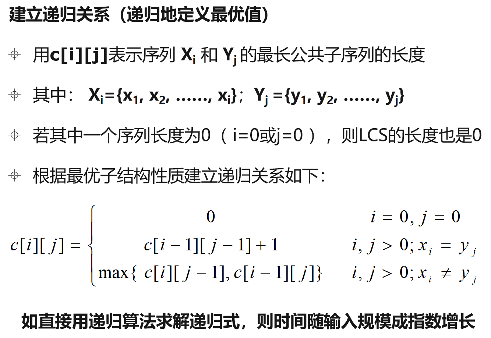

### [动态规划 - Dynamic Programming](#)

**介绍**：动态规划算法与分治法类似，其基本思想也**是将待求解问题分解成若干个子问题**，但是经分解得到的**子问题往往不是互相独立**的，一般需要构造一张表来记录所有已解决的子问题的答案，进行状态转移，避免重复计算。

-----------


### [1. 基本思想](#)

**动态规划问题的一般形式就是求最值**。动态规划其实是运筹学的一种最优化方法，只不过在计算机问题上应用比较多，比如说让你求最长递增子序列呀，最小编辑距离呀等等。

算法思想基本步骤：

* 找出最优解的**性质**（分析其结构特征）
* **递归**地定义最优值（优化目标函数）
* 以**自底向上**的方式计算出最优值
* 根据计算最优值时得到的信息，**构造**最优解


#### [1.1 套路](#)

**解体步骤**：

1. 确定dp数组（dp table）以及下标的含义, dp可能一维也可能二维。
2. 确定递推公式
3. dp数组如何初始化
4. 确定遍历顺序
5. 举例推导dp数组


```cpp
# 自顶向下递归的动态规划
def dp(状态1, 状态2, ...):
    for 选择 in 所有可能的选择:
        # 此时的状态已经因为做了选择而改变
        result = 求最值(result, dp(状态1, 状态2, ...))
    return result

# 自底向上迭代的动态规划
# 初始化 base case
dp[0][0][...] = base case
# 进行状态转移
for 状态1 in 状态1的所有取值：
    for 状态2 in 状态2的所有取值：
        for ...
            dp[状态1][状态2][...] = 求最值(选择1，选择2...)

```


 掌握动态规划算法的基本要素：

* 最优子结构性质： **当一个问题的最优解包含其子问题的最优解时，称此问题具有最优子结构性质**

* 重叠子问题性质：**用来求解原问题的递归算法反复地解同样的子问题，而不是总是在产生新的子问题**。
* **状态转移方程**


矩阵连乘问题

最长公共子序列问题 

最大子段和问题 

凸多边形最优三角剖分问题 

图像压缩问题 

0-1背包问题


#### 2.1 [最长公共子序列问题](https://leetcode.cn/problems/longest-common-subsequence/description/)

最长公共子序列（LCS）问题

给定2个序列X={x1, x2, ……, xm}和Y={y1, y2, ……, yn}

找出X和Y的一个最长公共子序列（不是子串）。






递归写法：

```cpp
int longestCommonSubsequence(string text1, string text2) {
    int t1s = text1.size();
    int t2s = text2.size();
    return helper(text1, t1s - 1, text2, t2s - 1);
}

// 闭区间]
int helper(string text1, int t1 , string text2, int t2){
    if(t1 >= 0 && t2 >=0 ){
        if(text1[t1] == text2[t2]){
            return 1 + helper(text1, t1 - 1, text2, t2 - 1);
        }
        return max(helper(text1, t1, text2, t2 - 1), helper(text1, t1 - 1, text2, t2));
    }
    return 0;
}
```

这种方式太慢了，需要一个备忘录！



```cpp
int longestCommonSubsequence(string text1, string text2) {
    int t1s = text1.size();
    int t2s = text2.size();
    std::vector<vector<int>> dp(t1s + 1, std::vector<int>(t2s + 1, 0));

    for(int i = 1; i <= t1s; i++){
        for(int  j = 1; j <= t2s; j++){
            if( text1[i - 1 ] == text2[j - 1] ){
                dp[i][j] = 1 + dp[i - 1][j - 1];
            }else{
                dp[i][j] = std::max(dp[i - 1][j], dp[i][j-1]);
            }
        }
    }   
    return dp[t1s][t2s];        
}
```


#### 2.2 [零钱兑换](https://leetcode.cn/problems/coin-change/)