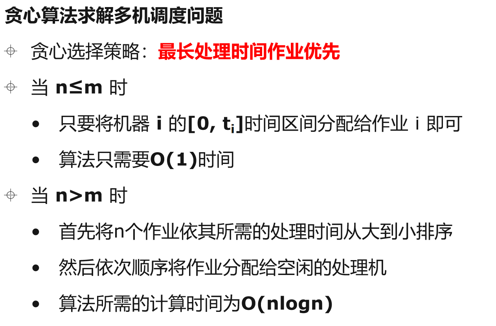

### [贪心算法 Greedy Algorithm](#)

**贪心算法的基本思想**: 贪心算法在每一步选择中都采取在当前状态下最优的选择


贪心算法得到的结果不能保证全局最优！


### 1. 活动安排问题 Activity-Selection Problem

活动安排问题就是要在所给的活动集合中，选出最大的相容活动子集合，即使得尽可能多的活动能兼容地使用公共资源。

贪心选择性质：将待安排的11个活动按结束时间的非减序排列，最早结束的活动优先，随后选择相容活动！


```cpp
int ActivitySelectionProblem(std::vector<std::vector<int>> activities){
    //按照
    std::sort(activities.begin(), activities.end(), [](vector<int> & t1, vector<int> &t2){
       return t1[1] < t2[1];
    });

    int count = 1;
    int end_time = activities[0][1]; //当前活动的结束时间

    for(int i = 1; i < activities.size(); i++){
        if (end_time <= activities[i][0]){
            end_time = activities[i][1];
            count++;
        }
    }

    return count;
}
```


### 2. 会场安排问题

假设要在足够多的会场里安排一批活动，并希望使用尽可能少的会场。设计一个有效的 [贪心算法](https://so.csdn.net/so/search?q=贪心算法&spm=1001.2101.3001.7020)进行安排。

（这个问题实际上是著名的图着色问题。若将每一个活动作为图的一个顶点，不相容活动间用边相连。使相邻顶点着有不同颜色的最小着色数，相应于要找的最小 会场数）。


```c++
//按照最早结束优先排序


```


### 3. 背包问题

与0-1背包问题类似，所不同的是在选择物品i装入背包时，可以选择物品 i 的一部分，而不一定要全部装入背包，这两类问题都具有相似的最优子结构性质，但背包问题可以用贪心算法求解，而0-1背包问题却不能用贪心算法求解！ 


首先计算每种物品单位重量的价值：Vi/Wi

然后按照贪心选择策略

* 将尽可能多的单位重量价值最高的物品装入背包
* 若将这种物品全部装入后，背包内的物品总重量未超过C
* 则选择单位重量价值次高的物品并尽可能多地装入背包依此策略一直地进行下去，直到背包装满为止


### 4. 最优装载问题

问题描述：有一批集装箱要装船其中：集装箱 i 的重量为wi ，轮船最大载重量为c要求：在不受体积限制的情况下，将尽可能多的集装箱装船。

**贪心选择策略**：重量最轻者先装船！


### 5. 单源最短路径

在有向图(带权有向图)中，寻找从某个源点到其余各个顶点或者每一对顶点之间的最短带权路径的运算，称为最短路径问题！

* 单源最短路径    Single-Source Shortest Path   (Dijkstra算法)
* 所有顶点对间的最短路径问题   All-Pairs Shortest paths （Floyd算法）


### 6. 多机调度问题

这个问题是NP完全问题，到目前为止还没有十分有效的解法，用贪心选择策略有时**可以设计出较好的近似算法**，采用最长处理时间作业优先的贪心选择策略可以。

贪心选择策略：最长处理时间作业优先

设：有n个独立的作业{1,2…n}

设：这n个作业由m台相同的机器进行加工处理

* 作业 i 所需要的执行时间为：ti


每个作业均可以在任何一个机器加工处理，但作业未完成之前不容许中断处理，作业也不能拆分为更小的子作业。

多机调度问题要求：给出一种作业调度方案，使所给的n个作业在尽可能短的时间内由m台机器加工处理完成




```cpp
int machinesGreedy(std::vector<int>& tasks, int m){
    //排序
    std::sort(tasks.begin(), tasks.end(), std::greater<>());
    //机器
    std::priority_queue<int, std::vector<int>, std::greater<>> machine_end_time;
    machine_end_time.push(0);
    int end_sp = 0;

    for (int i = 0; i < tasks.size(); ++i) {
        auto v = machine_end_time.top();
        machine_end_time.pop();
        machine_end_time.push(v + tasks[i] );
        end_sp = std::max(end_sp, v + tasks[i]);
        //放一台机器进去
        if (machine_end_time.size() < m){
            machine_end_time.push(0);
        }
    }

    return end_sp;
}
```

