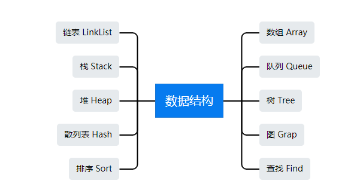

### [C++ 数据结构](#)
**介绍**： 数据结构是计算机存储、组织数据的方式。数据结构是指相互之间存在一种或多种特定关系的数据元素的集合, 研究的是数据的逻辑结构和数据的物理结构以及它们之间的相互关系。

-----
* **逻辑结构**：集合、线性结构、树形结构、图形结构等。
* **物理结构/存储结构**：顺序存储、链接存储、索引存储、散列存储等。

#### 目录:

* [顺序表 Array](./contents/SequenceList)
* [链表 List](./contents/LinkedList)
* [栈 Stack](./contents/Stack)
* [队列 Queue](./contents/Queue)
* [树 Tree](./contents/Tree) 
* [堆 Heap/优先队列](./contents/Heap)
* [哈希表 Hash](./contents/Hash)
* [图 Graph](./contents/Graph)
* [内外部排序 Sort](./contents/Sort)
* [查找 Find](./contents/Search)
* [高级数据结构 advance](./contents/Advance)

**导图：**

> [Create DateTime:  2022 - 5 - 05](#)

