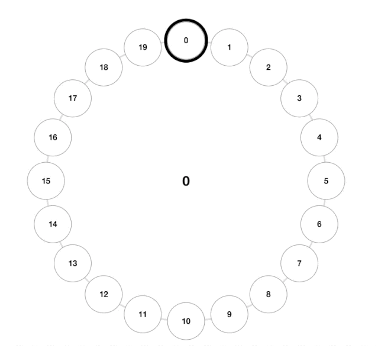
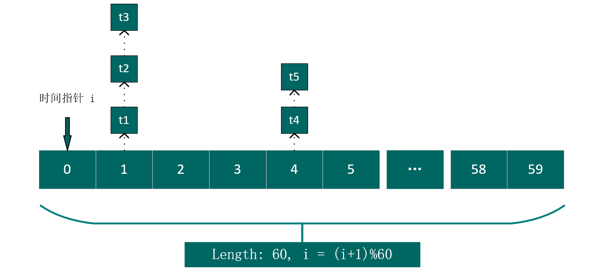
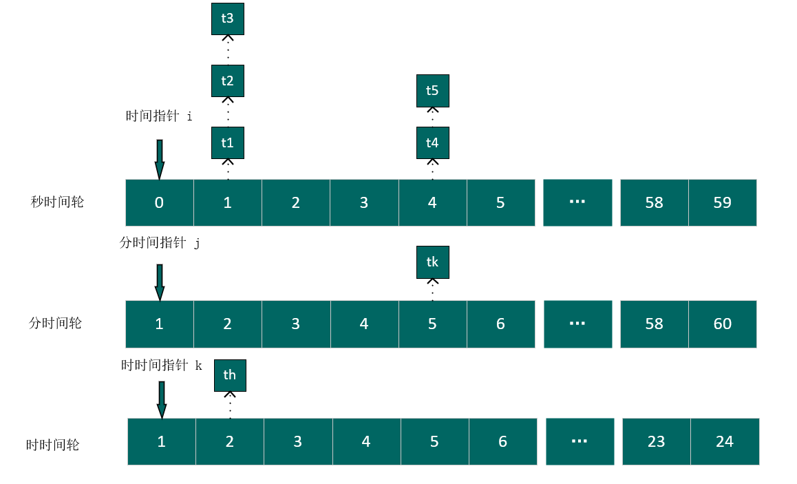
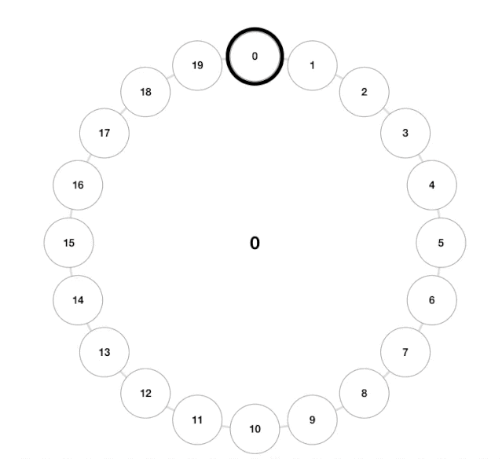
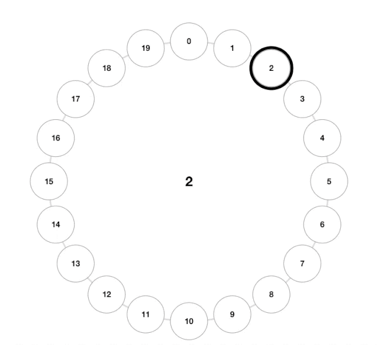
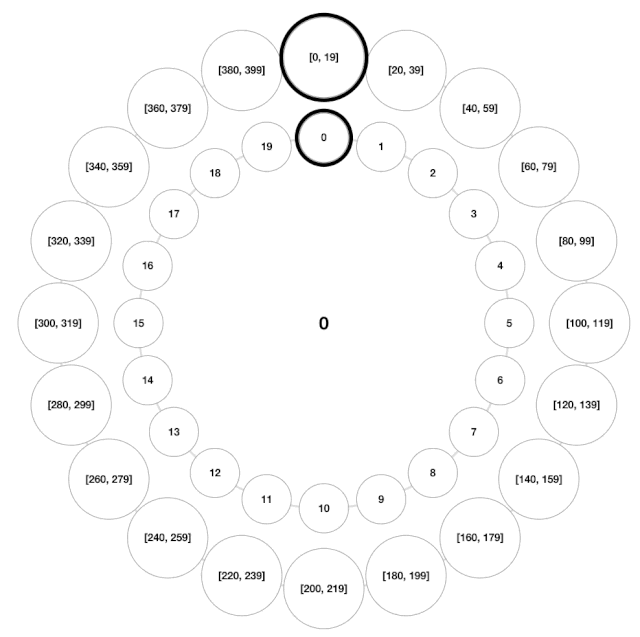
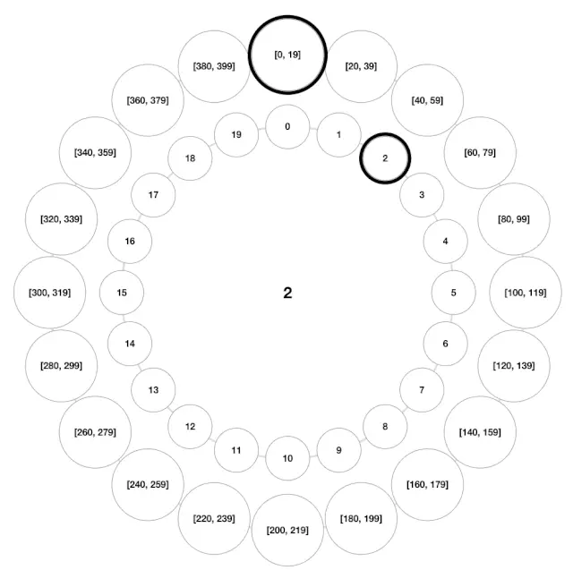
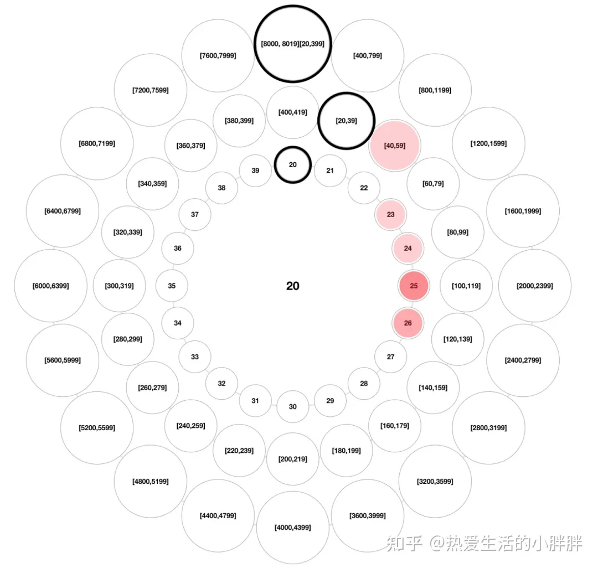

### [TimingWheel 时间轮](#)

**介绍**：时间轮(TimeWheel)作为一种高效率的计时器实现方案，在 Netty，Zookeeper，Kafka 等各种框架中，甚至 Linux 内核中都有用到！

----



### 一、定时器沿革

时间轮在1987年发表的论文Hashed and Hierarchical Timing Wheels中被首次提出。**其被发明的主要目的在于解决当时操作系统的计时器功能实现中，维护一个定时器的开销随着所维护定时器数量的增多而逐渐变大的问题**。这导致操作系统**无法同时高效的维护大量计时器**，进一步导致一些优秀的、需要使用到大量定时器的的网络协议、实时控制系统等程序的实际表现不尽人意。

在时间轮算法被发明出来之前，操作系统计时器功能的实现方式主要可以分为两种：**基于无序队列**和**基于有序队列**。

#### 1.1 基于无序队列实现的计时器
目前已经没人使用这个方案了
1. 新创建的计时器直接放在队列的末尾，时间复杂度为O(1)。
2. 在每次硬件时钟tick中断时(per tick)，遍历当前队列中所有的计时器，将当前时间下过期的计时器移出队列并调度执行task,时间复杂度O(n)。

<span style="color:red;font-weight:600;font-family:宋体" >**基于无序队列的计时器中，所维护的计时器总数量越多，则每次硬件时钟中断时的处理流程开销越大，最坏情况下甚至无法在一次时钟tick的间隔内完成计时器队列的遍历。**</span>


#### 1.2 基于有序队列实现的计时器

主要方案有：红黑树、最小堆

1. 有序队列下，所有计时器按照过期时间进行排序，新创建的计时器加入队列时的时间复杂度为O(log n)(通常使用完全二叉堆来实现有序队列)。
2. 在每次硬件时钟tick中断时，仅检查队列的头部元素(最早过期的任务)是否过期。如果未过期则直接结束，如果已过期则将队首元素出队调度task，并再次重复上述过程，直至最新的队首元素不过期或队列为空。平均时间复杂度为O(1)。

<span style="color:#0238e3;font-weight:600;font-family:宋体">**基于有序队列的计时器中，所维护的计时器总数量越多，则每次用户创建新的计时器时的延迟越高，在需要反复创建大量计时器的场合下，性能不佳**</span>


### 二、时间轮一步一步了解

我们假设一个秒级的定时器来了解时间轮， 基于队列的做法都是将每一个任务 当作单独的任务，没有进行分组，如果我们将任务进行分组，任务组里面有一个延时最大的任务的执行时间是60s，那么我们可以创建-一个长度为60的数组，相同时间执行的任务放在一起， 然后起一个线程， 每秒走一格走到59的时候执行完一轮次,然后又从头开始走。



线程每经过一秒将i加1，然后将对应位置的任务队列执行完成，如果一个新任务需要三秒后才能执行，就将其放到 (i+3)%60 所在位置的任务队列后面。


#### 2.1 多精度时间轮

秒级时间轮最长只能允许任务延时时长为60s，为此我们可以增加 分时间轮，时时间轮。



上面的时间轮只有秒，在任务多的时候，链表会变得很长，这样判断时间加起来，也会很慢，这个时候就需要多精度时间轮了，不止有秒时间轮，还有时/分/秒时间轮，这样，在秒级的任务就不会很多很长了。

假设三个时间轮启动的时间一样并且我们的任务Task计算出来的duration为24小时3分58秒，那么首先这个任务Task会存放在**时时间轮**的第24个格子上,**等**时时间轮走到第24个格子后，会将这个任务Task降级存放到分时间轮的第3个格子上，等分时间轮也走到第3个格子之后，又会把任务Task存放到秒时间轮的第58个格子上，等秒时间轮走到第58个格子上之后，就会执行任务，我们管这种时间轮叫做**层级时间轮**。


几个层次就需要几个时间指针，每个层级一个数组。


##### 2.1.1 多层时间轮创建新任务

创建新计时器时，根据超时时间，先尝试着放入最底层的时间轮，如果最底层的时间轮能放的下(比如第0分钟58秒过期的),就根据当前时间轮的tick间隔做除法来计算出需要放入的具体bucket。

如果当前时间轮放不下(比如距离当前时间10分钟20秒过期的，无法直接放入最大60秒的秒级时间轮，但能放到最大支持60分钟的分钟时间轮中)，则尝试着放到上一层的时间轮中，但是是基于上一层的时间轮的tick间隔来做除法来计算出具体要放入的bucket槽。

如果还是放不下(比如距离当前时间3小时20分钟18秒过期的，只能放到最大12小时的小时级时间轮中)，循环往复这一过程，直到放到合适层次的时间轮中。


kafka: 三层时间轮

linux内核: 八层时间轮 时间精度 10ms

skynet: 五层时间轮

* 时间精度 10ms
* 层级1 256  2560ms, 2.56s
* 层级2 64    163.84s
* 层级3 64    10,485.76s  = 2.9125h  
* 层级4 64     7.7672222天
* 层级5 64     1.3619252 年

```cpp
uint32_t tick =     0b01000000100000100000001011111111;
uint32_t checkOne = 0b00000000000000000000000011111111;
uint32_t checkTwo = 0b00000000000000000011111100000000;
uint32_t checkThr = 0b00000000000011111100000000000000;
uint32_t checkFor = 0b00000011111100000000000000000000;
uint32_t checkFie = 0b11111100000000000000000000000000;

std::cout << "one pointer: " << (tick & checkOne) << std::endl; //255
std::cout << "two pointer: " << ((tick & checkTwo)>>8) << std::endl; //2
std::cout << "sed pointer: " << ((tick & checkThr)>>14) << std::endl; //8
std::cout << "for pointer: " << ((tick & checkFor)>>20) << std::endl; //8
std::cout << "fiv pointer: " << ((tick & checkFie)>>26) << std::endl; //16
```


### 三、时间轮设计


#### 3.1 调度精度

**首先指定时间tick的精度**：时间轮在创建时需要指定调度精度，即时间轮内部逻辑上1次tick的间隔，并不是真的就按照秒、分、时那样的固定间隔，你可以按照自己系统的需求设置，例如最低采用10ms，100个格子，二级采用1000ms  100个格子，三级采用 100s 64个格子，四级为6400s，60个格子...  总共可以支持 106.666666667小时的延迟任务。

**运行时针以最小精度移动！**


**其次数据结构**，维护一个桶数组，由于不同超时时间的任务可能会被映射到同一个桶中，因此数组桶中维护一个指向某一列表的指针(引用)。

每当运行时针移动一次，就取出当前时刻的任务进行执行


#### 3.2 取模运算优化

如下是取模运算的本质，效率较低，可以优化为位运算

```cpp
m % n = m - n * floor(m/n)
```

也就是数组大小最好采用2<sup>n</sup>以方便进行位运算，假设2<sup>n</sup> = 16 。

```cpp
16 ：0 0 0 1 0 0 0 0
20 ：0 0 0 1 0 1 0 0

20 % 16 = 20 & (16 - 1)

    0 0 0 0 1 1 1 1
&   0 0 0 1 0 1 0 0
    ---------------
    0 0 0 0 0 1 0 0 
```

测试：

```cpp
int size = 64;
int m = 78;
auto mod = m & (size - 1);
printf("mod: %d, %%: %d \n", mod, m % size);
```


### 四、Kafka的时间轮TimingWheel。

Kafka时间轮的底层就是一个**环形数组**, wheelSize = 20，而数组中每个元素都存放一个**双向链表TimerTaskList**，链表中封装了很多**延时任务**。每格的时间跨度是1ms(tickMs = 1ms)。


所以现在整个时间轮的时间跨度就是 tickMs * wheelSize ，也就是 20ms。从0s到20ms，我们都分别有一个灰边小圆来承载。

Kafka的时间轮还有一个**表盘指针(currentTime)**，表示时间轮当前所处的时间。也就是图中用黑色粗线表示的圆，随着时间推移, 这个指针也会不断前进。

每一个定时任务都有延时时间**delayTime**，和过期时间**ExpiredTime**。比如当前时间是10ms，我们添加了个延时时间为2s的任务，那么这个任务的过期时间就是12ms，也就是当前时间10ms再走两秒，变成了12ms的时候，就到了触发这个定时任务的时间。

初始的时候, 时间轮的指针定格在0。此时添加一个超时时间为2s的任务, 那么这个任务将会插入到第二个时间格中。




如果这个时候又插入一个延时时间为8ms的任务进来, 这个任务的过期时间就是在当前时间2ms的基础上加8s, 也就是10ms, 那么这个任务将会插入到过期时间为10s的时间格中。



但是此一层时间轮只能支持延时20ms。

#### 4.1 多层级时间轮

为了支持更长的延时，第二层时间轮也是由20个时间格组成, 每个时间格的跨度是20ms，然后这个两层级时间轮就可以支持400ms了。



如果在当前时间是2s的时候, 插入一个延时时间为350s的任务, 这个任务的过期时间就是在2s的基础上加350s，也就是352s。



**kafka 三层时间轮**：



随着时间推进, 时间轮的指针循环往复地定格在每一个时间格上, 每一次都要判断当前定格的时间格里是不是有任务存在。其中有很多时间格都是没有任务的, 指针定格在这种空的时间格中, 就是一次 **"空推进"** ;

比如说, 插入一个延时时间400s的任务, 指针就要执行399次"空推进", 这是一种浪费。


#### 4.2 时间轮的前进

如何推进时间轮的前进，让时间轮的时间往前走。

- Netty 中的时间轮是**通过工作线程按照固定的时间间隔 tickDuration 推进的**。
  - 如果长时间没有到期任务，这种方案会带来**空推进**的问题，从而造成一定的性能损耗；
- Kafka 则是通过 DelayQueue 来推进，是一种空间换时间的思想；
  - DelayQueue 中保存着所有的 TimerTaskList 对象，根据时间来排序，这样延时越小的任务排在越前面。
  - 外部通过一个线程（叫做ExpiredOperationReaper）从 DelayQueue 中获取超时的任务列表 TimerTaskList，然后根据 TimerTaskList 的<span style="color:Red;font-weight:600" >过期时间来精确推进时间轮的时间</span>，这样就不会存在空推进的问题啦。

**其实 Kafka 采用的是一种权衡的策略，把 DelayQueue 用在了合适的地方。DelayQueue 只存放了 TimerTaskList，并不是所有的 TimerTask，数量并不多，相比空推进带来的影响是利大于弊的**。

Kafka 使用时间轮来实现延时队列，因为其底层是任务的添加和删除是基于链表实现的，是 O(1) 的时间复杂度，满足高性能的要求；


### 引用

> 秒懂 Kafka 时间轮（TimingWheel） - 热爱生活的小胖胖的文章 - 知乎 https://zhuanlan.zhihu.com/p/478935723
