### [Data Structure - 图的基本概念](#)

**定义**:  图就是由有穷非空顶点集V和顶点之间关系的边集E组成的集合，记 G =(V, E)。|V|表示图G中定点的个数，也称为图的**阶**，E = {(u,v)| u∈V, v∈V}, |E|表示图G的边数。如果点对有序，称为**有向图**，否则为**无向图**，两个定点v,w**邻接**当且仅当存在一条边 (v,w) 或 (w,v)。边若有权或者值称为**带权图**。

---

**目录导图：**

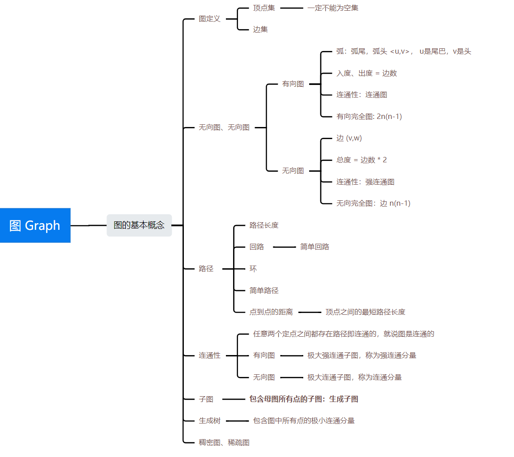

### 一、基本概念
图是由顶点[集合](https://so.csdn.net/so/search?q=集合&spm=1001.2101.3001.7020)以及顶点间的关系集合组成的一种数据结构，Graph = (V,E) V是顶点的又穷非空集合；E是顶点之间关系的有穷集合，也叫边集合。

* **有向图**：顶点对<x,y>是有序的, x 也称为 **弧尾**，y是**弧头**。 `x -----> y`
  * 有向边：若从顶点Vi到Vj的边有方向，则称这条边为有向边，也称为弧。
  * 用有序偶<Vi,Vj>来表示，Vi称为弧尾，Vj称为弧头。
* **无向图**：如果图中任意两个顶点对(x,y)是无序的，则称该图为无向图。
  * 无向边：若顶点Vi到Vj之间的边没有方向，则称这条边为无向边，用无序偶对(Vi,Vj)来表示。
  * 所以连接顶点A与D的边，可以表示为无序对(A,D)，也可以写成(D,A)。

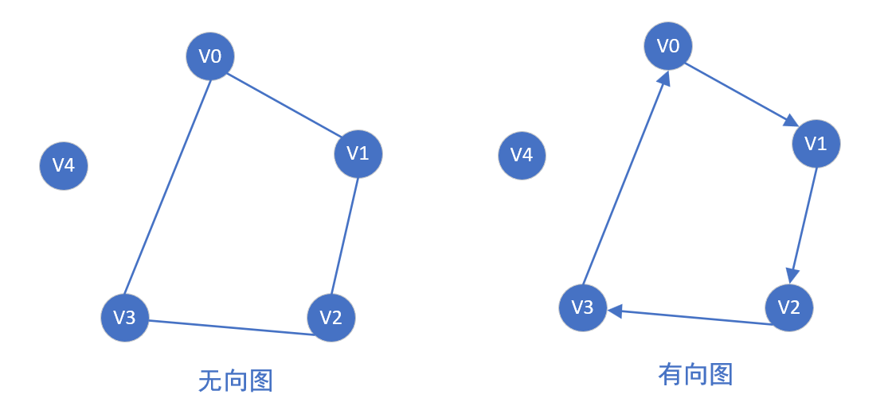

* **入度**是以顶点v为终点的有向边的数目。
* **出度**是以顶点v为起点的有向边的数目。
* 一个图的度数等于边数*2。

例子：G=(V,{E})其中顶点集合V={A,B,C,D};弧集合E={<A,D>,<B,A>,<C,A>,<B,C>}

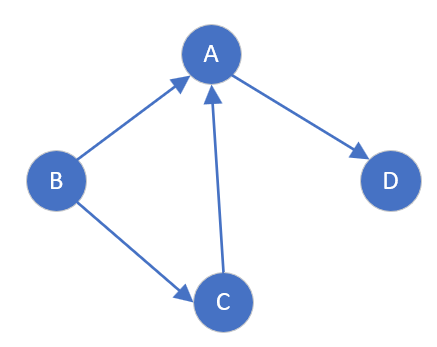


**权（Weight）**：有些图的边和弧有相关的数，这个数权（Weight）。这些带权的图通常称为网（Network）。

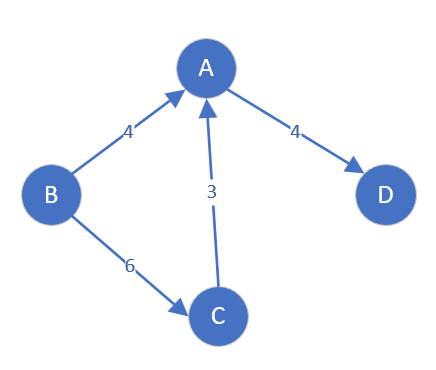

#### 1.1 简单图与多重图
* 简单图：不存在重复边、不存在顶点到自身的边的图(环)。
* 多重图--图G中某两个结点之间的边数多于一条，条，又允许顶点通过同- -条边和自己关联。

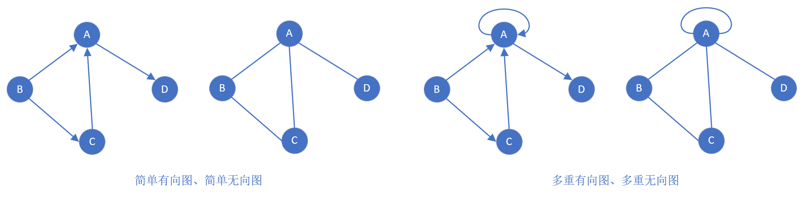


#### 1.2 完全图
对于给定的一组顶点，顶点间都存在边
* **完全无向图**：若有n个顶点的无向图有n(n-1)/2 条边, 则此图为完全无向图。
* **完全有向图**：有n个顶点的有向图有n(n-1)条边, 则此图为完全有向图。

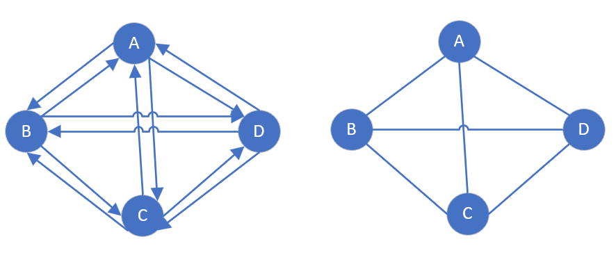

- 稀疏图：顶点很多而边很少的图
- 稠密图：顶点多边也多的图

#### 1.3 路径
**路径**: 顶点V1,到顶点Vk之间的一条路径是指顶点序列V1,V2,V3，....Vk-1，Vk，**路径长度**：路径上边的数目。

如下所示，是有向图的一个路径：

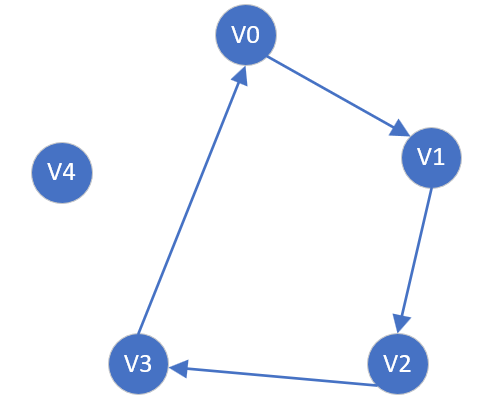

**回路**：第一个顶点和最后一个顶点相同的路径称为**回路或环**。

**简单路径：**在路径序列中，顶点不重复出现的路径称为简单路径。

**简单回路**: 除第一个顶点和最后一个顶点外，其余顶点不重复出现的回路称为简单回路。

**点到点的距离**：从顶点u出发到顶点v的最短路径若存在，则此路径的长度称为从u到v的距离。若从u到v根本不存在路径，则记该距离为无穷。


#### 1.4 连通性

**无向图中点连通**: 若从顶点v到顶点w有路径存在，则称v和w是**连通**的。

**有向图中点连通**：若从顶点v到顶点w和从顶点w到顶点v之间都有路径，则称这两个顶点是**强连通**的

如下所示：有向图定点ABC之间是强连通，但D与其他节点都不强连通，而右图是连通的。

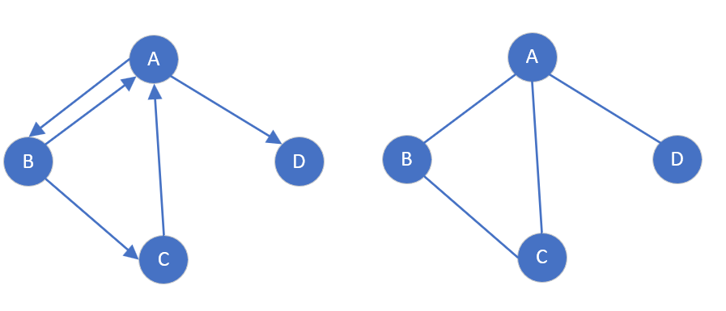

如果无向图任意两个定点都是连通的，那么无向图是连通的。如果有向图任意两个定点都是强连通的，那么有向图是强连通的。

* 一个无向图是连通的最少需要 n-1条边
* 一个无向图不是连通的最多可以有 (n-2)(n-1)/2 条边。
* 一个有向图是强连通最少需要 n-1 条边。

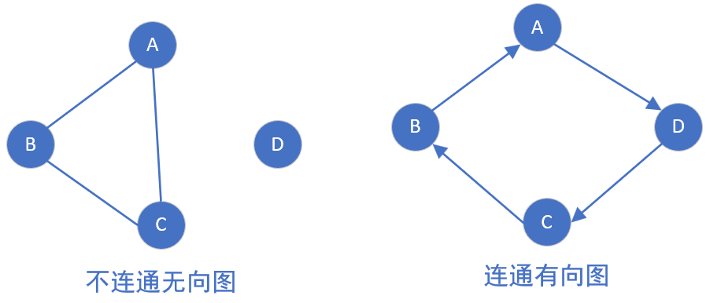


#### 1.5 子图

子图指节点集和边集分别是某一图的节点集的[子集](https://baike.baidu.com/item/子集/5017034?fromModule=lemma_inlink)和边集的子集的图, **注意** 并不是从原图当中任意选择几个顶点，任意选择几条边都能构成子图的，因为子图首先它必须是一个图。

**生成子图**：子图里边包含了原图当中的所有顶点，那么这个子图就可以称为原图的一个生成子图。

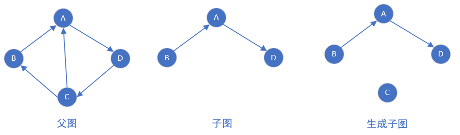

#### 1.6 连通分量、强连通分量

连通分量：无向图中的极大连通子图（*子图必须连通，且包含尽可能多的顶点和边*）。下图有两个连通分量， V4未画出。

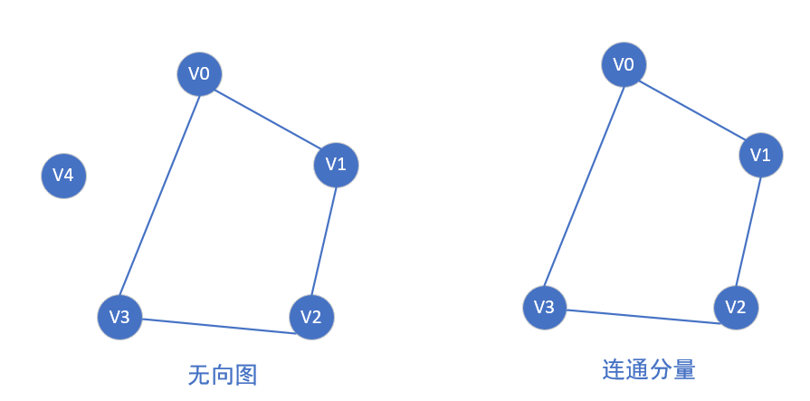

强连通分量：如图在图 G 中A,B,E,C,D是强连通的，将这个部分择出来就是一个极大的强连通分量。而顶点 F 和 A,B,C,D,E不是强连通的(从其他顶点到 F 的路径存在，而 F 到其他顶点的路径不存在)，所以 F 和 A,B,C,D,E是不强连通的。

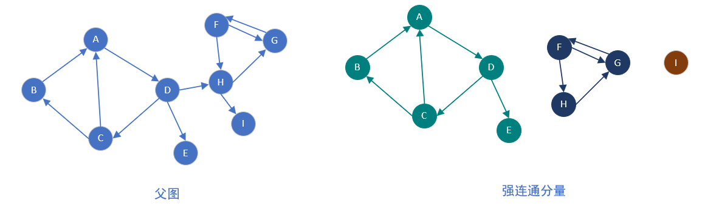

#### 1.7 生成树

只有连通图或者强连通图才有**生成树**，因为生成树需要包括图的所有定点，如果图是非(强)连通的，那么有些定点之间不存在边。

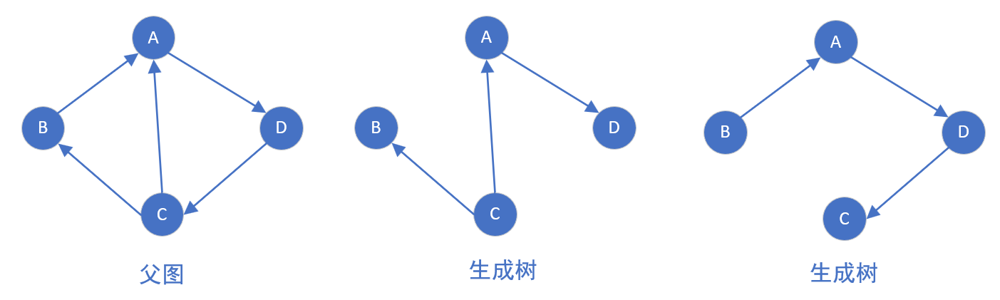

**最小生成树**：最小生成树可以用[kruskal](https://baike.baidu.com/item/kruskal/10242089?fromModule=lemma_inlink)（克鲁斯卡尔）算法或[prim](https://baike.baidu.com/item/prim/10242166?fromModule=lemma_inlink)（普里姆）算法求出。常用于解决各种问题，例如路程费用、施工道路规划、物流配送规划...

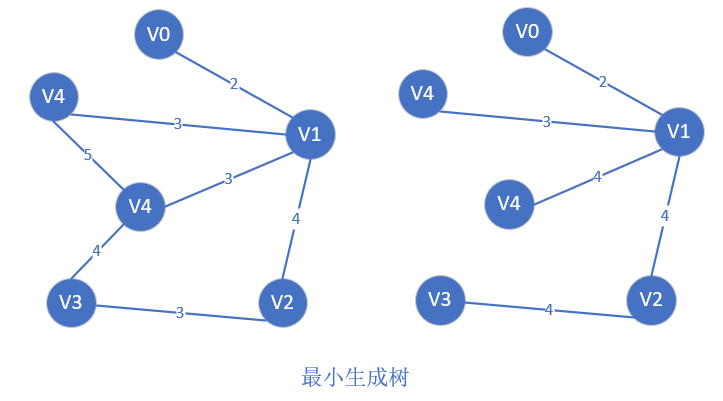

非连通图可以生成森林。

#### 1.8 有向无环图 DAG

简称**DAG图**，*是用来描述一项工程或系统的进行过程的有效工具。*

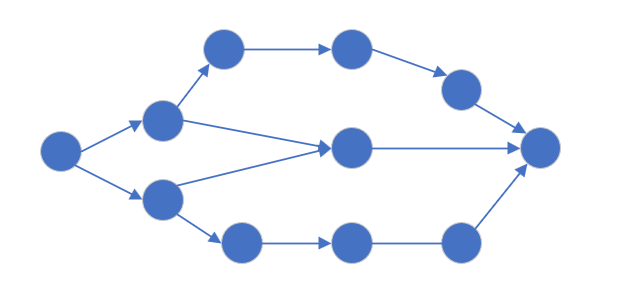

DAG 的两种表示方法
* AOV 网 (activity on vertex network)
	* 用一个有向图表示工程的各子工程及其相互制约的关系，其中顶点表示活动，有向边表示活动之间的优先制约关系，则称这种有向图为顶点表示活动的网，简称 AOV，**应用：拓扑排序**。

* AOE 网 (activity on edge network)
	* 在带权有向图中，以有向边表示活动，边上的权值表示该活动的持续时间，顶点表示事件，则称这种有向图为边表示活动的网，简称 AOE ，**应用：关键路径**

### 二、图的存储结构

图的存储方式有四种：邻接矩阵、邻接表、十字链表法、邻接多重表。


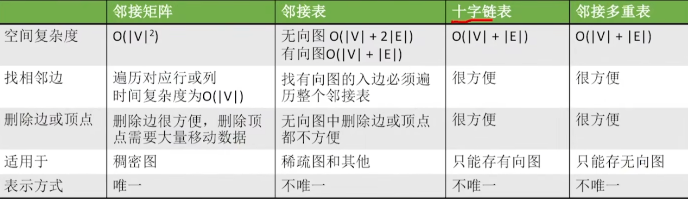

#### 2.1 邻接矩阵

**不适合稀疏图、适合稠密图**，邻接矩阵将图用二维矩阵存储，是一种较为直观的表示方式。

* 如果第 i 个顶点和第 j 个顶点之间有关系，且关系权值为 n，则A\[i]\[j]=n。
* 在无向图中，我们只关心关系的有无，所以当顶点 i 和顶点 j 有关系时，，当顶点 i 和顶点 j 没有关系时，A\[i]\[j]=0。如下图所示：

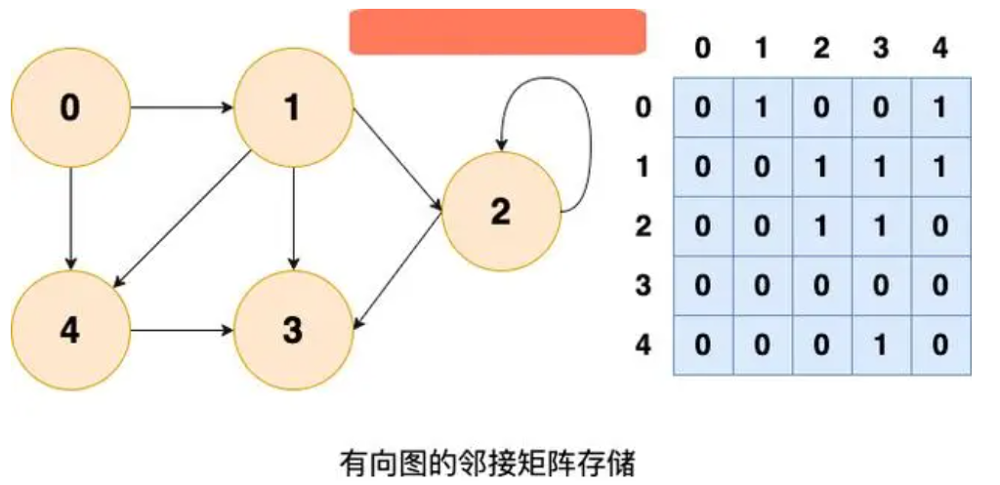

<span style="color:Red;font-weight:600" >A<sup>n</sup>\[i]\[j] 表示由定点i到定点j的长度为n的路径数目。</span>

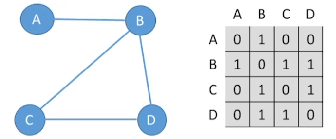

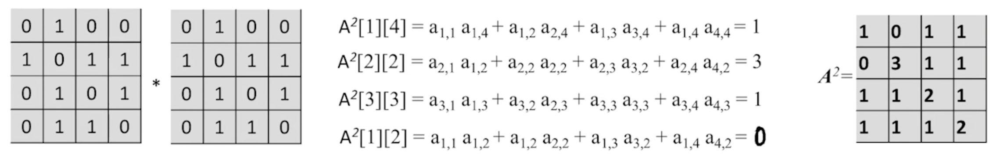

**带权图存储**

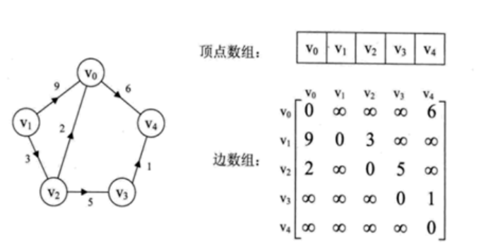


- **优点**：简单直观，可以快速查到一个顶点和另一顶点之间的关联关系。
  - 求顶点的度非常方便。
- **缺点**：占用空间大，如果一个图有1000个顶点，其中只有10个顶点之间有关联（这种情况叫作稀疏图），却不得不建立一个1000X1000的二维数组。
  - 空间复杂度 O(n^2+n)

```cpp
//邻接矩阵 非带权图
template<typename V, size_t VCount>
struct MatrixGraph{
    V vertex[VCount]; //顶点集
    int edge[VCount][VCount]; //边集合
    int edgeCount; //边数
};

MatrixGraph<char, 5> graph{
    {'A','B','C','D','E'},
    {
        {0,1,0,1,0},
        {1,0,0,0,0},
        {0,0,0,0,1},
        {1,0,0,0,1},
        {0,0,1,1,0},
    },
    8
};
```

> 如果是无向图，可以使用压缩存储，只存半个邻接矩阵。


#### 2.2 邻接表

邻接链表使用一个链表来存储某个顶点的所有后继相邻顶点。对于图中每个顶点 V<sub>i</sub>，把所有邻接于 V<sub>i</sub> 的顶点 V<sub>j</sub> 链成一个单链表，这个单链表称为顶点 V<sub>i</sub> 的 「邻接表」。**邻接表的存储方式，占用的空间比邻接矩阵要小得多**;

* 顺序存储加链式存储。
* **邻接表由于边的顺序不定所以表示方式不唯一，但是邻接矩阵是唯一的**。

无向图的邻接表存储：(存在一个浪费空间的问题， 边的存储有点冗余)

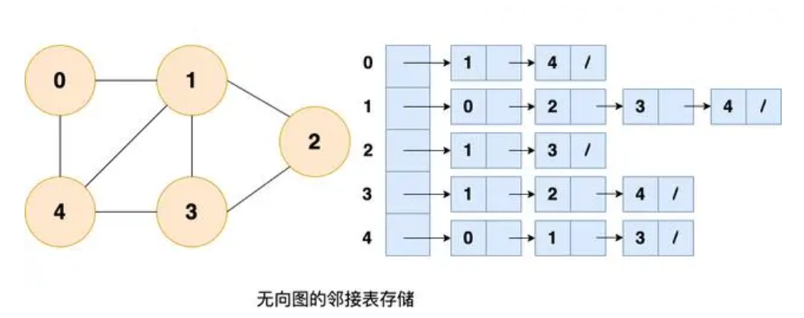

有向图的邻接表存储 ( 边的存储没有冗余)

* <span style="color:red">对于有向图，**不好找顶点的入度**。</span>

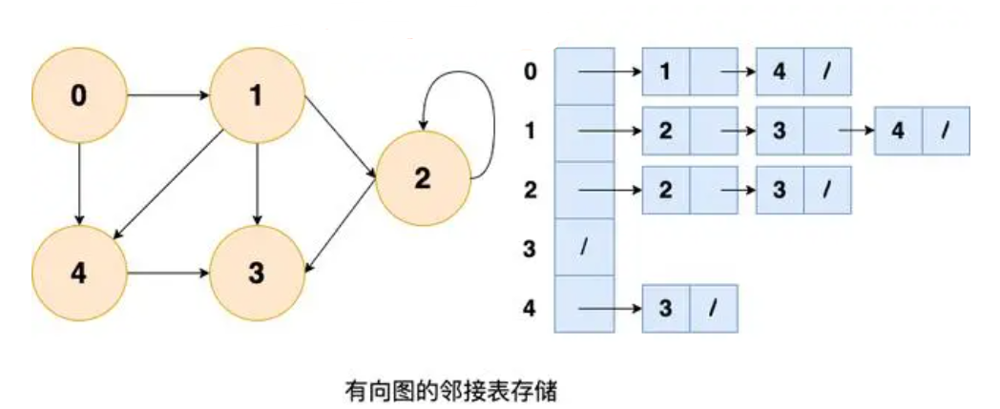

```cpp
struct EdgeNode{  //定义边节点
    int idx; //定点所在索引
    EdgeNode *next;
};

template<typename V>
struct VNode{
    V v;
    EdgeNode *first; //指向边集
};

template<typename V, size_t VCount>
struct AdjoinGraph {
    VNode<V> vertex[VCount]; //定点集合
    int edgeCount; //边数
}; 
```

**特点**:

- 方便找任一顶点的所有邻接顶点
- 节省稀疏图的空间
  - 需要 N 个头指针 + 2E 个结点（每个结点至少 2 个域）
- 对于是否方便计算任一顶点的度
  - 无向图：方便
  - 有向图：只能计算出度
- 不方便检查任意一对顶点间是否存在边

#### 2.3 有向图十字链表

十字链表是**有向图**的一个**专有**的链表结构，邻接表对于**有向图计算顶点的入度**是一个很麻烦的事情，而十字链表正好可以解决这个问题。十字链表和邻接表一样，他会有两个结构来表示图：其中一个结构用于保存顶点信息，另外一个结构是用于保存每条边的信息。

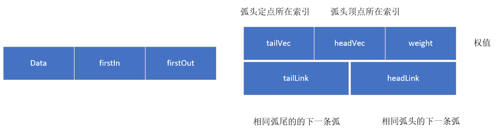


```cpp
//表结点结构
struct ArcNode {
    int tailVex;   //弧尾的下标，一般都是和对应的头结点下标相同
    int headVex;   //弧头的下标
    ArcNode * headLink; //指向下一个弧头同为headvex的表结点 ，边是箭头的那边
    ArcNode * tailLink;  //指向下一个弧尾为tailvex的表结点,边不是箭头的那边
    int weight;  //只有网才会用这个变量
};

//头结点
template<typename V>
struct VNode
{
    V data;  //这个是记录每个顶点的信息（现在一般都不需要怎么使用）
    ArcNode *firstIn; //指向第一条（入度）在该顶点的表结点
    ArcNode *firstOut; //指向第一条（出度）在该顶点的表结点
};

template<typename V, size_t VCount>
struct Graph
{
    int kind;  //图的种类(有向图：0，有向网：1)
    int edgeCount; //边数
    VNode<V> node[VCount]; //图的（顶点）头结点数组
};
```

例子：


#### 2.4 无向图邻接多重表

存储方式：**顶点集+边集**，与十字链表一样，邻接多重表是由顶点集合和边集合构成的。但又与十字链表不同的是，邻接多重表是无向图的存储结构吗，而十字链表是针对有向图的。因为不考虑边的方向，所以和十字链表相比较，顶点结点只需要一个指针域指向所连接的边结点即可。

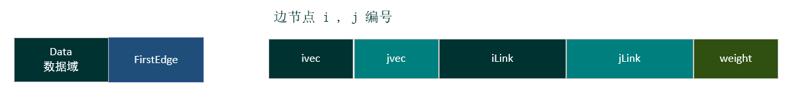

```cpp
//顶点集
typedef struct VexNode
{
    //顶点信息
    char data;
    //指向顶点所连接的边节点链表
    ArcNode* firstEdge;
}VexNode;

//边集
typedef struct ArcNode
{
    //分别表示该边节点所连接的两个顶点
    int iVex, jVex;
    //指向有着相同头 尾顶点的边节点
    struct ArcNode* iLink, *jLink;
    int weight;
}ArcNode;
```

和十字链表差不多，只是前面依靠弧头弧尾来区分，这个是依靠**索引**。

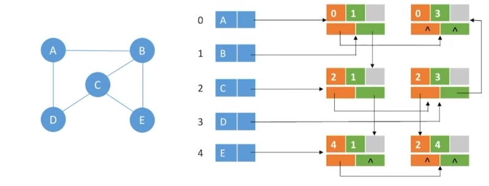


### 三、图的基本操作

图的基本操作如下所示：

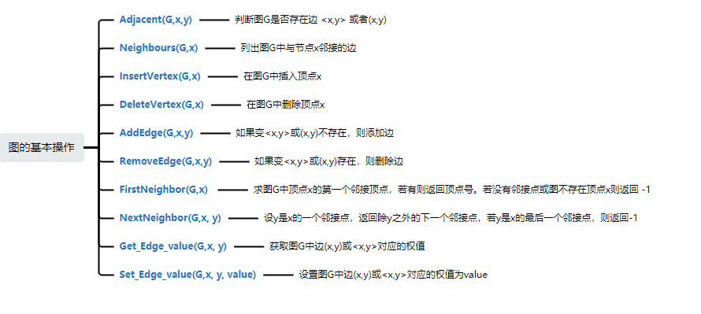

#### 3.1 邻接矩阵 - 无向图

优点在于查找非常高效、缺点是增删顶点由于二维数组不方便。

* Adjacent(G,x,y) 判断效率是 O(1)，只需要找到顶点x,y对应的下标即可。
* Neighbours(G,x)  效率是 O(n)。
* InsertVertex(G,x)、DeleteVertex(G,x)。由于采用二维数组，邻接矩阵不好增删顶点。
* AddEdge(G,x,y) 效率是 O(1)。
* RemoveEdge(G,x,y) 效率是 O(1)。
* FirstNeighbor(G,x)  非常方便
* NextNeighbor(G,x, y) 非常方便
* Get_Edge_value(G,x, y) 效率是 O(1)。
* Set_Edge_value(G,x, y, value)  效率是 O(1)。


#### 3.2 邻接矩阵 - 有向图

优点在于查找非常高效，缺点是增删顶点由于二维数组不方便。

* Adjacent(G,x,y) 判断效率是 O(1)，只需要找到顶点x,y对应的下标即可。
* Neighbours(G,x)  效率是 O(n)。
* InsertVertex(G,x)、DeleteVertex(G,x)。由于采用二维数组，邻接矩阵不好增删顶点。
* AddEdge(G,x,y) 效率是 O(1)。
* RemoveEdge(G,x,y) 效率是 O(1)。
* FirstNeighbor(G,x)  非常方便
* NextNeighbor(G,x, y) 非常方便
* Get_Edge_value(G,x, y) 效率是 O(1)。
* Set_Edge_value(G,x, y, value)  效率是 O(1)。


#### 3.3 邻接表 - 无向图

对于边会冗余存储两次，但是顶点的增删较为容易。

* Adjacent(G,x,y) 判断效率是 O(n)，需要遍历顶点x的边集合。
* Neighbours(G,x) 效率是 O(n)，遍历顶点x的出边集合。如果需要所有邻接入边，需要遍历其他所有定点，效率是 O(|E|+|V|)
* InsertVertex(G,x) 效率是 O(1)
* DeleteVertex(G,x)， 一条边存储了两次，所有x有几条边，需要删除 2n次。
* AddEdge(G,x,y) 效率是 O(n)。
* RemoveEdge(G,x,y) 效率是 O(n)。
* FirstNeighbor(G,x)  非常方便 O(n)
* NextNeighbor(G,x, y) 非常方便 O(n)
* Get_Edge_value(G,x, y) 效率是 O(n)。
* Set_Edge_value(G,x, y, value)  效率是 O(n)。


#### 3.4 邻接表 - 无向图

对于边会冗余存储两次，但是顶点的增删较为容易。

* Adjacent(G,x,y) 判断效率是 O(n)，需要遍历顶点x的边集合。
* Neighbours(G,x) 效率是 O(n)，遍历顶点x的出边集合。如果需要所有邻接入边，需要遍历其他所有定点，效率是 O(|E|+|V|)
* InsertVertex(G,x) 效率是 O(1)
* DeleteVertex(G,x)，需要遍历其它所有的定点的边集，是是否邻接，邻接则需要删除有关的边，效率是 O(|E|+|V|)
* AddEdge(G,x,y) 效率是 O(n)。
* RemoveEdge(G,x,y) 效率是 O(n)。
* FirstNeighbor(G,x)  出边非常方便 O(n)，但是入边非常困难需要遍历所有的边集，效率是 O(|E|+|V|)。
* NextNeighbor(G,x, y) 出边非常方便 O(n)，但是入边非常困难需要遍历所有的边集，效率是 O(|E|+|V|)。
* Get_Edge_value(G,x, y) 效率是 O(n)。
* Set_Edge_value(G,x, y, value)  效率是 O(n)。


#### 3.5 十字链表法

各个方便都很优秀，操作都比邻接表和邻接矩阵方便和高效，但是组织存储有些麻烦。
