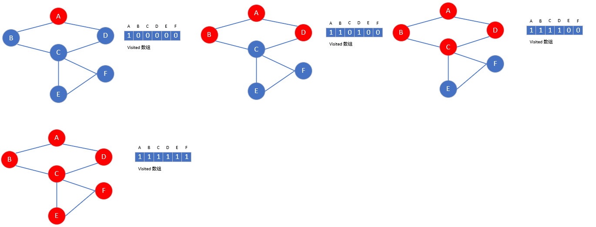
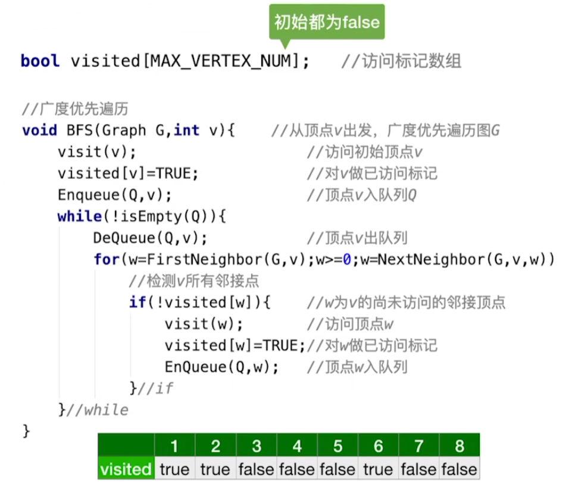
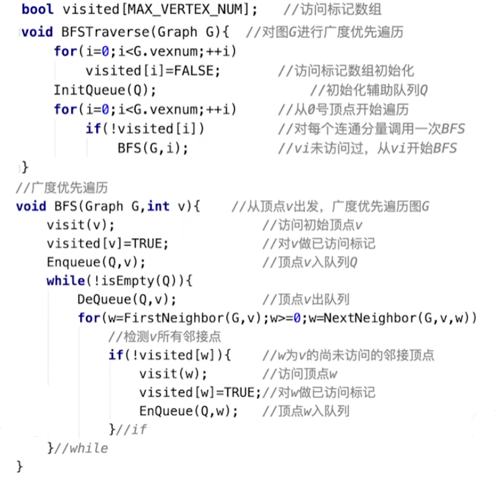
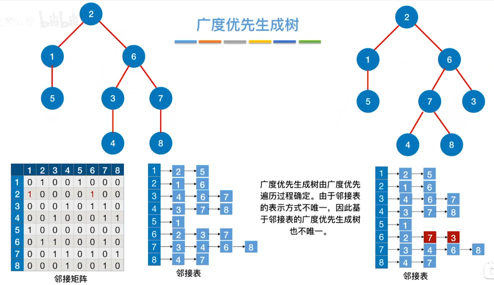

### [广度优先遍历算法 BFS *(Breadth First Search)*](#)

**介绍**： 图的广度优先搜索（Breadth First Search，BFS）又被称为宽度优先搜索，也叫图的层序遍历，是最常见的图搜索方法之一，**需要分别处理连通图或者非连通图两种情况**。

----

需要一个**标记数组**，用于标记节点已经被访问过了，**防止重复访问**，广度优先搜索指从某个节点（源点）出发，一次性访问所有未被访问的邻接点，再依次从这些已访问过的邻接点出发，一层一层地访问。

**基本思想是**：

**1、**从图中某个顶点V0出发，并访问此顶点；

**2、**从V0出发，访问V0的各个未曾访问的邻接点W1，W2，…,Wk;然后,依次从W1,W2,…,Wk出发访问各自未被访问的邻接点；

**3、**重复步骤2，直到全部顶点都被访问为止。

**算法步骤**:

首先，先准备一个**队列**（利用队列的结构）和一个**Visited 数组**  或者 **Set**（Set用来作为类似于注册的作用，防止节点重复进入队列），统称为访问数组。

* 第一步： 先把根顶点放入队列中，访问数组对应节点置已访问状态。
* 第二步： 如果队列非空
  * 获取队列长度，按照长度遍历队列中的节点
    * 取出顶点 node，进行访问，然后将其访问数组对应节点位置置为已访问状态
    * 获得其所有 **邻接节点**，如果未被访问则将其都放到队列中去
    * 如果一个节点已经没有next节点的时候，那就直接将该节点弹出去就行，不用注册也不用添加到队列中。
* 回到第二步继续执行，直到队列为空，结束。

**代码**：

#### 非连通图的问题

对于非连通图，如果要实现遍历还需要一点操作。

每次队列为空，需要判断 **Visited 数组** 是否还有节点未访问，有的话就将其加入到队列中

当然也可以采用如下的代码:

**效率**：

* 邻接矩阵 时间复杂度 O(|V|2)
* 邻接表 时间复杂度 O(|V|+|E|)

#### 广度优先生成树

使用广度优先遍历，可以生成一棵树、或者森林！

