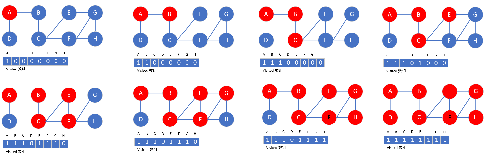
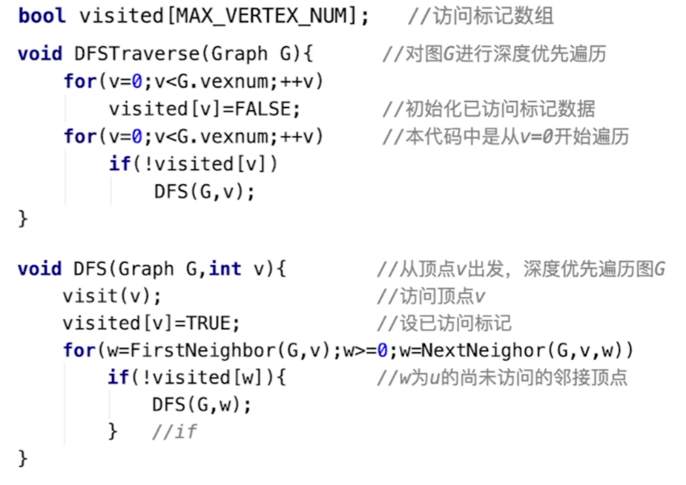

### [深度优先遍历算法 DFS *(Depth First Search)*](#)

**介绍**： 等同于树的先序遍历，也需要借助一个标记访问数组，指示顶点是否已经访问过了，还需要关注图是否连通。

----

需要借助递归或者栈来解决：

**算法实现**：

**效率**：

* 空间复杂度 O(n)

* 时间复杂度
  * 邻接矩阵：O(|V|2)
  * 邻接表: O(|V|+|E|)
