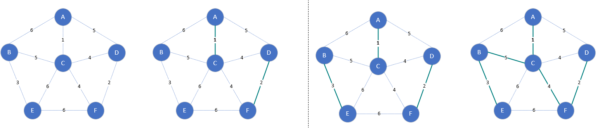
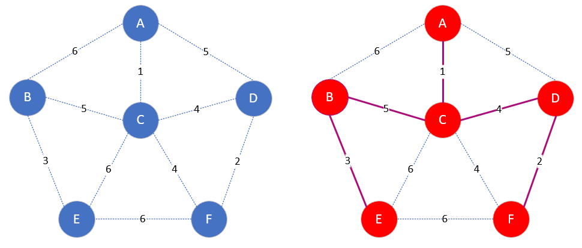

### [最小生成树 *Minimum-Spanning-Tree，MST*](#)

**介绍**：对于一个带权连通无向图G=(V,E)，生成树不同，每棵树的权（树中所有边上的权值和）也不同，设R为G的所有生成树的集合，若T为R中权值和最小的生成树，则T称为G的最小生成树（Minimum-Spanning-Tree，MST）。

---

### 一、基本概念

* 最小生成树可以用[kruskal](https://baike.baidu.com/item/kruskal/10242089?fromModule=lemma_inlink)（克鲁斯卡尔）算法或[prim](https://baike.baidu.com/item/prim/10242166?fromModule=lemma_inlink)（普里姆）算法求出。

* 最小生成树不唯一。

#### 1.1 克鲁斯卡尔 kruskal

每次选择权值最小的边，使这条边的两头连通（原本已近连通则不选）直到所有结点都连通， **由边开始，适合稀疏图**。时间复杂度 O(|E|Log2|E|)。

假设 G = ( V , E ) 是一个具有 n个顶点的带权连通无向图， T = ( U , TE ) 是 G的最小生成树，其中 U是 T的顶点集， **TE**是 **T**的边集，则由 G构造从起始顶点 v 出发的最小生成树 T的步骤如下：

* 置 U 的初值等于 v(即包含有 G中的全部顶点)，**TE** 的初值为空集（即图 T中每一个顶点都构成一个分量）；

* 将图 G中的边按权值从小到大的顺序依次选取：若选取的边未使生成树T形成回路，则加入 TE；否则舍弃，直到TE 中包含 n − 1条边为止；

实现 Kruskal 算法的关键是如何判断选取的边是否与生成树中己有的边形成回路，这可以通过并查集来解决；

#### 1.2 普里姆算法 Prim

本质上是一种贪心算法: 从某一个顶点（所以存在多个最小生成树）开始构建生成树，每次将代价最小的新顶点纳入生成树，直到所有顶点都纳入为止，**由顶点开始，适合稠密图**，时间复杂度 O(|V|2)。

假设 G = ( V , E ) 是一个具有 n个顶点的带权连通无向图， T = ( U , TE ) 是 G的最小生成树，其中 U是 T的顶点集， **TE**是 **T**的边集，则由 G构造从起始顶点 v 出发的最小生成树 T的步骤如下：

* 初始化 U = { v }；以 v到其他顶点的所有边为候选边；
* 重复以下步骤 n − 1次，使得其他 n − 1个顶点被加入到 U中：
  * 以顶点集 U和顶点集 V − U 之间的所有边(称为割集 ( U , V − U )作为候选边 即 **保证选择的边不能使得树存在环。** ，从中挑选权值最小的边(称为轻边)加入 **TE**，设该边在 V − U中的顶点是k，将 k 加入 U 中
  * 考察当前 V − U中的所有顶点 j，修改候选边，若 ( k ， j )的权值小于原来和顶点 j关联的候选边，则用 ( k , j )取代后者作为候选边；

