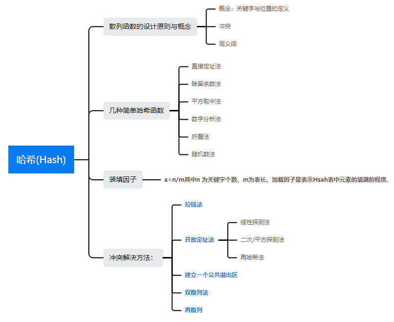

### [Data Structure - 哈希表 Hash](#)

**介绍**:  散列是一种以**常数平均时间复杂度**执行插入、删除和查找的技术。散列表 Hash Table，是一种数据结构，特点是：数据元素的**关键字**与其**存储地址**直接相关。

-----

**目录**:

* [散列函数、装填因子](./contents/HashFunction.md)
* 冲突解决方法
  * [拉链法](./contents/links.md)
  * [开放定址法](./contents/open.md)
  * [双散列法](./contents/double.md)
  * [建立一个公共溢出区](./contents/overflow.md)
  * 再散列：**将散列表扩容，构造一个新的散列表**

**思维导图**：

------

