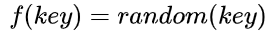

### [散列函数](#)

采用散列技术将记录存储在一块连续的存储空间中，这块连续的存储空间称为**散列表**(hash table)，将关键码映射为[散列表](https://so.csdn.net/so/search?q=散列表&spm=1001.2101.3001.7020)中适当存储位置的函数称为**散列函数**(hash function)，所得到的存储位置成为**散列地址**(hash address)。


### [1. 散列函数的设计原则与概念](#)

1. **计算简单**。散列函数不应该有很大的计算量，否则会降低查找效率。
2. **函数值(即散列地址)分布均匀**，希望散列函数能够把记录以相同的概率“散列”到散列表的所有地址空间中，这样才能保证存储空间的有效利用，并减少冲突。


以mod作为散列函数为例：


* 若不同的关键字通过散列函数映射到同一个值，则称为 <span style="color: red;font-size: 18px;" >**同义词**</span>。
* 当两个关键字散列到同一个单元的时候, 称为发生了 <span style="color: red;font-size: 18px;" >**冲突**</span>。

**冲突解决策略**：

* 分离链接法
* 拉链法(链地址法)
* 线性探测法


### [2. 几种常见的散列函数](#)

#### 1. 直接定址法

直接定址法的散列函数是关键码的线性函数，**适合关键字分布基本连续的情况，不连续导致空位较多**即：

```shell
H(key) = a × key + b（a，b为常数）
```

#### 2. 除留余数法

除留余数法的基本思想是：选择某个适当的正整数p，以关键码除以p的余数作为散列地址即：

**p**：如果m为散列表长度，则p取一个不大于 m或等于m的质数。

```c++
H(key) = key mod p
```

#### 3. 平方取中法

平方取中法是对**关键码平方**后，按散列表大小，**取中间若干位**作为散列地址（简称平方后截取），其原理是一个数平方后，中间的几位分布较均匀，从而冲突发生的概率较小。

比如假设关键字是 4321，那么它的平方就是 18671041，抽取中间的 3 位就可以是 671，也可以是 710，用做散列地址

#### 4. 数字分析法

如果**关键字**是**位数较多的数字**（比如手机号），且这些数字部分存在相同规律

则可以采用抽取**剩余不同规律部分**作为散列地址


比如手机号前三位是接入号，中间四位是 HLR 识别号，只有后四位才是真正的用户号

也就是说，如果手机号作为关键字，那么极有可能前 7 位是相同的

此时我们选择后四位作为散列地址就是不错的选择

 

同时，对于抽取出来的数字，还可以再进行反转

右环位移，左环位移等操作

 

**目的就是为了提供一个能够尽量合理地将关键字分配到散列表的各个位置的散列函数**


数字分析法通常适合处理关键字位数比较大的情况

如果事先知道关键字的分布且关键字的若干位分布较均匀，就可以考虑用这个方法


#### 5. 折叠法

折叠法是将关键字**从左到右分割成位数相等**的几部分（注意最后一部分位数不够时可以短些）

然后将这**几部分叠加求和**

并按**散列表表长**，**取后几位**作为***\*散列地址\****

比如假设关键字是 9876543210，散列表表长为三位

则我们可以将它分为四组 987|654|321|0

然后将它们叠加求和 987+654+321+0=1962

再取后 3 位得到散列地址即为 962


有时可能这还不能够保证分布均匀

那么也可以尝试从一端到另一端来回折叠后对齐相加

比如讲 987 和 321 反转

再与 654 和 0 相加，变成 789+654+123+0=1566

此时散列地址为 566

折叠法事**先不需要知道关键字的分布**，**适合****关键字位数较多的情况**


#### 6. 随机数法

选择一个随机数

**取关键字**的**随机函数值**为它的**散列地址**：

当关键字的**长度不等**时**采用**这个方法构造散列函数是比较**合适**的


### [3.  装填因子](#)

**装填因子**：a=n/m其中n 为关键字个数，m为表长。加载因子是表示Hsah表中元素的填满的程度.

加载因子是表示Hsah表中元素的填满的程度。

* 加载因子越大,填满的元素越多,好处是,空间利用率高了,但冲突的机会加大了。
* 加载因子越小,填满的元素越少,好处是:冲突的机会减小了,但:空间浪费多了。


冲突的机会越大,则查找的成本越高.反之,查找的成本越小.因而,查找时间就越小.

因此,必须在 "冲突的机会"与"空间利用率"之间寻找一种平衡与折衷. 这种平衡与折衷本质上是数据结构中有名的"时-空"矛盾的平衡与折衷.
