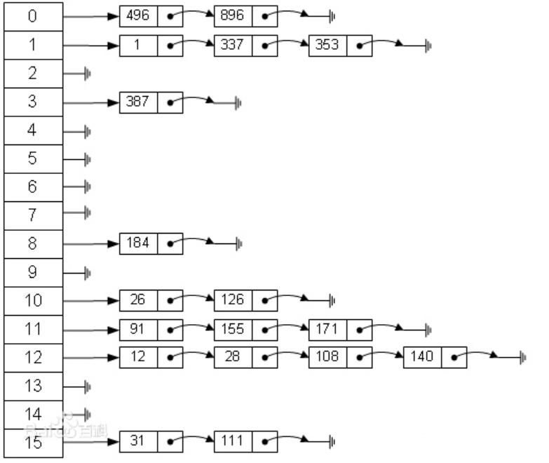
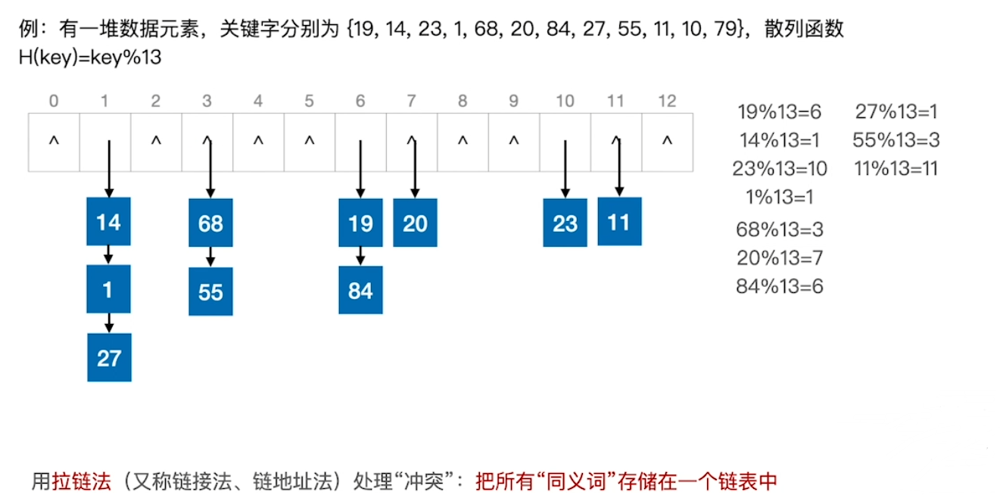

### [拉链法](#)

**介绍**：将[哈希值](https://links.jianshu.com/go?to=https%3A%2F%2Fbaike.baidu.com%2Fitem%2F%E5%93%88%E5%B8%8C%E5%80%BC)相同的数据元素存放在一个[链表](https://links.jianshu.com/go?to=https%3A%2F%2Fbaike.baidu.com%2Fitem%2F%E9%93%BE%E8%A1%A8)中，在查找[哈希表](https://links.jianshu.com/go?to=https%3A%2F%2Fbaike.baidu.com%2Fitem%2F%E5%93%88%E5%B8%8C%E8%A1%A8)的过程中，当查找到这个链表时，必须采用线性查找方法。这样的好处是，不怕冲突多；缺点是降低了散列结构的随机存储性能。本质是用单链表结构辅助散列结构的不足。

例如：

