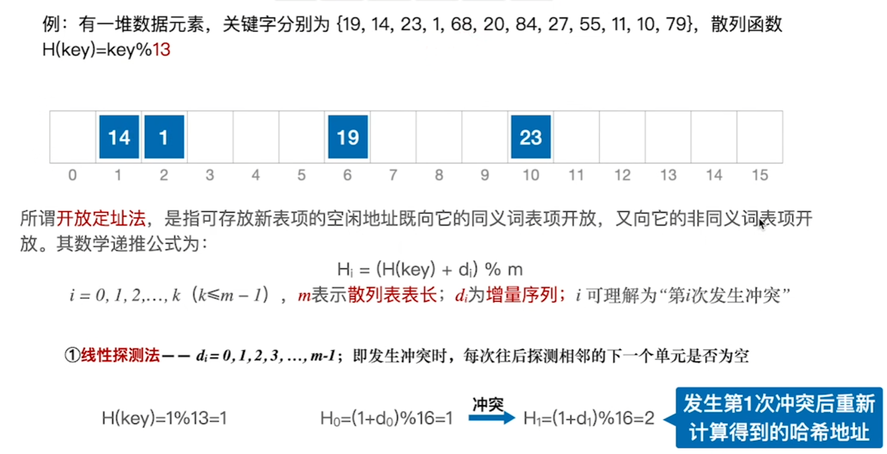
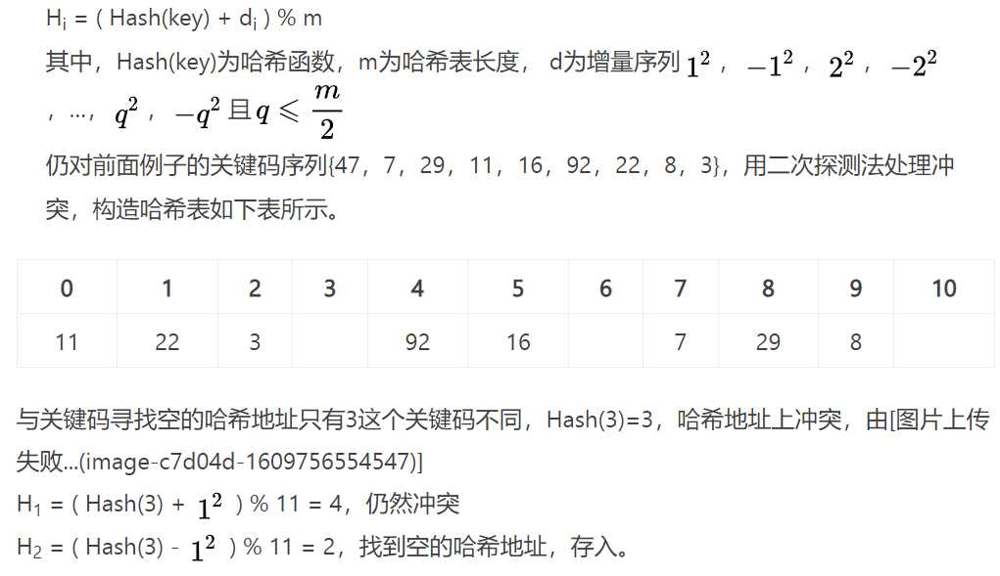
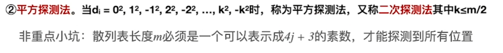

### [开放定址法](#)

**介绍**：所谓开放定址法，即由关键码得到的哈希地址一旦产生了冲突，也就是说，该地址已经存放了数据元素。我们需要寻找下一个空的哈希地址，只要哈希表足够大，空的哈希地址总能找到，并将数据元素存入。

----

#### 1. 线性探测法：

线性探测法的地址增量di = 1, 2, ... , m-1，其中，i为探测次数。该方法一次探测下一个地址，知道有空的地址后插入，若整个空间都找不到空余的地址，则产生溢出。

H1 = ( Hash(3) + 1 ) % 11 = 4，仍然冲突
H2 = ( Hash(3) + 2 ) % 11 = 5，仍然冲突
H3 = ( Hash(3) + 3 ) % 11 = 6，找到空的哈希地址，存入。

**分析**：

线性探测法可能使第i个哈希地址的同义词存入第i+1个哈希地址，这样本应存入第i+1个哈希地址的元素变成了第i+2个哈希地址的同义词……因此，

可能出现很多元素在相邻的哈希地址上**“堆积”**起来，大大**降低了查找效率**。为此，可采用**二次探测法**，或再哈希函数探测法，以改善“堆积”问题。

#### 2. 二次探测法

**二次探测法**生成的探测地址序列不是连续的，而是跳跃式的，为后续待插入的记录留下空间从而减少堆聚。

由于采用的是平方：有些位置无法探测到

#### 3. 伪随机数探测法

和上面差不多不过，di 是一个随机数。
