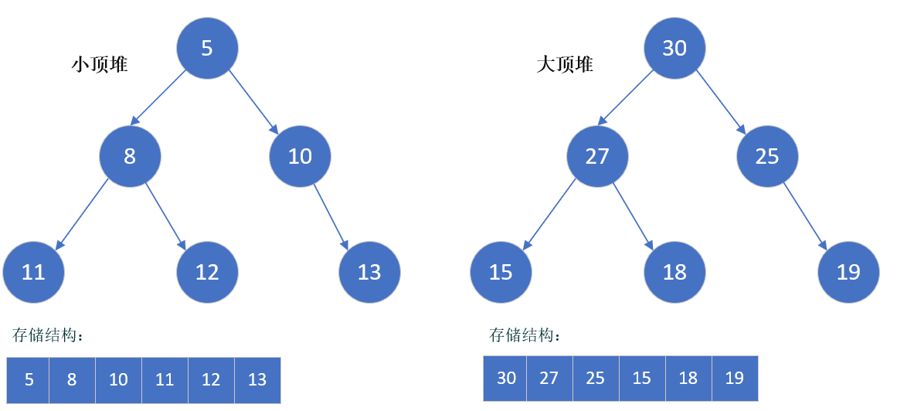
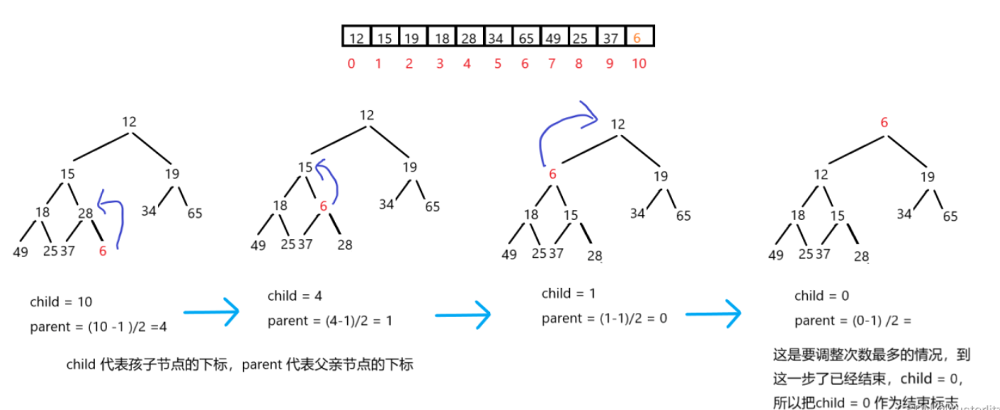
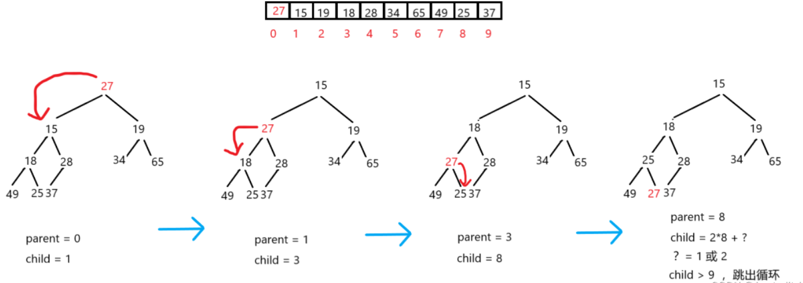

### [Data Structure - 堆 Heap](#)

**介绍**：堆(Heap)是计算机科学中一类特殊的数据结构，是最高效的优先级队列。**堆通常是一个可以被看做一棵完全二叉树的数组对象**。



**堆（heap）**:

- 堆中某个结点的值总是不大于或不小于其父结点的值；
- 堆总是一棵完全二叉树。
- 将根节点最大的堆叫做最大堆或大根堆，根节点最小的堆叫做**最小堆（小根堆）**或**小根堆（大顶堆）**。
-  堆的存储不同于链表的存储，堆的存储是用一个**一维数组**来存储的。
- 堆的两个基本操作为**down操作**和**up操作**，顾名思义，down操作就是向下调整，up操作就是向上调整
- 由于建堆是从倒数第二行开始，所以 是 h-1 层开始计数。最终结果约等于 N 。所以向下调整算法建堆的时间复杂度是O（N）

* 具有n 个(n>0)结点的完全二叉树的高度为，上下调整算法的时间负责度与此相关！
$$
\lfloor \log _{2}^{n} \rfloor +1
$$

[参考文章 ：https://blog.csdn.net/m0_65679465/article/details/127998659](https://blog.csdn.net/m0_65679465/article/details/127998659)

#### 堆的基本操作
C语言描述，核心就是**上下调整和根删除**。

```cpp
// 堆的构建
Heap* HeapCreate();
// 堆的销毁
void HeapDestroy(Heap* hp);
// 堆的插入
void HeapPush(Heap* hp, HPDataType x);
//向下调整算法
void AdjustDown(HPDataType* a, size_t size);
// 堆的删除
void HeapPop(Heap* hp);
// 取堆顶的数据
HPDataType HeapTop(Heap* hp);
// 堆的数据个数
int HeapSize(Heap* hp);
// 堆的判空
int HeapEmpty(Heap* hp);
```

* **插入一个数**：插入一个数是在数组的最后面插入,然后不断往上移，heap[++size]=x，up(size)；
* **求集合中的最小值**：数组第一个数一定是最小的；heap[1];
* **删除最小值**:  删除最小值需要一定技巧，因为堆是一个一维数组，删除第一个比较困难，所以将数组的最后一个覆盖到第一个数，然后将最后一个数删除，最后在down操作一遍；
  * heap[1]=heap[size],size--,down(1);
* **删除任何一个元素**: 和删除根节点是类似的，假如是第k的点那么就是让最后一个数等于第k个数，这里需要判断一下看看改变后的k是变大了还是变小了，我们也可以不进行判断直接down操作一遍up操作一遍，因为无外乎只有3种情况变大，变小或者不变，所以down和up只会选择一个。
  * heap[k]=heap[size],size--,down(k),up(k);
* 修改任何一个元素: 修改一个元素和删除一个元素同理，我们修改完以后down操作一遍up操作一遍就可以了。heap[k]=x,down(k),up(k);


#### **向上调整算法**




#### 向下调整算法




#### 堆的数据删除

删除最小值:  删除最小值需要一定技巧，因为堆是一个一维数组，删除第一个比较困难，所以将数组的最后一个覆盖到第一个数，然后将最后一个数删除，最后在down操作一遍；


#### 实现

```cpp
#include <iostream>
#include <queue>
#include "treeNode.hpp"
#include "mathTool/cal.h"
#include <chrono>
#include <thread>
using namespace std::literals;
using namespace  std::literals::chrono_literals;

class user {
private:
    std::string _name;
    uint16_t _age;
public:
    user(): user("",0){
        std::cout << "Call default constructor" << std::endl;
    };
    user(const user& other): _name(other._name),_age(other._age){
        std::cout << "Call copy constructor" << std::endl;
    };
    explicit user(const std::string& name, const uint16_t& age):_name(name), _age(age){
        std::cout << "Call constructor" << std::endl;
    };
    std::string getName() const{ return _name; };
    uint16_t getAge() const{ return _age; };
    ~user() {
        std::cout << "Call destory" << std::endl;
    };

    bool operator<(const user&other) const{
        return _age < other._age;
    }

    bool operator>(const user&other) const{
        return _age > other._age;
    }
};

template<class T, typename  = typename std::enable_if< std::is_default_constructible_v<T>>>
struct MinHeap{
constexpr static const uint32_t DefaultCapacity = 16;
private:
    T * store;
    uint32_t size;
    uint32_t capacity;
public:
    MinHeap(){
        store = (T*)calloc(DefaultCapacity, sizeof(T));
        capacity = DefaultCapacity;
        size = 0;
    };

    T& front(){
        if (isEmpty()) throw std::logic_error("the heap is empty!");
        return store[0];
    }

    void insert(const T& value){
        expand();
        store[size] = value;
        up(size);
        size++;
    }

    void up(uint32_t idx){
        //有无父母
        if (idx == 0) return; //已经到根了 无序调整理
        auto fatherIdx = (idx - 1)/2;
        if (store[idx] < store[fatherIdx]){
            T temp;
            temp = store[fatherIdx];
            store[fatherIdx] = store[idx];
            store[idx] = temp;
            //继续调整
            up(fatherIdx);
        }
    }

    inline bool isEmpty(){ return size == 0;}

    void Pop(){
        if (isEmpty()) throw std::logic_error("the heap is empty!");
        store[0] = store[size - 1];
        down(0);
    }

    void down(uint32_t idx){
        if (idx >= size) return;
        auto leftSonIdx = idx * 2 + 1;
        auto rightSonIdx = idx * 2 + 2;
        if (leftSonIdx < size){
            //有左孩子
            if (rightSonIdx < size){
                //还有右孩子
                if (store[leftSonIdx] > store[rightSonIdx]){
                    //右孩子小一些
                    if (store[idx] > store[rightSonIdx]){
                        std::swap(store[idx], store[rightSonIdx]);
                        down(rightSonIdx);
                    }
                }else{
                    if (store[idx] > store[leftSonIdx]){
                        std::swap(store[idx], store[rightSonIdx]);
                        down(rightSonIdx);
                    }
                }
            }else{
                if( store[leftSonIdx] < store[idx]){
                    std::swap(store[idx], store[leftSonIdx]);
                    down(leftSonIdx);
                }
            }
        }//没有孩子直接 GG
    }

    void expand(){
        if (size >= capacity){
            capacity *= 2;
            auto new_store = (T*)calloc(capacity, sizeof(T));
            for (int i = 0; i < size; ++i) {
                new_store[i] = store[i];
            }
        }
    }
    ~MinHeap(){
        std::cout << "destory min heap!" << std::endl;
        free(store);
        store = nullptr;
    }

};


int main() {
    user me{"remix", 28};
    user zm{"qu", 29};
    user sm{"qwe", 27};
    user qm{"qweqw", 24};

    MinHeap<user> heap;
    heap.insert(me);
    heap.insert(zm);
    heap.insert(sm);
    heap.insert(qm);

    heap.Pop();
    heap.Pop();

    std::cout <<  "name: " <<heap.front().getName() << std::endl;

    return 0;
}
```

