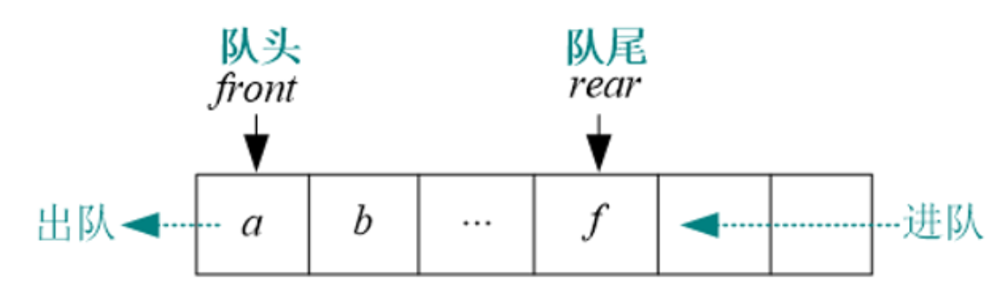
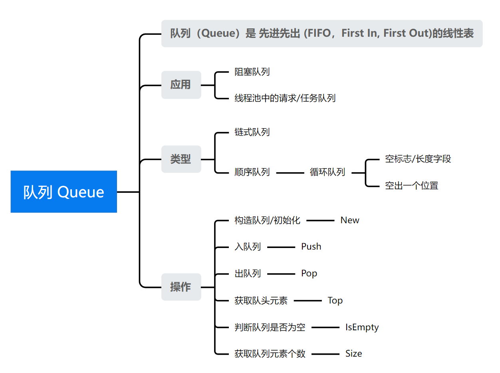

### [Data Structure - 队列 Queue](#)

**介绍**:   **队列（Queue）** 是 **先进先出 (FIFO，First In, First Out)** 的线性表。在具体应用中通常用链表或者数组来实现，用数组实现的队列叫作 **顺序队列** ，用链表实现的队列叫作 **链式队列**。

----

它只允许在表的一端进行插入，而在另一端删除元素。在队列中，允许插入的一端叫做**队尾 Rear**，允许删除的一端叫做**队头 Front**。

队列既可以用**数组**和也可以用**链表**的结构实现，使用链表的结构实现更优一些，因为如果使用数组的结构，每次删除队头，后面的元素就要向前移动，所以效率比较低。

* 使用数组实现的队列**存在“假溢出”的问题也就是明明有位置却不能添加的情况，解决方法是**：[**循环队列**](./circularQueue.md)
  * 循环队列可以解决顺序队列的假溢出和越界问题。解决办法就是：从头开始，这样也就会形成头尾相接的循环，这也就是循环队列名字的由来。

* 用链表表示的队列简称**链队列**, 一个链队列显然需要两个分别指示队头和队尾的指针才能唯一确定。

#### 导图：

#### 队列操作模型

根据操作队列的场景分为四大模型

* 单生产者——单消费者
* 多生产者——单消费者
* 单生产者——多消费者
* 多生产者——多消费者。

根据队列中数据分为：

* 队列中的数据是定长的
* 队列中的数据是变长的
