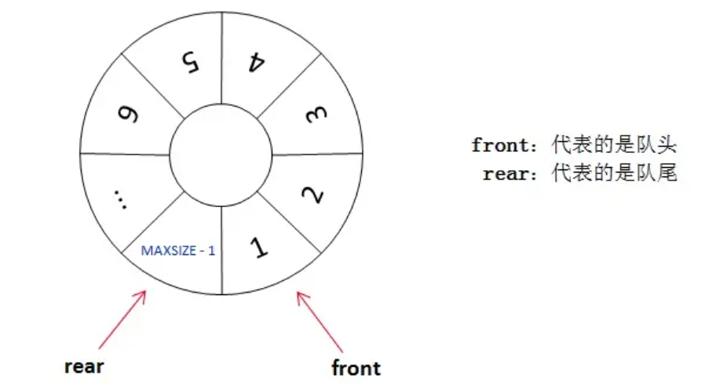

### [循环队列 SequenceQueue](#)

循环队列可以解决顺序队列的假溢出和越界问题。解决办法就是：从头开始，这样也就会形成头尾相接的循环，这也就是循环队列名字的由来。


顺序队列中，我们说 `front==rear` 的时候队列为空，循环队列中则不一样，也可能为满，如上图所示。解决办法有两种：

1. 可以设置一个**标志变量** `flag`,当 `front==rear` 并且 `flag=0` 的时候队列为空，当`front==rear` 并且 `flag=1` 的时候队列为满，或者增加一个长度表示。
2. 队列为空的时候就是 **front==rear** ，队列满的时候，我们保证数组还有一个**空闲的位置**，rear 就指向这个空闲位置，如下图所示，那么现在**判断队列是否为满的条件就是：`(rear+1) % QueueSize==front`** 。




C++ 实现，空一个元素方式的循环队列实现！

```cpp
template<typename ValueType,unsigned int Count>
class ArrayQueue{
private:
    int front;
    int rear;
    ValueType *base;
    unsigned int capacity;
public:
    ArrayQueue(){
        front = rear = 0;
        capacity = Count + 1;
        base = static_cast<ValueType*>(calloc(Count + 1, sizeof(ValueType)));
        if (base == nullptr){
            throw std::bad_alloc();
        }
    }

    inline bool isEmpty(){
        if (front == rear) return true;
        return false;
    }

    void pop(){
        if (this->isEmpty()){
            throw std::logic_error("the queue is empty!");
        }
        front = (front+1) % capacity;
    }

    ValueType& top(){
        if (this->isEmpty()){
            throw std::logic_error("the queue is empty!");
        }
        return base[front];
    }

    bool pushBack(const ValueType & v){
        //判断是否满了
        if ((rear + 1)%capacity == front){
            return false;
        }
        base[rear++] = v;
        return true;
    }

    bool pushBack(ValueType && v){
        if ((rear + 1)%capacity == front){
            return false;
        }
        base[rear++] = v;//call 移动构造函数
        return true;
    }

    unsigned int size(){
        return  (rear - front + capacity) % capacity;
    }

    ~ArrayQueue(){
        free(base);
    }
};
```


测试
```cpp
ArrayQueue<int, 10> numbers;
numbers.pushBack(22);
numbers.pushBack(23);
numbers.pushBack(24);
numbers.pushBack(25);
numbers.pushBack(26);

std::cout << "len: " << numbers.size() << std::endl;
while (!numbers.isEmpty()){
    std::cout << numbers.top() << " " <<std::endl;
    numbers.pop();
}
```