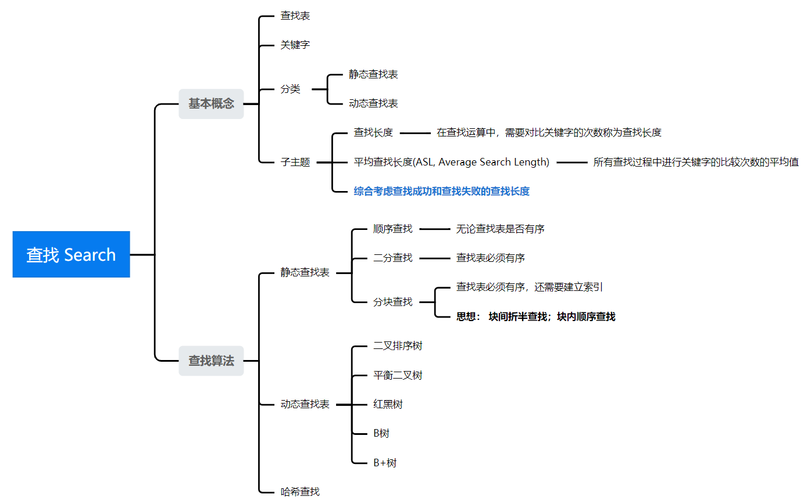

### [Data Structure - 查找 Search](#)

**介绍**:   在数据集合中寻找满足某种条件的数据元素的过程称为**查找**。

----
**查找表**(查找结构的统称，并非新的数据结构)： 用于查找的数据集合称为[查找表](https://so.csdn.net/so/search?q=查找表&spm=1001.2101.3001.7020)，它由同一类型的数据元素(或记录)组成(线性结构、树状结构、图状结构等都可）

**关键字**：数据元素中**唯一**标识该元素的某个数据项的值，使用基于关键字的查找，查找结果应是唯一的。

**静态查找表**：仅做查询和检索操作的查找表，仅关注查找速度即可。

**动态查找表**：在查询之后，还需要将查询结果为不在查找表中的数据元素插入到查找表中；或者，从查找表中删除其查询结果为在查找表中的数据元素。

#### 目录：

* 静态查找表

  * [顺序查找](./contents/sequence.md)

  * [二分查找](./contents/binary.md)

  * [分块查找](./contents/blockSearch.md) 

* 动态查找表 
  * 请看数据结构之**树**

* 哈希查找
  * 请看数据结构之**哈希**

#### 导图：

