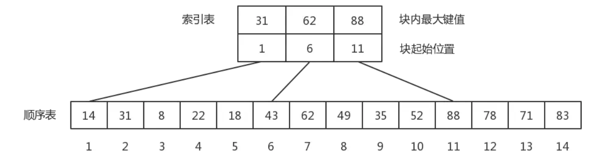
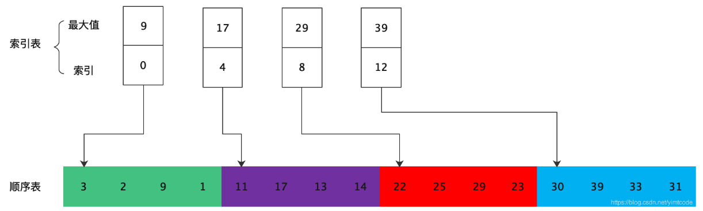
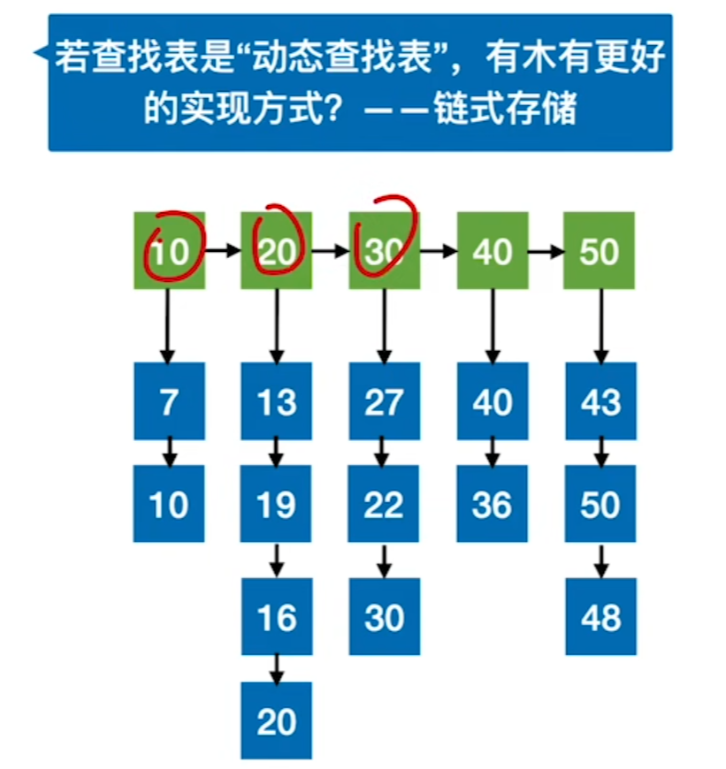

### [Block Search 分块查找 ](#)

**介绍**： 分块查找(索引[顺序查找](https://so.csdn.net/so/search?q=顺序查找&spm=1001.2101.3001.7020)）：分块查找又称索引顺序查找，是顺序查找的一种改进方法，除本身外，还需要建立一个索引表,由于**只要求索引表是有序的**，对块内节点没有排序要求，因此特别适合于节点动态变化的情况。

----

**解释**：它吸取了顺序查找和折半查找各自的优点，既有动态结构，又适于快速查找。折半查找其实也算是分块查找的特殊用法，分块查找的速度虽然不如折半查找算法，但比顺序查找算法快得多，同时又不需要对全部节点进行排序。当节点很多且块数很大时，对索引表可以采用折半查找，这样能够进一步提高查找的速度。

* 后面的索引块中最小值大于前一个块中的最大值
* 块内无序，块间有序。
* **思想： 块间折半查找；块内顺序查找**
* 索引表一定是有序的

如下索引表：

* [1, 5] 是一个索引块，最大值为31
* [6, 11] 是一个索引块，最大值为64, 最小值一定大于32
* [12, 14] 是一个索引块，最大值为88, 最小值一定大于64




其他例子，索引从0开始：




数据结构:

```cpp
//索引表数据元素
template<typename V>
struct Index{
    V maxValue; //最大值
    int low, high;// [low, high]
};
```



