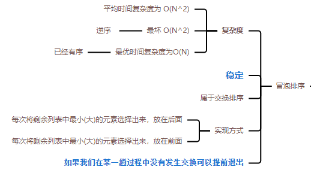

### [Bubble Sort - 冒泡排序](#)

**介绍**：  冒泡排序是一种简单的排序算法，它也是一种稳定排序算法。其实现原理是重复扫描待排序序列，并比较每一对相邻的元素，当该对元素顺序不正确时进行交换。一直重复这个过程，直到没有任何两个相邻元素可以交换，就表明完成了排序。 

----





* 时间复杂度：最差时间复杂度为`O(n2)`，最优时间复杂度为`O(n)`，平均时间复杂度为 `O(n2)`
* 空间复杂度：O(1)
* 稳定性：稳定
* **属于交换排序**


比较相邻的元素。如果第一个比第二个大，就交换他们两个。

对每一对相邻元素作同样的工作，从开始第一对到结尾的最后一对。这步做完后，最后的元素会是最大的数。

针对所有的元素重复以上的步骤，除了最后一个。 

持续每次对越来越少的元素重复上面的步骤，直到没有任何一对数字需要比较。

**如果我们在某一趟过程中没有发生交换可以提前退出**, [**重点**](#) !

**代码实现**：

```cpp
/* ** 每次把最大的放在后面 ** */
template<typename T, typename Compare = std::function<int(const T&,const T&)>>
void bubbleSort(std::vector<T>& array, Compare bubbleCompare){
    auto count = array.size();
    for (int i = 0; i < count - 1; ++i) {
        bool isChange = false;
        for (int j = 0; j < count - 1 - i; ++j) {
            if (bubbleCompare(array[j + 1], array[j]) < 0){
                std::swap(array[j], array[j+1]);
                isChange = true;
            }
        }
        if (!isChange) return;
    }
}
```

