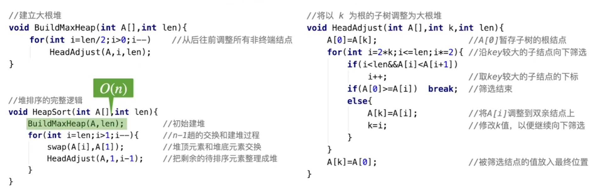

### [Heap Sort 堆排序](#)

**介绍**： 堆排序是利用堆这种数据结构而设计的一种排序算法，堆排序是一种选择排序，它的最坏，最好，平均时间复杂度均为 **O(nlogn)**，它也是不稳定排序。

----

[**堆**](../../Heap)是一种叫做**完全二叉树**的数据结构，可以分为大根堆，小根堆，而堆排序就是基于这种结构而产生的一种程序算法，**顺序存储**。

**堆排序**: 是指利用堆这种数据结构所设计的一种排序算法。堆积是一个近似完全二叉树的结构，并同时满足堆积的性质：即子结点的键值或索引总是小于（或者大于）它的父节点。堆排序可以说是一种利用堆的概念来排序的选择排序。分为两种方法：

1. 大顶堆：每个节点的值都大于或等于其子节点的值，在堆排序算法中用于升序排列。
2. 小顶堆：每个节点的值都小于或等于其子节点的值，在堆排序算法中用于降序排列。


* 稳定性：**不稳定**

* 时间复杂度： 最坏，最好，平均时间复杂度均为 **O(nlogn)**

* 建堆的时间负责度 **O(n)**,  有几个元素就要查看几遍。


**思想**: 堆排序就是把堆顶的元素与最后一个元素交换，交换之后破坏了堆的特性，我们再把堆中剩余的元素再次构成一个大顶堆，然后再把堆顶元素与最后第二个元素交换….如此往复下去，等到剩余的元素只有一个的时候，此时的数组就是有序的了。

#### 1. 算法步骤

1. 创建一个堆 H[0……n-1]；
2. 把堆首（最大值）和堆尾互换；
3. 把堆的尺寸缩小 1，并调用 shift_down(0)，目的是把新的数组顶端数据调整到相应位置；
4. 重复步骤 2，直到堆的尺寸为 1。


#### 标准实现：




#### 本人实现
首先将序列构建成一个大顶堆, 利用分支节点个数 = `n/2`。

那么如何构建呢？ 我们找到了最后一个非叶子节点，，比较它的左右节点中最大的一个的值，是否比他大，如果大就交换位置。

```cpp
template<typename T, typename Compare = std::function<int(const T&,const T&)>>
void buildMaxHeap(std::vector<T>& array,Compare compare){
    auto count = array.size();
    if (count <= 1) return;
    int branchNode = static_cast<int>((array.size() - 1)/2);
    for (int i = branchNode; i >= 0; i--) {
        adjustDown(array,i, count, compare);
    }
}
```

调整算法：
```cpp
template<typename T, typename Compare = std::function<int(const T&,const T&)>  >
void adjustDown(std::vector<T>& array,size_t index, size_t count, Compare compare){
    for (int i = index * 2 + 1; i < count; ) {
        if (i + 1 < count && compare(array[i + 1],array[i]) > 0) i++;
        //i为最大孩子的
        if (compare(array[i],array[index]) > 0){
            //交换一下
            std::swap(array[i], array[index]);
            //继续调整子孩子
            index = i;
            i = i * 2 +1;
        }else{
            break; //调整完了
        }
    }
}
```

我们再把堆中剩余的元素再次构成一个大顶堆，然后再把堆顶元素与最后第二个元素交换….如此往复下去，等到剩余的元素只有一个的时候，此时的数组就是有序的了。

```cpp
//build 建立大根堆
template<typename T, typename Compare = std::function<int(const T&,const T&)>  >
void heapSort(std::vector<T>& array, Compare compare){
    auto count = array.size();
    if (count < 2){ return;}
    //建立大顶堆
    buildMaxHeap(array, compare);
    //交换顺序，然后调整
    for (int i = array.size() - 1; i > 0 ; i--) {
        std::swap(array[i], array[0]); //交换
        adjustDown(array, 0, i, compare); //向下调整
    }
}
```


