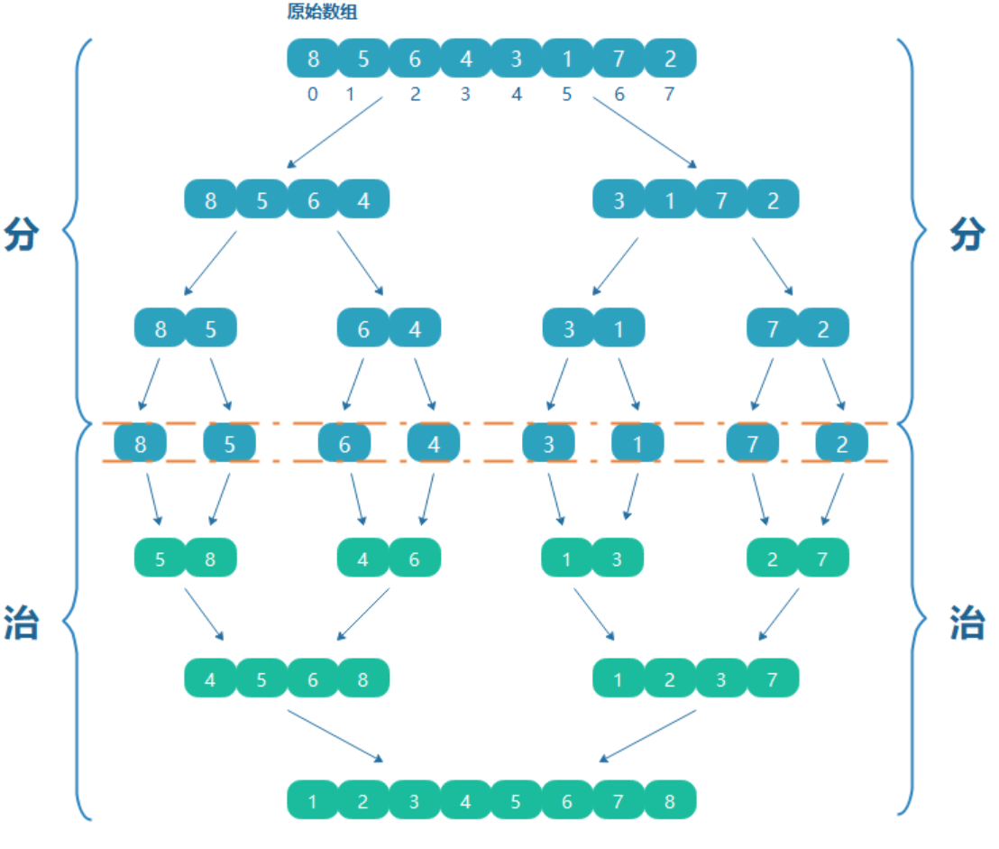
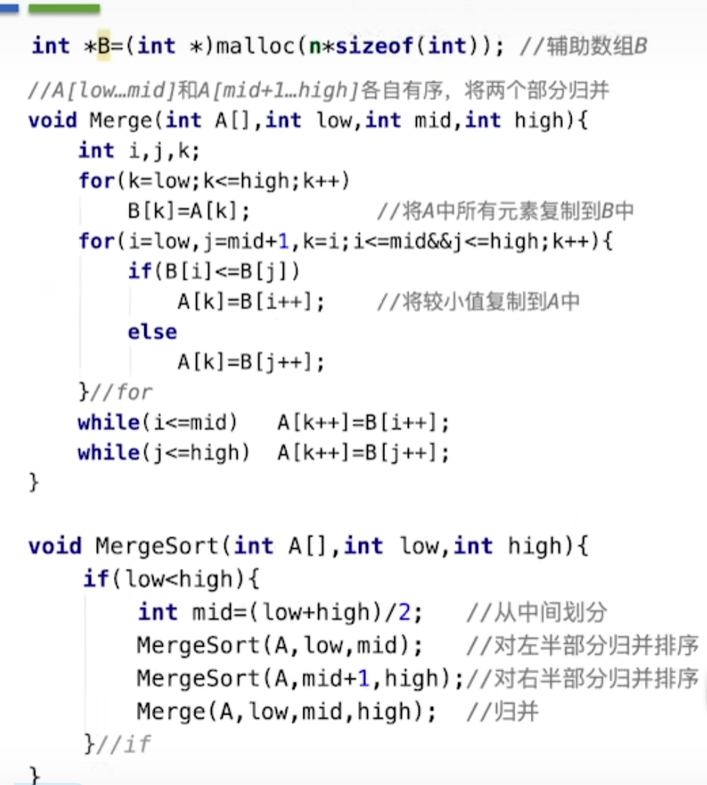
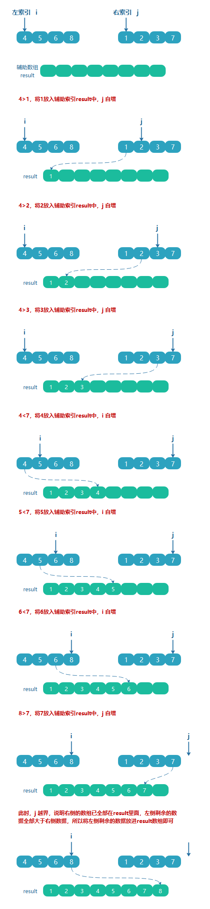

### [归并排序](#)

**介绍**：  归并排序（Merge sort）是建立在归并操作上的一种有效的排序算法。该算法是采用**分治法(Divide and Conquer)**的一个非常典型的应用。作为一种典型的分而治之思想的算法应用，**若将两个有序集合并成一个有序表，称为2-路归并，与之对应的还有多路归并。**


归并排序总时间 = 分解时间 + 子序列排好序时间 + 合并时间

* **归并排序的时间复杂度为：O(nlogn)**
* 一般使用 2-路归并
* 空间复杂度 O(n)


**基本思想**：



#### 算法标准实现:



#### 自己的实现:

```cpp
//用于合并操作
template<typename T, typename Compare = std::function<int(const T&,const T&)>  >
void merge(std::vector<T>& array,std::shared_ptr<T[]> temp, int low, int mid, int height ,Compare compare){
    if (low >= height) return;
    //需要一个数组存储临时值
    for (int i = low; i <= height; ++i) {
        temp[i] = array[i];
    }
    int i = low, j = mid + 1, k = low;
    while (i <= mid && j <= height){
        //i 优先
        if (temp[i] <= temp[j]) {
            array[k] = temp[i];
            i++;
        }else{
            array[k] = temp[j];
            j++;
        }
        k++;
    }
    while (i <= mid) array[k++] = temp[i++];
    while (j <= height) array[k++] = temp[j++];
}

//主要结构
//low ~ mid |  mid+1 ~ height
template<typename T, typename Compare = std::function<int(const T&,const T&)>  >
void mergeSortExecutor(std::vector<T>& array, std::shared_ptr<T[]> temp, size_t low, size_t height, Compare compare){
    if (low < height){
        auto mid = (low + height)/2;
        mergeSortExecutor(array,temp, low, mid, compare);
        mergeSortExecutor(array,temp, mid + 1, height, compare);
        merge(array,temp, low, mid, height, compare);
    }
}

template<typename T, typename Compare = std::function<int(const T&,const T&)>  >
void mergeSort(std::vector<T>& array, Compare compare){
    //临时数组
    std::shared_ptr<T[]> tempArray( new T[array.size()], [](T* ptr){ delete [] ptr; });
    mergeSortExecutor(array, tempArray, 0, array.size() - 1, compare);
}
```


#### 例子讲解：

借助一个辅助空数组，把左右两边的数组按照大小比较，按顺序放入辅助数组中即可。

