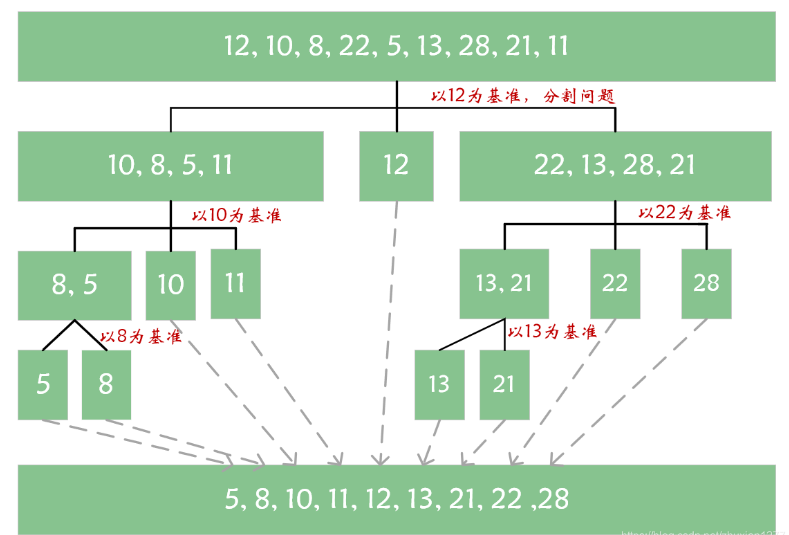
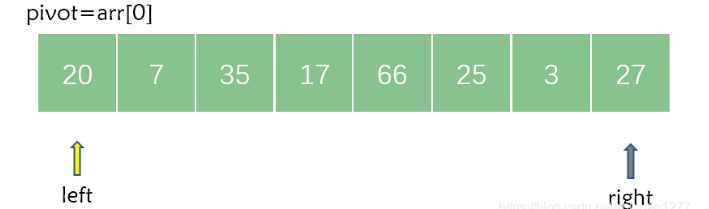
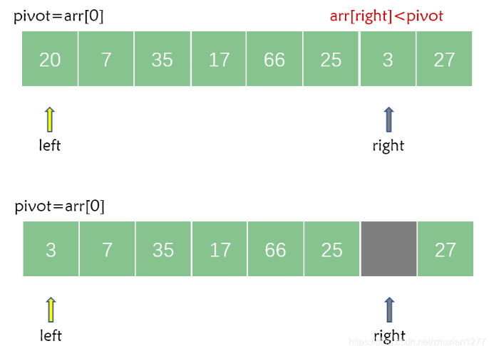
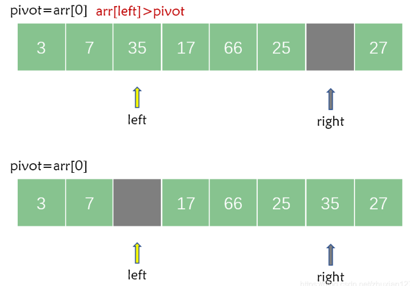
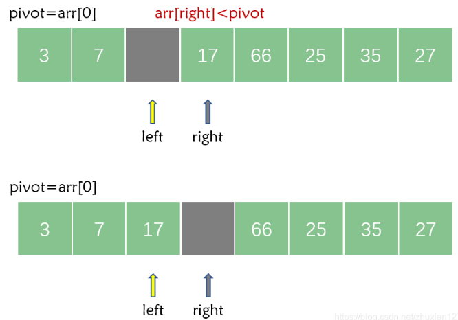
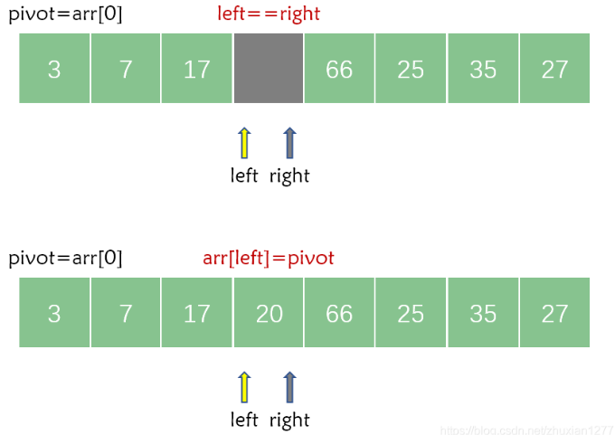

### [Quick Sort 快速排序](#)

**介绍**： 快速排序（*Quick Sort*）是对**冒泡排序的一种改进**，基于**分治**的思想，通过一趟排序将待排序记录分割成独立的两部分，其中一部分记录的关键字均比另一部分记录的关键字小，则可以分别对着两部分记录继续进行排序，以达到整个序列有序。

-----

- 稳定性：**并不稳定**
- 复杂度：
  - 最好 O(n log n)
  - 最坏 n^2，选第一个作为基准，列表完全逆序！

* 适合：数组

* 空间复杂度：O(log n)， 几趟用几个空间！

  

#### 1. 快速排序过程解析

假设待排序的序列为 `arr[0]~arr[n-1]`，首先任意选取一个元素（通常选取第一个）为基准元素（pivot），然后按照下述原则重新排列其余记录：将所有比它小的元素都安置在它的位置之前，将所有比它大的元素都安置在它的位置之后。最后以该基准元素所落的位置 i 作为分界线，可以将序列分割成 `arr[0]~arr[i-1]`、`arr[i+1]~arr[n-1]` 两个子序列。这个过程叫做一趟快速排序（或一次划分）。




1. 首先对待排序序列进行一趟快速排序；
2. 一趟排序下来之后，基准元素的左边都是比它小的元素，右边都是比它大的元素；
3. 再对基准元素左边的序列进行快速排序，对右边也进行快速排序；
4. 重复步骤2、3，直到序列排序完成。


#### 2. 快速排序的具体步骤

快速排序最核心的地方在于一趟快速排序过程。一趟快速排序的具体步骤是（以从小到大排序为例）：

1. 附设两个指针 `left` 和 `right`，它们初始分别指向待排序序列的左端和右端；此外还要附设一个基准元素 `pivot`（一般选取第一个，本例中初始 `pivot` 的值为 20）, **但是这样不好，可以利用随机函数产生一个left ~ right的随机数，然后再交换第一个元素和pivot的值即可**。

    ```cpp
    std::mt19937_64 engine(time(0));
    std::uniform_int_distribution<size_t> g(low,height);
    size_t pivot = g(engine);
    
    T pivotValue = array[pivot];
    ```




2. 首先从 `right` 所指的位置从右向左搜索找到第一个小于 `pivot` 的元素，然后将其记录在基准元素所在的位置。
	```cpp
	 while (low < height){
        /* 首先从右边开始搜索 */
        while (array[height] >= pivotValue && height > low ) height--;
        array[low] = array[height]; //然后移动值
	
        while (array[low] < pivotValue && low < height ) low++;
        array[height] = array[low];
    }
	```
	


3. 接着从 `left` 所指的位置从左向右搜索找到第一个大于 `pivot` 的元素，然后将其记录在 `right` 所指向的位置。
    ```cpp
     while (low < height){
         while (array[height] >= pivotValue && height > low ) height--;
         array[low] = array[height];
     	/* 从左边边开始搜索 */
         while (array[low] < pivotValue && low < height ) low++;
         array[height] = array[low];//然后移动值
     }
    ```



4. 然后再从 `right` 所指向的位置继续从右向左搜索找到第一个小于 `pivot` 的元素，然后将其记录在 `left` 所指向的位置，**继续循环**。



5. 接着，`left` 继续从左向右搜索第一个大于 `pivot` 的元素，如果在搜索过程中出现了 `left == right` ，则说明一趟快速排序结束。此时将 `pivot` 记录在 `left` 和 `right` 共同指向的位置即可。
	```cpp
        while (low < height){
            while (array[height] >= pivotValue && height > low ) height--;
            array[low] = array[height];
   
	         while (array[low] < pivotValue && low < height ) low++;
            array[height] = array[low];
        }
        array[low] = pivotValue; //交换值
   ```
	


#### 3. 快速排序的代码实现

自己的实现：

```cpp
/*
  小于 < pivot <= 大于等于
*/
template<typename T>
void quickSort(std::vector<T>& array, size_t low, size_t height){
    auto start = low;
    auto end = height;
    if (low >= height) { return; }
	//生成随机数
    std::mt19937_64 engine(time(0));
    std::uniform_int_distribution<size_t> g(low,height);
    size_t pivot = g(engine);

    T pivotValue = array[pivot];

    std::swap(array[low], array[pivot]);

    while (low < height){
        while (array[height] >= pivotValue && height > low ) height--;
        array[low] = array[height];

        while (array[low] < pivotValue && low < height ) low++;
        array[height] = array[low];

    }
    array[low] = pivotValue;

    quickSort(array, start, low);
    quickSort(array, low +1, end);
}


template<typename T>
void quickSort(std::vector<T>& array){
    quickSort(array,0, array.size());
}
```


**标准实现：**

```java
/**
 * 快速排序
 */
public static void quickSort(int[] arr, int left, int right){
    if (left < right){
        // 把数组分块
        int pivot = partition(arr, left, right);
        System.out.println(Arrays.toString(arr));
        // 基准元素左边递归
        quickSort(arr, left, pivot-1);
        // 基准元素右边递归
        quickSort(arr, pivot+1, right);
    }
}

public static int partition(int[] arr, int left, int right){
    int pivot = arr[left];        	// 选取第一个为基准元素
    while(left<right){
        /* 先从右往移动，直到遇见小于 pivot 的元素 */
        while (left<right && arr[right]>=pivot){
            right--;
        }
        arr[left] = arr[right];         // 记录小于 pivot 的值
        
        /* 再从左往右移动，直到遇见大于 pivot 的元素 */
        while(left<right && arr[left]<=pivot){
            left++;
        }
        arr[right] = arr[left];         // 记录大于 pivot 的值
    }
    arr[left] = pivot;            		// 记录基准元素到当前指针指向的区域
    return left;						// 返回基准元素的索引
}
```

