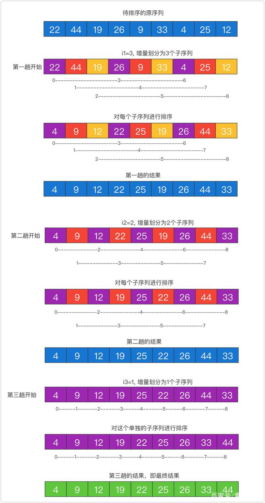

### [希尔排序](#)

**介绍**： **希尔排序**（Shell Sort）是[插入排序](https://so.csdn.net/so/search?q=插入排序&spm=1001.2101.3001.7020)的一种。也称缩小增量排序，是直接插入排序算法的一种更高效的改进版本。**希尔排序是把记录按下标的一定增量分组，对每组使用直接插入排序算法排序**；**随着增量逐渐减少**，每组包含的关键词越来越多，当增量减至1时，整个文件恰被分成一组，算法便终止

----

* **非稳定排序算法**

* **时间复杂度**：最坏 **O(N^2)、n在某个范围 O(N^1.3)**

先将排序表分割成若干形如 L`[i, i+d, i+2d, ... , i+kd]` 的 特殊字表，对各个子表分别进行直接插入排序。缩小增量d, 重复上述过程，直到d=1为止。 利用性质：**插入排序在数据基本有序的情况下表现更好！**




#### 代码实现

```cpp
int compare(int a, int b){
    return a - b;
}

/* 希儿排序 */
template<typename T, typename Compare = std::function<int(const T&,const T&)>>
void shellSort(std::vector<T>& array, Compare shellCompare){
    auto count = array.size();
    int j = 0;
    for (int d = count / 2; d >= 1 ;  d /= 2) {
        //还是一下子遍历所有，只是向前查找位置的步长变了
        for (int i = d ; i < count; i++) {
            //需要 前一个元素 > 当前元素
            if (shellCompare(array[i - d], array[i]) > 0){
                T temp = array[i];
                for (j = i; j >= d ; j -= d) {
                    if (shellCompare(array[j - d], temp) > 0){
                        array[j] = array[j - d];
                    }else{
                        break;
                    }
                }
                array[j] = temp;
            }
        }
    }
}

std::vector<int> scores = {49,38,65,97,76,12,27,49};

shellSort(scores, compare);

for (auto &num: scores) {
    std::cout << num << " ";
}
```


