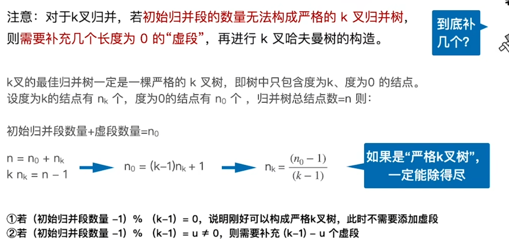

### [External Sort 外部排序](#)

**介绍**： 很多排序算法，插入排序、选择排序、归并排序等等，这些算法都属于内部排序算法，即排序的整个过程只是在内存中完成。而当待排序的文件比内存的可使用容量还大时，**文件无法一次性放到内存中进行排序**，需要借助于外部存储器（例如硬盘、U盘、光盘），这时就需要用到外部排序算法来解决。外部排序一般基于**归并排序**来进行。

----

 **实现外部排序的两个过程：**

1. **将整个初始文件分为多个初始归并段**。
2. **将初始归并段进行归并，直至得到一个有序的完整文件**。

#### 一、归并排序法

外部排序通常采用归并排序法。它包括两个相对独立的阶段：

* 根据内存缓冲区的大小，将外存上的文件分成若干长度为l的子文件，依次读入内存并利用内部排序方法对它们进行排序，并将排序后得到的有序子文件重新写回外存，称这些有序子文件为`归并段`或`顺串`。
* 对这些归并段进行逐趟归并，使归并段（有序子文件）逐渐由小到大，直至得到整个有序文件为止。

 假设有一个含10 000个记录的文件,首先通过10次内部排序得到10个初始归并段 `R1`～`R10`,其中每一段都含1000个记录。然后对它们作如下图所示的两两归并,直至得到一个有序文件为止。

​     从上图可见, 由10个初始归并段到一个有序文件,共进行了4趟归并,每一趟从m个归并段得到个归并段。这种归并方法称为2-路平衡归并。

#### 二、效率印象

对于外部排序算法来说，影响整体排序效率的因素主要取决于读写外存的次数，**即访问外存的次数越多**，算法花费的时间就越多，**效率就越低**。

外部信息读写的时间远远大于内部排序和内部归并的时间，因此应着力减少I/O次数。**增加归并路数，可减少归并趟数，进而减少总的磁盘I/O次数。**

[**优化方法**](#)： 以上两个方法都可以减少归并的趟数，进而减少读写磁盘的次数，提高外部排序速度

* **增大归并路数k**
* **减少初始归并段个数r**

**四路归并**：总共需要两趟。

**多路归并的负面影响**：

* K路归并时，需要开辟K个输入缓存区，内存开销增加。
* 每挑选一个关键字需要对比关键字 k-1 次，内部归并排序所需时间增加， [**利用败者树解决**](#)。

#### 三、败者树

败者树是树形选择排序的一种变型，可视为一棵**完全二叉树**。

败者树：可视为一棵**完全二叉树（多了一个冠军头头）**。**k个叶节点分别是当前参与比较的元素**，**非叶子结点用来记忆左右子树中的“失败者”**（比较的两个数，大者为失败、小的为胜利者），而让胜者继续进行比较，一直到根节点。

k-路归并的败者树的深度为 **[logk]+1**， 也就是要对比: **[logk]** 次数。

如果进行1024路对比，那么普通方法需要1023次，而败者树只需要十次。

#### 四、败者树案例：

有八个段进行归并！

计算胜利者和败者。

实现：

#### 五、置换选择排序

**置换选择排序算法作用是由一个无序文件产生若干有序子文件**。
用于生成初始归并段，通常产生的初始归并段个数较少
是在树形选择排序的基础上得来的的，特点是在整个排序的过程中，选择最小（或最大）关键字和输入、输出交叉或平行。

**实现过程**：

> FI：初始待排文件。FO：初始归并段输出文件。WA：内存工作区。FO和WA初始状态为空，WA可容纳w个记录

1. 从FI输入w个记录到工作区WA
2. 从WA中选出其中关键字取最小值得记录，极为MINMAX记录
3. 将MINMAX记录输出到FO中去
4. 若FI不为空，则从FI输入下一个记录到WA中
5. 从WA中所有关键字必MINMAX记录的关键字大的记录中选出最小关键字记录，作为新的MINMAX记录
6. 重复3-5，直至WA中选不出新的MINMAX记录为止，由此得到一个初始归并段，输出一个归并段的结束标志到FO中去
7. 重复2-6，直至WA为空，由此得到全部初始归并段。

图片解释：

遇到逆序元素不输出

等待逆序元素满了，开启一个新段：

新段开始：

最后形成一个新的归并段：

#### 六、最佳归并树

**由置换选择生成树所得初始归并段，其各长短不等对平衡归并有什么影响**？

> 若将初始归并段的长度看成是归并树中叶子结点的权，显然，归并方案不同，所得归并树也不同，树的带权路径长度（或外存读写次数）也不同。因此若对长度不同的多个初始归并段，构造一棵哈夫曼树作为归并树，便可以使在进行外部归并时所需对外存进行的读写次数达到最少，这棵归并树成为最佳归并树。
>
> **树的带权路径长度，哈弗曼树**

**结构概述**

各叶结点表示一个初始归并段，上面的权值表示该归并段的长度；叶结点到根的路径长度表示其参加归并的趟数；各非叶结点代表归并成的新归并段；根结点表示最终生成的归并段；树的带权路径长度WPL为归并过程中的总读记录数。

**算法优化**

引入哈夫曼树的思想，在归并树中，让记录少的初始归并段最先归并，记录数多的初始归并段最晚归并，就可以建立总的读写次数最少的最佳归并树。

**二路归并例子：**

**三路归并例子：**

**k路归并的例外：**

注意:对于k叉归并，若初始归并段的数量无法构成严格的k叉归并树, 则需要补充几个长度为0的“虚段”，再进行k叉哈夫曼树的构造。不然结果如下：

如果不增加虚段：

如果增加虚段：

#### 七、 需要增加虚段的数量

**严格k叉树只能包含度为0的节点和度为k的节点，设度为0的结点有n个，度为k的结点有m个**。

参与归并的段、虚段都是叶子节点，即度为0的结点。

严格k叉树有 **n= (k-1)m+1**  => **m=(n-1)/(k-1)**

若(n-1)MOD(k-1)=0，则说明正好可以构造k叉归并树

若m=(n-1)MOD(k-1)=u（u不为0），则再加上k-u-1个空归并段就可以建立归并树。

**例子**：对于98个长度不等的初始归并段，在构建5路最佳归并树时需要增加多少个虚段？
解：k=5，n=98，k-(n-1)mod(k-1)-1 = 3,需要增加三个虚段。

