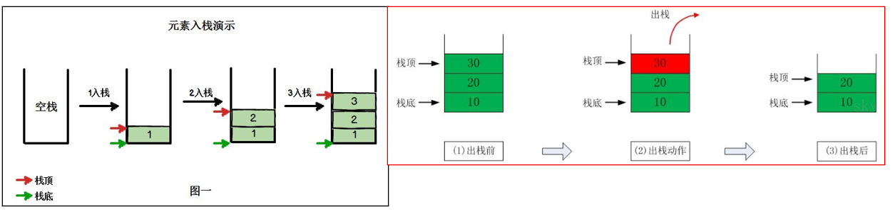
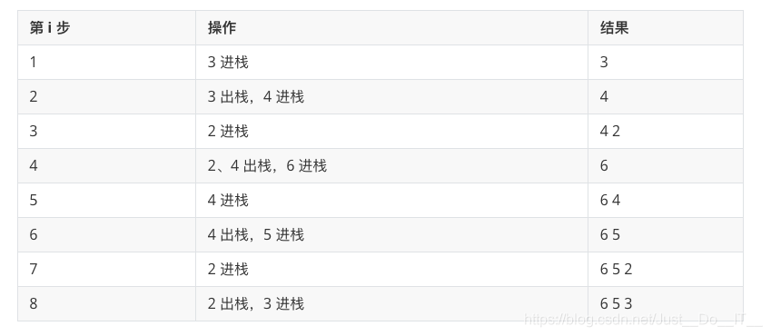

### [栈 Stack](#)

**绍**:  栈是一种后进先出的数据机构, 实现方式有链式结构和顺序结构。

----


### [1. 概念定义](#)

栈是限定仅在**线性表**尾进行插入和删除操作的线性表，栈又称为先进后出（Last In First Out）的线性表，简称LIFO结构。

* **栈顶**：允许插入和删除的一端称为栈顶。
* **栈底**：不可以进行插入和删除操作。
* **空栈**：不含任何数据元素的栈称为空栈。




#### [1.1 栈的应用场景](#)

* 子程序的调用：在跳往子程序前，会先将下个指令的地址存到堆栈中，直到子程序执行完后再将地址取出，以回到原来的程序中。
* 处理递归调用：和子程序的调用类似，只是除了储存下一个指令的地址外，也将参数、区域变量等数据存入堆栈中。
* 表达式的转换[中缀表达式转后缀表达式]与求值(实际解决)。
* 二叉树的遍历。
* 图形的深度优先(depth一first)搜索法。
  

#### [1.2 程序应用](#)

- 中缀表达式转换为后缀表达式

- 后缀表达式求值

- 两个栈实现一个队列

  

### [2. 单调栈](#)

这种数据结构在栈的基础上，栈内的元素是单调有序的，所以单调栈分为单调递增栈和单调递减栈。

- 单调递增栈： 从栈顶往栈底看，是单调递增的关系（含相等）
- 单调递减栈： 从栈顶往栈底看，是单调递减的关系（含相等）

例子：现在有一组数：3，4，2，6，4，5，2，3，如果从左往右依次进**单调递减栈**，那么是这样操作的：



单调递增栈**伪代码**：

```cpp
stack<int> st;
//此处一般需要给数组最后添加结束标志符
for (遍历这个数组)
{
	// 如果栈不为空且栈顶元素比压栈元素小，则栈顶元素出栈并作计算与更新结果，然后继续下一轮比较，直至该元素可以入栈；
    // 否则，（即栈为空，或栈顶元素大于等于压栈元素），直接入栈即可
    while ( !st.empty() && vec[st.top()] < vec[i] ) {
        st.pop();
        // Do something
    }
    st.push(i);  // 数组内的元素都要入栈，但入栈的是其下标
}


```

练习题目：[Leetcode 739. 每日温度](https://leetcode.cn/problems/daily-temperatures/)
