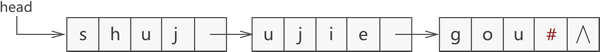

## [Data Structure - 字符串](#)
**介绍**： 串，即字符串(String），是由零个或多个字符组成的有限序列，严格意义上讲，串存储结构也是一种线性存储结构，因为字符串中的字符之间也具有"一对一"的逻辑关系。

----

### [1. 字符串概述](#)
字符串(String），是由零个或多个字符组成的有限序列，严格意义上讲，串存储结构也是一种线性存储结构，因为字符串中的字符之间也具有"一对一"的逻辑关系。
串中字符的数目n为串的长度, 零个字符的串称为空串(null string),它的长度为0。
```
S=”a1a2…an”   (n>=0)
```

* **前缀**：对于字符串 abcxxxxefg，我们称 abc 属于 abcxxxxefg 的某个前缀。
* **后缀**：对于字符串 abcxxxxefg，我们称 efg 属于 abcxxxxefg 的某个后缀。

**字符串可以有丰富的操作**：

|操作| 函数                 |
|:----|:-------------------|
|赋值| strcpy(数组名、字符串)    |
|判空| strlen()、strcmp() |
|字符串比较| strcmp             |
|求字符串长度| strlen             |
|字符串拷贝| strcpy             |
|字符串连接| strcat             |
|求字符串子串（截取字符串）| strsub | 

#### [1.1 串的表示](#)
**定长顺序存储表示**：类似线性表的顺序存储结构，用一组地址连续的存储单元存储字符串的字符序列。  
```cpp
char str[19] = "data.biancheng.net";
```
**堆分配存储表示**：这种存储方式特点是：仍一一组连续的存储单元存放字符串序列，但它们的存储空间是在程序执行过程中动态分配而得的。  
```cpp
char * ptr = (char*)malloc(10 * sizeof(char));
```
**块链存储表示**：和线性表的链式存储类似，也是用链表来保存字符串的值。根据串的特殊，若每个字符占一个结点太小，则采取每个结点可以存放一个也可以存放多个字符。如图所示：图a就是块链存储方式，而图b则过于浪费空间。

> 

使用链表存储字符串，其最后一个节点的数据域不一定会被字符串全部占满，对于这种情况，通常会用 '#' 或其他特殊字符（能与字符串区分开就行）将最后一个节点填满。

### [2. 串模式匹配算法](#)
是一种用来判断两个串之间是否具有"主串与子串"关系的算法。实现串的模式匹配的算法主要有以下两种：
* 普通的模式匹配算法、BF算法
* 快速模式匹配算法、KMP算法

#### [2.1 BF算法原理](#)
普通模式匹配算法，其实现过程没有任何技巧，就是简单粗暴地拿一个串同另一个串中的字符一一比对，得到最终结果。BF 算法最坏情况的时间复杂度为 **O(n*m)**

算法表示：
```cpp
//串普通模式匹配算法的实现函数，其中 father是伪主串，son是伪子串
int BF(const char* father, const char* son){
    int i = 0, j = 0;
    while (father[i] != '\0' && son[j] != '\0'){
        if (father[i] == son[j]){
            i++; j++;
        }else{
            i = i - j + 1;
            j = 0;
        }
    }
    if (j == strlen(son)) return i - j;
    return -1;
}
```

#### [2.2 KMP算法](#)
KMP 算法的原理，主要分为两部分，第一部分是构建生成 Prefix Table，第二部分是根据 Prefix Table 完成搜索， KMP 算法的**核心** **是利用匹配失败后的信息**，尽量减少模式串与主串
的匹配次数以达到快速匹配的目的。KMP 算法的时间复杂度 O (m+n)

* 前缀 是指除了最后一个字符以外，一个字符串的全部头部组合；
* 后缀 是指除了第一个字符以外，一个字符串的全部尾部组合。

匹配串： `A B A B C A B A A`


**求next数组的朴素方案：**， 复杂度较高，并没有采取递归的思想！

```cpp
// end 包括在判断内部
// start >= 1
// end > start
// 例如 aaavvxx start = 1, end = 3; 
// 就是判断字符串 aaav的后缀aav 是否 等于 前缀aaa。
bool isSame(const std::string& pattern,int start,int end){
    int front = 0;
    while (start <= end){
        if (pattern[start] == pattern[front]){
            start++;
            front++;
        }else{
            return false;
        }
    }
    return true;
}
```
得到next数组！
```cpp
vector<int> getNext(const std::string& pattern){
    auto len = pattern.size();
    vector<int> next(len, 0);
    for (int i = 2; i < len; ++i) {
        for (int j = 1; j <= i; ++j) {
            if (isSame(pattern,j,i- 1)){
                next[i] = i  - j;
                break;
            }
        }
    }
    return next;
}
```

其它方法：

```cpp
//动态规划
vector<int> get_next(string& pattern){
    int n = pattern.size();
    vector<int> next(n + 1, 0);
    int i = 2;  //next[i]
    int j = 0;  //j 表示上一个next[i-1] 的 值
    while(i < n){
        if(j == 0 || pattern[i - 1] == pattern[j]){
            if (pattern[i - 1] == pattern[j]) j++;
            next[i] = j;
            i++;
        }else{
            j = next[j];
        }

    }
    return next;
}

```

kmp算法

```cpp
int strStr(string haystack, string needle) {
    int n = haystack.size();
    int m = needle.size();
    int i = 0;
    int j = 0;

    vector<int> next = get_next(needle);

    while(i < n && j < m){
        if(haystack[i] == needle[j]){
            i++;
            j++;
        }else{
            if(j == 0) i++;
            else{
                j = next[j];
            }
        }
    }

    if(j >= m) return i - m;
    return -1;
}
```

