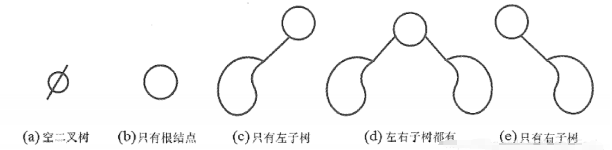
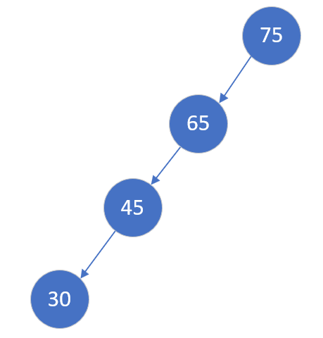
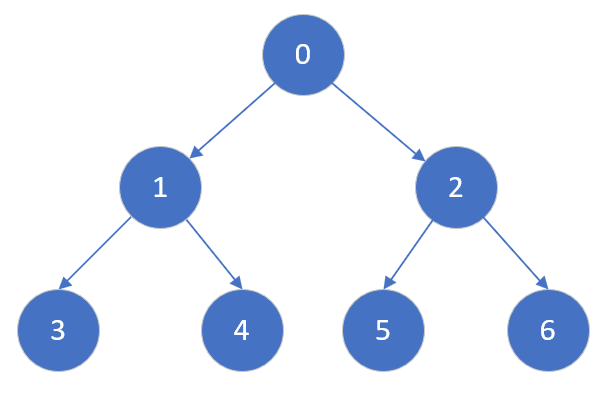
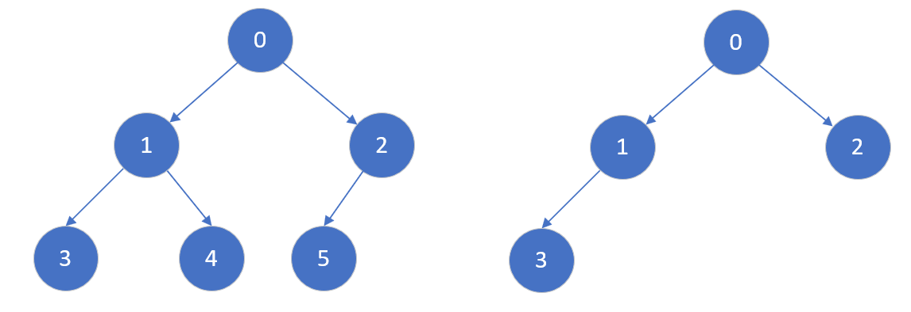

### [Data Structure - 二叉树](#)
**介绍**： 二叉树（Binary tree）是树形结构的一个重要类型。二叉树是另一种树形结构，其特点是**每个结点至多只有两棵子树**( 即二叉树中不存在度大于2的结点)，并且二叉树的子树有左右之分，其次序不能任意颠倒。


```cpp
//C++ 二叉树结构
struct TreeNode {
    int val;
    TreeNode *left;
    TreeNode *right;
    
    TreeNode() : val(0), left(nullptr), right(nullptr) {}
    TreeNode(int x) : val(x), left(nullptr), right(nullptr) {}
    TreeNode(int x, TreeNode *left, TreeNode *right) : val(x), left(left), right(right) {}
};
```


### [1. 二叉树的性质](#)

* 二叉树是n (n≥0) 个结点的有限集合。n=0的时候为空二叉树。
* 每个结点至多有二棵子树(即不存在度大于2的结点)，二叉树的子树有左、右之分，且其次序不能任意颠倒。
* 高为h的二叉树最多有`2^h -1` 个节点。

* 二叉树的5种基本形态如图所示: 




### [2. 几个特殊的二叉树](#)

有几个特殊的二叉树，需要关注。

#### [2.1 斜树](#)

所有的结点都只有左子树的二叉树叫**左斜树**。所有结点都是只有右子树的二叉树叫**右斜树**，这两者统称为斜树。



这种结构应该尽力避免，因为有悖于 log(N)这个复杂度的需求。

#### [2.2 满二叉树](#)

一棵深度为k，且有`2^k -1`个结点的树就是满二叉树， 满二叉树适合使用顺序表来存储，序号为 `i` 的左孩子节点序号为 `i*2+1`, 右孩子节点序号为 `i*2+2`, 其父节点啊序号为 `(i-1)/2` 取整,**满二叉树节点个数n满足 n%2=1*** 。



* 叶子只能出现在最下一层。出现在其它层就不可能达成平衡。
* 非叶子结点的度一定是2。
* 在同样深度的二叉树中，满二叉树的结点个数最多，叶子数最多。

#### [2.3 完全二叉树](#)

高度为h、有n个结点的二叉树，当且仅当其每个结点都与高度为h的满二叉树中编号为0~n-1的结点一一对应时，称为完全二叉树




* 叶子结点只可能在层次最大的两层上出现。对于最大层次中的叶子结点，都依次排列在该层最左边的位置上。

* 若 i <= n / 2, 则结点i 为 **分支结点**，否则为**叶子结点**。

* **若有度为`1`的结点，则只可能有一个，且该结点只有左孩子而无右孩子**  [**(重要特征)**](#)。

* 按层序编号后，一旦出现某结点(编号为i)为叶子结点或只有左孩子，则编号大于i的结点均为叶子结点。

* 若**n**为**奇数**，则每个[**分支结点**](#) **都有左孩子和右孩子**;   若为**偶数**，则 **编号最大的分支结点只有左孩子**，没有右孩子，其余分支结点左、右孩子都有。

* 具有n 个(n>0)结点的完全二叉树的高度为: 

* $$
  \lfloor \log _{2}^{n} \rfloor +1
  $$

#### [2.4 二叉排序树](#)

又叫**二叉查找树**，其中序遍历结果就是一个排序好的序列，满足如下的性质：


* 左子树上所有结点的关键字均**小于**根结点的关键字;
* 右子树上的所有结点的关键字均**大于**根结点的关键字;
* 左子树和右子树又各是一棵二叉排序树。


#### [2.5 二叉平衡树](#)

AVL树是根据它的发明者G.M. **A**delson-**V**elsky和E.M. **L**andis命名的， **树上任一结点的左子树和右子树的深度之差不超过1**。


**特性**： AVL 树的查找、插入和删除在平均和最坏情况下都是O **(logn)**。

如果在AVL树中插入或删除节点后，使得高度之差大于1。此时，AVL树的平衡状态就被破坏，它就不再是一棵二叉树；为了让它重新维持在一个平衡状态，就需要对其进行旋转处理。学AVL树，重点的地方也就是它的**旋转算法**；

在所有的不平衡情况中，都是按照先 **寻找最小不平衡树**，然后 **寻找所属的不平衡类别**，再 **根据 4 种类别进行固定化程序的操作**。


