###  [平衡二叉树](#)

**介绍** ：AVL树是根据它的发明者G.M. **A**delson-**V**elsky和E.M. **L**andis命名的， **树上任一结点的左子树和右子树的深度之差不超过1**。

-----

> Java HashMap 就是一颗AVL树


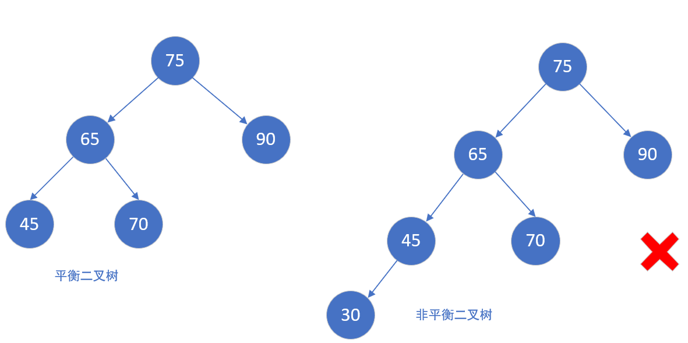


**特性**： AVL 树的查找、插入和删除在平均和最坏情况下都是O **(logn)**。

如果在AVL树中插入或删除节点后，使得高度之差大于1。此时，AVL树的平衡状态就被破坏，它就不再是一棵二叉树；为了让它重新维持在一个平衡状态，就需要对其进行旋转处理。学AVL树，重点的地方也就是它的**旋转算法**；

在所有的不平衡情况中，都是按照先 **寻找最小不平衡树**，然后 **寻找所属的不平衡类别**，再 **根据 4 种类别进行固定化程序的操作**。


**平衡因子**：树上任一结点的左子树和右子树的深度之差，取值(-1,0,1 ) = 左子树高度 - 右子树高度。

```cpp
template<typename T>
struct TreeNode {
    T val;
    TreeNode *left, *right;
    int balance = 0; //平衡因子
    TreeNode() : val(0), left(nullptr), right(nullptr) {}
    TreeNode(const T& x) : val(x), left(nullptr), right(nullptr) {}
    TreeNode(const T& x, TreeNode *left, TreeNode *right) : val(x), left(left), right(right) {}
};
```


#### 获取树的高度

```cpp
int maxDepth(TreeNode* root) {
    if (root  != nullptr){
        auto lHeight = maxDepth(root->left);
        auto rHeight = maxDepth(root->right);
        auto result = std::max(lHeight, rHeight);
        return result + 1;
    }
    return 0;
}
```


### 1. 插入操作

当进行插入操作的时候，我们需要更新**通向根节点路径上**的那些节点的所有平衡信息。

把需要重新平衡的结点叫做α，由于任意两个结点最多只有两个儿子，因此高度不平衡时，α结点的两颗子树的高度相差2.容易看出，这种不平衡可能出现在下面4中情况中：

1.对α的左儿子的左子树进行一次插入

2.对α的左儿子的右子树进行一次插入

3.对α的右儿子的左子树进行一次插入

4.对α的右儿子的右子树进行一次插入


#### [1.1 LL 平衡旋转 - 右单旋转](#)

这种情况属于发生在树的 **外边**，对15的左儿子的左子树进行一次插入，导致15的平衡因子不符合要求。

* 节点 15 的左子树的左孩子进行了一次插入。
* 左孩子节点10代替15的位置
* 左孩子的右孩子12，成为节点15的左孩子。
* 平衡完成。

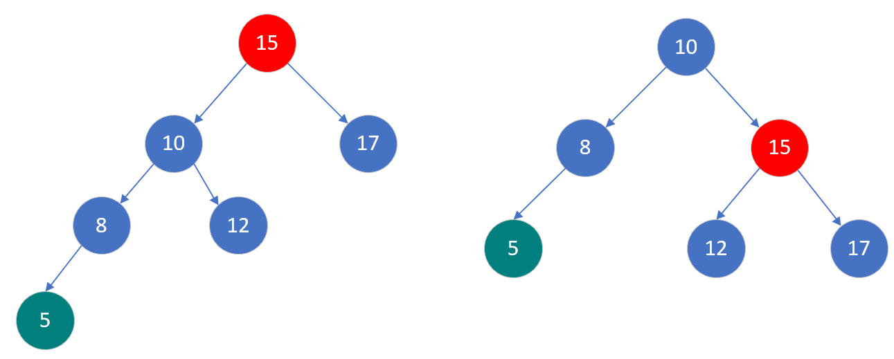

#### [1.2 RR 平衡旋转 - 左单旋转](#)

这种情况属于发生在树的 **外边**，对15的右儿子的右子树进行一次插入，导致15的平衡因子不符合要求。

* 右孩子节点20代替15的位置
* 右孩子的左孩子16，成节点15的左孩子。
* 平衡完成。

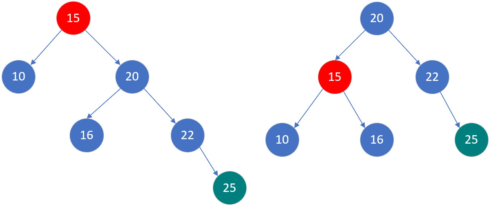


#### [1.3 LR 平衡旋转 - 双旋转](#)

一次旋转无法解决问题，需要两次选择，先向左旋转，再向右旋转。

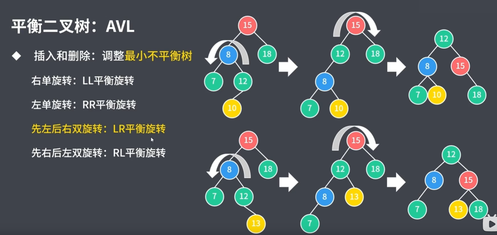

#### [1.3 RL 平衡旋转 - 双旋转](#)

一次旋转无法解决问题，需要两次选择，先向右旋转，再向左旋转。

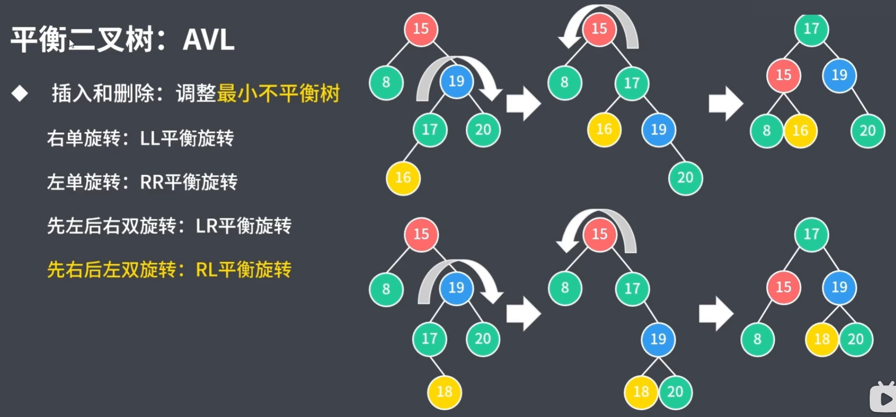

### 2. 删除操作

删除操作和插入操作一样都可能导致平衡二叉树高度不平衡时。

一、 删除节点

删除方法**就是二叉排序树的删除方法**， 删除步骤需要分成以下几种情况:：

* **被删除结点为叶子结点**，叶子节点直接删除
* **被删除结点D仅有一个孩子**
  * 要删除的节点没有左子树
  * 要删除的节点没有右子树
* 要删除的节点左右子树均存在

二、找到最小不平衡子树

从被删除节点向上寻找其哪个祖先是最小不平衡子树，找不到就是平衡的，找到了就需要调整。

三、找到最小不平衡子树的，**个头**最高的儿子(子树的高度最高)、孙子节点(儿子节点的儿子节点中深度最高的子树节点)。 可能存在高度相等的情况，选择左右子树都可以

四、根据孙子节点所在位置，分为LL、LR、RR、RL几种情况进行调整。

五、调整导致不平衡向上传导，回到**二**，继续调整。


#### 2.1 第三步详解

以下为如何找最高儿子、孙子的方法：

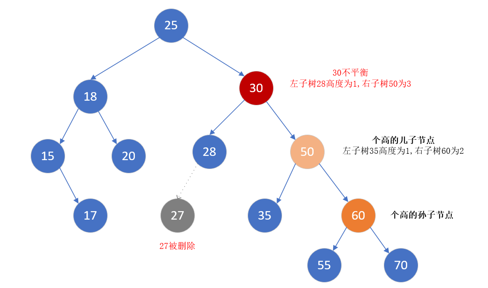

调整方法：


再来一个小例子：17的左孩子被删除了，导致不平衡。

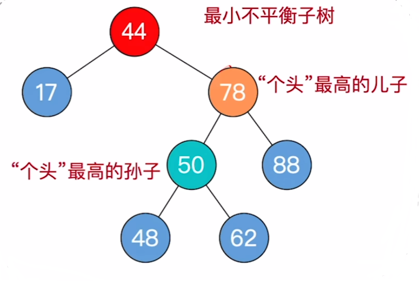

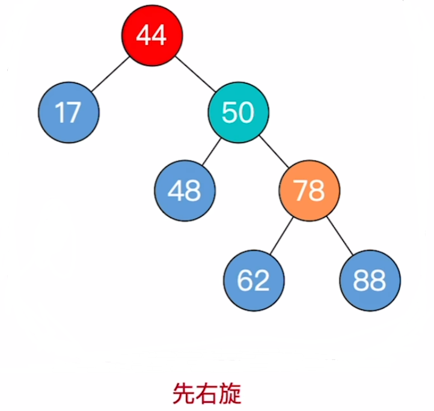

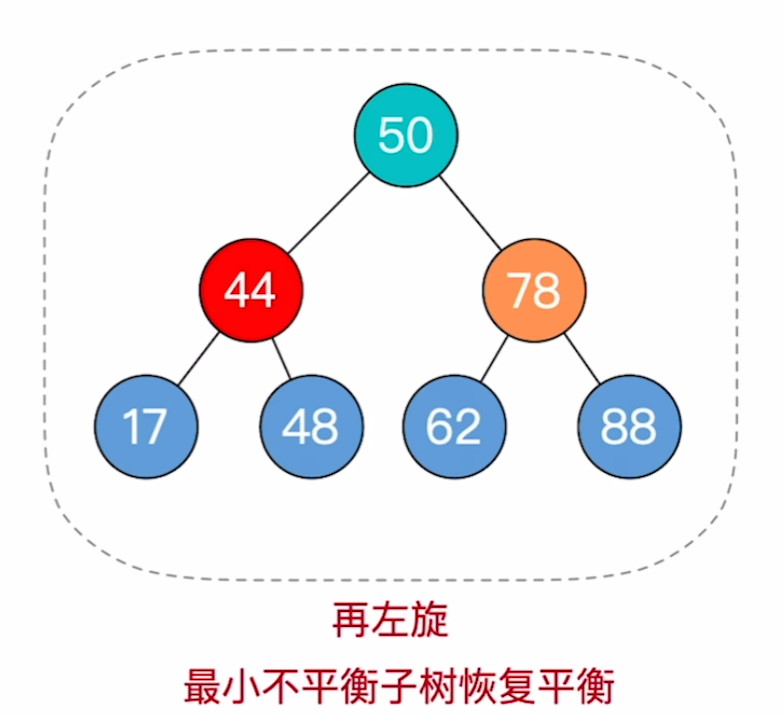

#### 2.2 第五步详解

最小不平衡子树的旋转可能导致树变矮，从而导致上层祖先不平衡。

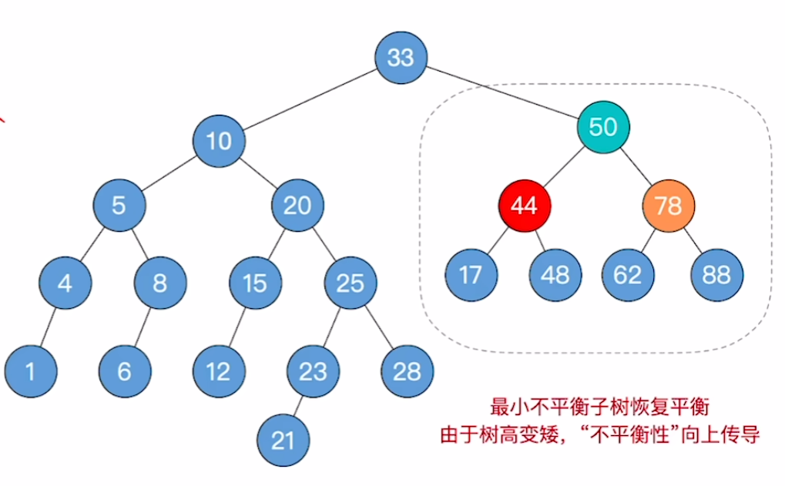

然后发行 33 不平衡，

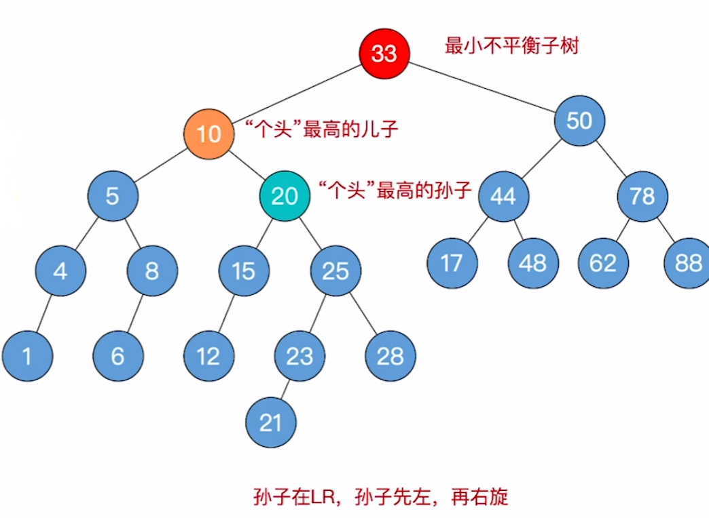

旋转完成：

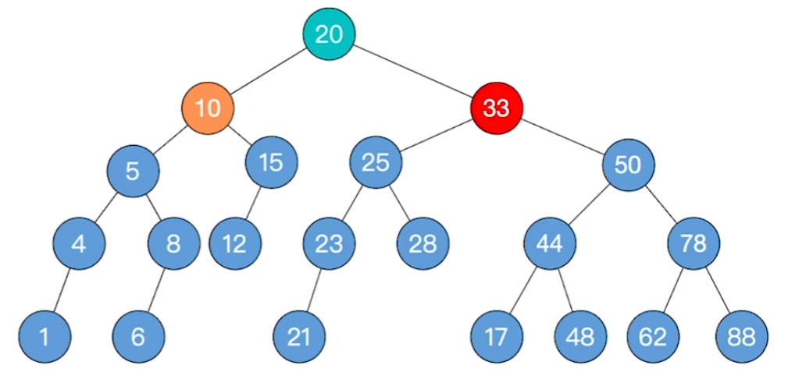
