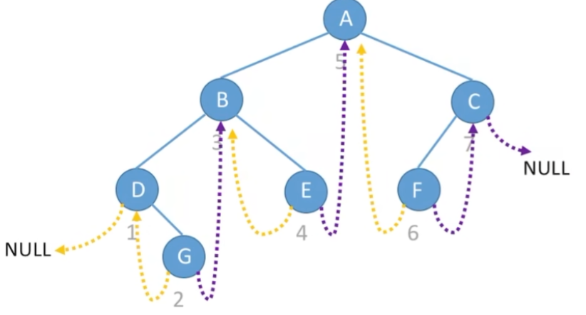
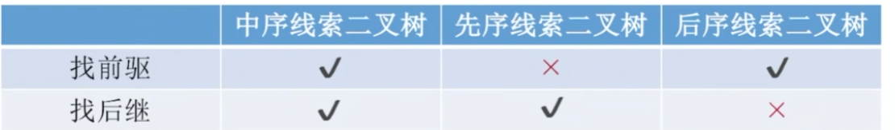

###  [线索二叉树](#)

**介绍**： 对于n个结点的二叉树，在二叉链存储结构中有n+1个**空链域**，利用这些空链域存放在某种遍历次序下该结点的**前驱结点和后继结点**的指针，这些指针称为线索，加上线索的二叉树称为线索二叉树。

中序线索二叉树：




优势

*  利用线索二叉树进行中序遍历时，不必采用堆栈处理，速度较一般二叉树的遍历速度快，且节约存储空间。
* **任意一个结点都能直接找到它的前驱和后继结点**。

不足

* 结点的插入和删除麻烦，且速度也较慢。**每次修改树的结构后就需要重新线索化**！
* 线索子树不能共用


#### [1.  线索二叉树数据结构](#)

如果左子树为空，则让其指向其前驱，如果右子树为空，则让其指向其后继。

```cpp
//C++ 二叉树结构
struct TreeNode {
    int val;
    TreeNode *left;
    TreeNode *right;
    bool leftTag = false; //左子树是否为线索
    bool rightTag = false; //右子树是否为线索
    TreeNode() : val(0), left(nullptr), right(nullptr) {}
    TreeNode(int x) : val(x), left(nullptr), right(nullptr) {}
    TreeNode(int x, TreeNode *left, TreeNode *right) : val(x), left(left), right(right) {}
};


//清楚 线索二叉树结构
void freeCluedTree(TreeNode* tree){
    if (tree != nullptr){
        if (!tree->leftTag) freeCluedTree(tree->left);
        if (!tree->rightTag) freeCluedTree(tree->right);
        delete tree;
        tree = nullptr;
    }
}
```


#### [2. 线索二叉树的类型](#)

根据采用的遍历方法不同，可以分为：

* 先序遍历线索二叉树
* **中序遍历线索二叉树**，也就这个有意义！
* 后序遍历线索二叉树


各个线索树能否找到前驱后继：




#### [3. 算法思想与实现](#)

**线索化算法思想：** 我们使用以下算法对一颗二叉树进行线索化，在对一颗二叉树进行中序遍历的过程中，

* 如果某一节点的左孩子为空，那么将其左孩子指向该节点的前驱。
* **利用前驱来设置后继，因为前驱的后继就是当前节点**。
*  如果前驱不为空且右孩子为空，前驱右孩子指向当前节点。

**中序线索流程：**

* 需要一个全局变量作为 **前驱(pre)** , 初始化值为nullptr。
* 如果节点非空，进入递归
  * 先递归左子树
    * 判断节点左孩子是否为空，为空建立前驱 `node->left = pre;`
    * [**判断前驱是否不为空且右子树为空，为其建立后继**](#)。 `pre->right = node;`
    * 将当前节点赋值给前驱
  * 递归右子树
* 最后一个节点，要将 rightTag 设置为 true。

```cpp
//中序线索化二叉树
static void InCluedExecutor(TreeNode * node, TreeNode *&pre){
    if (node != nullptr){
        InCluedExecutor(node->left, pre);
        if (node->left == nullptr){
            //建立前驱
            node->left = pre;
            node->leftTag = true;
        }
        if (pre!= nullptr && pre->right == nullptr){
           //建立后继
           pre->right = node;
           pre->rightTag = true;
        }
        pre = node;
        InCluedExecutor(node->right, pre);
    }
}

//开始执行
void InClued(TreeNode * tree){
    TreeNode *pre = nullptr;
    if (tree != nullptr) {
        InCluedExecutor(tree, pre);
        //pre 指向最后一个元素 ，也要处理一下
        if (pre->right == nullptr){
            pre->rightTag = true;
        }
    };
}
```

