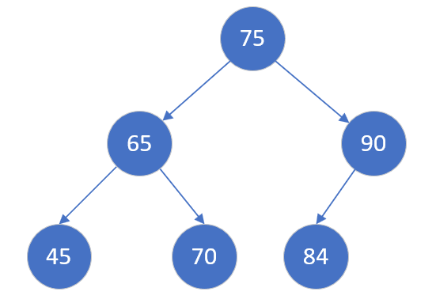

### [二叉排序树*（Binary Search Tree）*](#)

介绍：又叫**二叉查找树**，其中序遍历结果就是一个排序好的序列，满足如下的性质：



* 若它的左子树不空，左子树上所有结点的关键字均**小于**根结点的关键字;
* 若它的右子树不空，右子树上的所有结点的关键字均**大于**根结点的关键字;
* 左子树和右子树又各是一棵二叉排序树。


**掌握知识：**

* 如何构建一颗二叉查找树
* 二叉排序树的查找操作
* 二叉排序树的**删除操作**, 这个需要一点操作。


**二叉排序树插入相同值的处理**

* 不插入，二叉排序树的节点必须是 `unique` 的。

* 修改数据结构，增加一个字段，指定该节点的值重复了多少次。

```cpp
//节点定义
struct TreeNode {
    int val;
    TreeNode *left;
    TreeNode *right;
    TreeNode() : val(0), left(nullptr), right(nullptr) {}
    TreeNode(int x) : val(x), left(nullptr), right(nullptr) {}
    TreeNode(int x, TreeNode *left, TreeNode *right) : val(x), left(left), right(right) {}
};
//释放
void freeTree(TreeNode* tree){
    if (tree != nullptr){
        freeTree(tree->left);
        freeTree(tree->right);
        delete tree;
        tree = nullptr;
    }
}
```

**二叉搜索树的性能**：

对于二叉搜索树，如果插入的数据是随机的，那么它就是接近平衡的二叉树，平衡的二叉树，它的操作效率（查询，插入，删除）效率较高，时间复杂度是O（logN）。

但是可能会出现一种极端的情况，那就是插入的数据是有序的（递增或者递减），那么所有的节点都会在根节点的右侧或左侧，此时，二叉搜索树就变为了一个链表，它的操作效率就降低了，时间复杂度为O(N)，所以可以认为二叉搜索树的时间复杂度介于O（logN）和O(N)之间，视情况而定。


* 最好情况下, 二叉搜索树是一棵完全二叉树, 它搜索节点的时间复杂度为: O(logn);

* 最坏情况下, 二叉搜索树会是一棵只有单分支的树, 则它搜索节点的时间复杂度为: O(n)


### [1.  构建一颗二叉查找树](#)

可以采用递归或者非递归插入方法：

#### [1.1 非递归算法](#)

此方法使用了 `指针引用`，二叉树的每一个节点都在 **堆** 上面。

```cpp
static bool Insert(TreeNode* & head,int val){
    if (head == nullptr){
        head  = new TreeNode(val);
        return true;
    }
    auto newNode = new TreeNode(val);
    auto searchNode = head;
    while (searchNode != nullptr){
        //已经存在当前节点
        if (searchNode->val == val){
            return false;
        }
        if (searchNode->val > val) {
            if (searchNode->left == nullptr) {
                searchNode->left = newNode;
                return true;
            }
            searchNode = searchNode->left;
        }
        if (searchNode->val < val){
            if (searchNode->right == nullptr) {
                searchNode->right = newNode;
                return true;
            }
            searchNode = searchNode->right;
        }
    }
    return true;
}
```

**使用方法**

```cpp
TreeNode *tree = nullptr;
Insert(tree , 78);
Insert(tree , 64);
Insert(tree , 70);
Insert(tree , 40);
Insert(tree , 81);
Insert(tree , 90);
Insert(tree , 101);
//测试代码

freeTree(tree);
```


#### [1.2 递归算法](#)

要求传入的头结点非 空指针。

```cpp
static void RecursiveInsert(TreeNode* head,int val){
    if (head == nullptr) return;
    if ( val > (head->val) ){
        if (head->right == nullptr) {
            head->right = new TreeNode(val);
            return;
        }
        RecursiveInsert(head->right, val);
    }
    if ( val < (head->val) ){
        if (head-> left == nullptr) {
            head->left = new TreeNode(val);
            return;
        }
        RecursiveInsert(head->left, val);
    }
}
```

使用方法：

```cpp
TreeNode *tree = new TreeNode(78);

RecursiveInsert(tree , 78);
RecursiveInsert(tree , 64);
RecursiveInsert(tree , 40);
RecursiveInsert(tree , 81);
RecursiveInsert(tree , 90);
RecursiveInsert(tree , 101);
```


### [2. 二叉排序树的查找操作](#)

**二叉搜索树的性能**：

* 最好情况下, 二叉搜索树是一棵完全二叉树, 它搜索节点的时间复杂度为: O(logn);

* 最坏情况下, 二叉搜索树会是一棵只有单分支的树, 则它搜索节点的时间复杂度为: O(n)

#### [2.1  查找某个值](#)

根据二叉搜索树的性质:

* 如果当前节点值 **<** 待查找值, 去该节点**右子树**继续查找。
* 如果当前节点值 **>** 待查找值, 去该节点**左子树**继续查找。

```cpp
static TreeNode* Find(TreeNode*  head,int val){
    if (head != nullptr){
        if (head->val == val) return head; //找到了
        if (head->val < val) return Search(head->right, val);
        if (head->val > val) return Search(head->left, val);
    }
    return nullptr;
}
```


#### [2.2  查找最值](#)

最左边的节点就是最小值，最右边的节点就是最大值。

```cpp
static TreeNode* FindMin(TreeNode*  head){
    if (head == nullptr) return head;
    while (head->left != nullptr){
        head = head->left;
    }
    return head;
}

static TreeNode* FindMax(TreeNode*  head){
    if (head == nullptr) return head;
    while (head->right != nullptr){
        head = head->right;
    }
    return head;
}
```


#### [2.3  查找某个值的双亲节点](#)

有时候需要知道某个节点的父节点。

```cpp
static TreeNode* FindParent(TreeNode * head, TreeNode *node){
    if (head == nullptr || node == nullptr) return nullptr;

    if (head->left == node || head->right == node) return head;

    if (head->val < node->val) return FindParent(head->right, node);
    if (head->val > node->val) return FindParent(head->left, node);
    return nullptr;
}
```


#### [2.4 查找节点，并返回节点和父节点](#)

这是一个特殊的需求：

```cpp
//<node, parent>
static std::tuple<TreeNode*, TreeNode*> FindNodeAndParent(TreeNode*  head, int val){
    std::tuple<TreeNode*, TreeNode*> result(nullptr, nullptr);
    if (head == nullptr) return result;
    //就是根节点
    if (head->val == val) {
        std::get<0>(result) = head;
        return result;
    }
    //就是父节点
    if (head->left != nullptr && head->left->val == val) {
        std::get<0>(result) = head->left;
        std::get<1>(result) = head;
        return result;
    }
    //就是父节点
    if (head->right != nullptr && head->right->val == val) {
        std::get<0>(result) = head->right;
        std::get<1>(result) = head;
        return result;
    }
    //去子树去查找
    if (head->val < val && head->right != nullptr) return FindNodeAndParent(head->right, val);
    if (head->val > val && head->left != nullptr) return FindNodeAndParent(head->left, val);
    return result;
}
```


### [3. 删除一个节点的值](#)

**删除操作**：这个操作需要仔细考虑，因为删除节点后还需要维护 二叉排序树的基本结构。

[**先要查找到待删除节点的位置, 然后再进行删除，定义 current 为待删除的元素,  定义 parent 为待删除元素的父节点。**](#)

删除步骤需要分成以下几种情况:

* **被删除结点为叶子结点**，叶子节点直接删除
* **被删除结点D仅有一个孩子**
  * 要删除的节点没有左子树
  * 要删除的节点没有右子树
* 要删除的节点左右子树均存在

#### [3.1 被删除结点为叶子结点](#)

直接从二叉排序中删除即可，不会影响到其他结点。例如删去70：


#### [3.2  被删除结点D仅有一个孩子](#)

**如果只有左孩子**，那么只需要把要删除结点的左孩子连接到要删除结点的父亲结点，然后删除D结点；

* **删除节点的值修改为其左子树根节点的值。**
* 删除节点的左右孩子指针修改为左子树根节点的左右孩子指针。


**如果只有右孩子**，那么只要将要删除结点D的右孩子连接到要删除结点D的父亲结点，然后删除D结点。

* **删除节点的值修改为其右子树根节点的值。**
* 删除节点的左右孩子指针修改为右子树根节点的左右孩子指针。


#### [3.3  要删除的节点左右子树均存在](#)

这种情况比较难办，**可以使用其右子树的最小数据代替该节点的数据，或者左子树的最大值来代替该节点的数据**。即选择 **左子树的“最右边”，或者 右子树的“最左边”**。

 推荐：[**使用左子树的最大值代替该节点的数据**](#)， 使用其他的元素替换会打扰其顺序。

例如以72 代替 75，然后删除 72.


如果左子树的最大值所在节点**还存在左子树**，但也需要**递归**处理：

* 先将应该删除节点的值替换为左子树的最大值。  **将75 换成 72**
* 然后递归删除左子树最大值所在节点。  **以72所在节点为 根节点，删除72** ->  **把72 换成 71，再删除71** -> **71是叶子节点，完成删除**！


**综合案例分析1**: 需要删除64这个节点。


首先找到65这个节点，其有左右孩子：

交换节点为45，由于45**不存在左子树**， 属于叶子节点，直接删除。


**综合案例分析2**: 需要删除7这个节点。 需要和6这个节点交换位置。 6有一个左子树，然后：

* 6节点的左右孩子指针修改为节点5的左右孩子指针。
* **将6的值修改为5**


#### [3.4 删除算法实现](#)

**二叉排序树节点被存在栈上面，需要删除** 。

**自己的实现：**

```cpp
/* 小心删除根节点且树上只有一个根节点的情况 */
TreeNode* deleteNode(TreeNode* root, int key) {
    //查找位置
    auto result = FindNodeAndParent(root, key);
    TreeNode *node, *parent;
    std::tie(node, parent) = result;
    // key 这个值不存在
    if (node == nullptr) return root;
    // node 是叶子节点， 直接删除
    if (node->left == nullptr && node->right == nullptr){
        //根节点
        if (parent == nullptr){
            delete root; //释放根节点
            return nullptr;
        }
        if (parent->left == node)  parent->left = nullptr;
        if (parent->right == node) parent->right = nullptr;
        delete node; //释放节点
        return root; //返回吧
    }
    //只有左孩子
    if (node->left != nullptr && node->right == nullptr ){
        auto removeNode = node->left; //左子树根节点
        node->val = node->left->val;
        node->left = removeNode->left;
        node->right = removeNode->right;
        delete removeNode; //释放
        return root;
    }
    //只有右孩子
    if (node->right != nullptr && node->left == nullptr ){
        auto removeNode = node->right; //右子树根节点
        node->val = node->right->val; //交换值
        //接替左子树的指针
        node->left = removeNode->left;
        node->right = removeNode->right;
        delete removeNode; //释放
        return root;
    }
    //左右孩子都有
    TreeNode *changeNode = FindMax(node->left); //找到左子树
    //如果还有左子树，需要递归删除
    if (changeNode->left != nullptr){
        node->val = changeNode->val; //替换这个值
        deleteNode(changeNode,changeNode->val);
    }else{
        //叶子节点，找到交换节点的父节点
        TreeNode*leafNodeParent =  FindParent(node, changeNode);
        node->val = changeNode->val; //替换这个值
        if (leafNodeParent->left == changeNode)  leafNodeParent->left = nullptr;
        if (leafNodeParent->right == changeNode) leafNodeParent->right = nullptr;
        delete changeNode;
    }
    return root;
}
```


**leetcode**:

```cpp
class Solution {
public:
    TreeNode* deleteNode(TreeNode* root, int key) {
        if (root == nullptr) {
            return nullptr;
        }
        if (root->val > key) {
            root->left = deleteNode(root->left, key);
            return root;
        }
        if (root->val < key) {
            root->right = deleteNode(root->right, key);
            return root;
        }
        if (root->val == key) {
            if (!root->left && !root->right) {
                return nullptr;
            }
            if (!root->right) {
                return root->left;
            }
            if (!root->left) {
                return root->right;
            }
            TreeNode *successor = root->right;
            while (successor->left) {
                successor = successor->left;
            }
            root->right = deleteNode(root->right, successor->val);
            successor->right = root->right;
            successor->left = root->left;
            return successor;
        }
        return root;
    }
};
/*
作者：LeetCode-Solution
链接：https://leetcode.cn/problems/delete-node-in-a-bst/solution/shan-chu-er-cha-sou-suo-shu-zhong-de-jie-n6vo/
来源：力扣（LeetCode）
著作权归作者所有。商业转载请联系作者获得授权，非商业转载请注明出处。
*/
```


