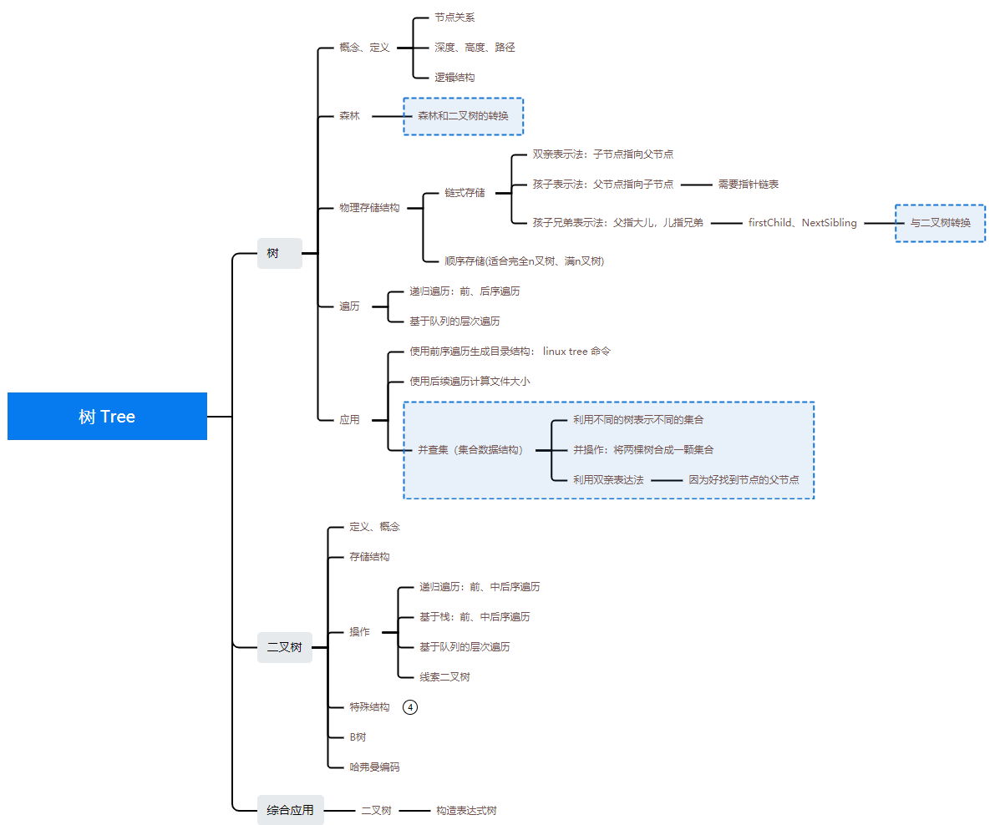

### [Data Structure - 树 Tree](#)

**介绍**:  树本身是一种**递归定义**的数据结构，由**n**个点和**n-1**条边组成、一棵树可以由若干子树构成， 多棵树组合在一起称为森林（forest），即森林是若干棵树的集合。

---

**目录：**

* [树](#)
  
  * [树的基本概念](./contents/conception.md)
  * [物理存储结构](./cpp/README.md)
    * [二叉树和树的转换 (孩子兄弟表示法)](./cpp/README.md)
    * [二叉树和森林的转换 (孩子兄弟表示法)](./cpp/README.md)
  * 遍历
    * 先根遍历
    * 后根遍历
    * 层次遍历
* [二叉树](./BinaryTree)
  * [二叉树的基本概念、各种二叉树](./BinaryTree)
  * [二叉树的物理存储结构](./BinaryTree/cpp/store.md)
    * 链式 - 二叉链表、三叉链表
    * 顺序存储
  * 遍历
    * [递归遍历：前、中后序遍历](./BinaryTree/cpp/reverse.md)
    * [非递归遍历：前、中后序遍历](./BinaryTree/cpp/stack_foreach.md)
    * [层次遍历](./BinaryTree/cpp/level.md)
    * 由两个遍历序列(一定要有中序遍历序列)生成二叉树
  * [线索二叉树](./BinaryTree/cpp/clueTree.md)
  * [**二叉排序树**](./BinaryTree/cpp/sortTree.md)
  * [**平衡二叉树**](./BinaryTree/cpp/avl.md)
  * [相关题目](#relate)
* [哈弗曼树、哈弗曼编码](./cpp/HuffmanTree.md)
* 集合：并查集 (集合 Set也是基于树来实现的！)
* **高级树**
  
  * [红黑树](./contents/redblacktree.md)
  * B树
    * B+树
    * B-树
  
  
  

----

**思维导图**：

#### [relate](#)

[1. 验证一颗二叉树是否为二叉搜索树](https://leetcode.cn/problems/validate-binary-search-tree/submissions/)
