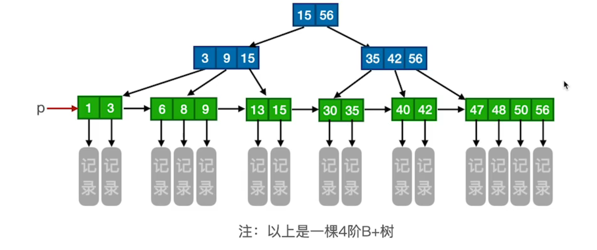
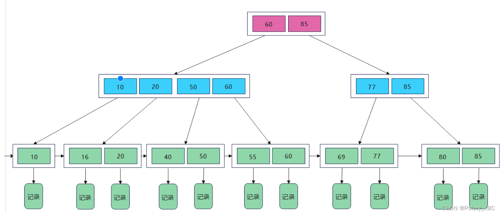
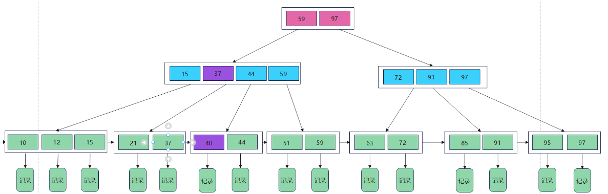
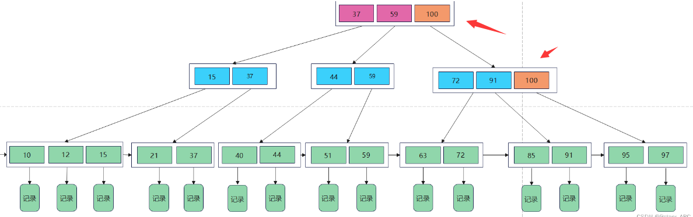
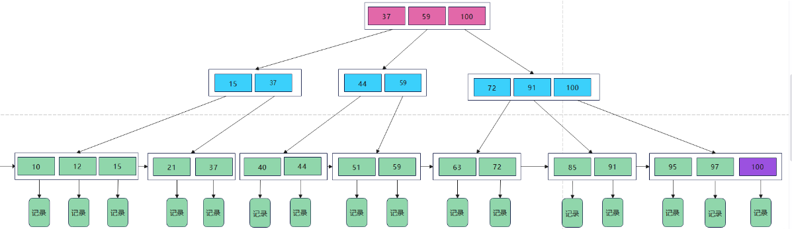

### [B+ Tree](#)

**介绍**：B+树是一种平衡的树状数据结构，常用于数据库和文件系统中的索引结构。它是B树的一种变体，具有许多优点。

----

B树：有序数组+平衡多叉树；B+树：有序数组链表+平衡多叉树；

1. **所有的非叶子结点只存储关键字信息**。
2. 所有数据都存在叶子结点中。
3. 所有的叶子结点中包含了全部元素的信息。
4. 所有**叶子结点之间都有一个链指针**。

1. 节点结构：B+树由内部节点和叶节点组成。内部节点存储键值对的索引信息用于快速定位，叶节点存储实际的数据记录。

由于**B+ Tree**所有的数据都在叶子结点，并且结点之间有指针连接，在找大于某个关键字或者小于某个关键字的数据的时候，`B+ Tree`只需要找到该关键字然后沿着链表遍历就可以了，而**B- Tree**还需要遍历该结点的关键字去搜索。

**B- Tree**因为非叶子结点也保存具体数据，所以在查找某个关键字的时候找到即可返回。而**B+ Tree**所有的数据都在叶子结点，每次查找都得到叶子结点。所以在同样高度的**B- Tree**和**B+ Tree**中，**B- Tree**查找某个关键字的效率更高。

由于**B-Tree**的每个结点（这里的结点可以理解为一个数据页）都存储主键+实际数据，而**B+Tree**非叶子结点只存储关键字信息，而每个页的大小有限是有限的，所以同一页能存储的**B-Tree**的数据会比**B+Tree**存储的更少。这样同样总量的数据，**B-Tree**的深度会更大，增大查询时的磁盘**I/O**次数，进而影响查询效率。

#### 1.2 磁盘块读取

操作系统从磁盘读取数据到内存是以磁盘块（`block`）为基本单位的，位于同一个磁盘块中的数据会被一次性读取出来，而不是需要什么取什么。即使只需要一个字节，磁盘也会从这个位置开始，顺序向后读取一定长度的数据放入内存。

这样做的理论依据是计算机科学中著名的**局部性原理**： 当一个数据被用到时，其附近的数据也通常会马上被使用。预读的长度一般为页（`page`）的整倍数。页是计算机管理存储器的逻辑块，硬件及操作系统往往将主存和磁盘存储区分割为连续的大小相等的块，每个存储块称为一页（在许多操作系统中，页的大小通常为`4k`）。

数据库索引采用B+树的主要原因是B树在提高了磁盘IO性能的同时并没有解决元素遍历的效率低下的问题。正是为了解决这个问题，B+树应运而生。B+树只要遍历叶子节点就可以实现整棵树的遍历。而且在数据库中基于范围的查询是非常频繁的，而B树不支持这样的操作(或者说效率太低)。

#### 1.3 B+树和B树的差异

* 在B+树中，具有n个关键字的结点只含有n棵子树，即每个关键字对应一棵子树；而在B树中，具有n个关键字的结点含有n+1棵子树。
* 在B+树中，每个节点（非根内部节点）的关键字个数n的范围为 **⌈m/2⌉~m** (而根节点：**1~m**)；而在B树中，每个节点（非根内部节点）的关键字个数n的范围为 **⌈m/2⌉-1 ~ m-1** (根节点：**1~m-1**)。
* 在B+树中，叶节点包含了全部关键字，非叶节点中出现的关键字也会出现在叶节点中；而在B树中，最外层的终端节点包含的关键字和其他节点包含的关键字是不重复的。
* 在B+树中，叶节点包含信息，所有**非叶节点仅起索引作用**，非叶节点的每个索引项只含有对应子树的最大关键字和指向该子树的指针，不含有该关键字对应记录的存储地址。
  

#### 1.4 B+树的查找

B+树中的所有数据均保存在叶子结点，且根结点和内部结点均只是充当控制查找记录的媒介，并不代表数据本身，所有的内部结点元素都同时存在于子结点中，是子节点元素中是最大（或最小）元素。

例如在上图中的B+树中查找55这个关键字，步骤如下：

在根节点中对比55和根节点中的元素[60, 85]，发现55<60，因此应该在第一个结点中继续寻找；
同理，比较55和第一个节点中的元素[10, 20, 50, 60]，发现50<55<60，因此55应该存在于第四个结点当中；
继续对比55和第四个结点中的元素[55, 60]，找到55，查找成功。当然，也有查找失败的情况，即要查找的元素并不在B+树中。

### 2. B+树的插入

B+树的插入和B树十分相似，其插入规则如下：

* 插入的操作全部都在叶子结点上进行，且不能破坏关键字自小而大的顺序；
* 当插入关键字后结点的关键字个数大于m，需要进行“分裂”。
  * 若被插入关键字所在的结点，其含有关键字数目小于m，则直接插入；
  * 若被插入关键字所在的结点，其含有关键字数目等于m，则需要将这个结点分为左右两部分，中间的结点放到父节点中。假设其双亲结点中包含的关键字个数小于 m，则插入操作完成。
    * 在第 2 种情况中，如果上移操作导致其双亲结点中关键字个数大于 M，则应**继续分裂其双亲结点**。
  * 若插入的关键字比当前结点中的最大值还大，破坏了B+树中从根结点到当前结点的所有索引值，此时需要及时修正后，再做其他操作。

插入100，由于其值比最大值 97 还大，插入之后，从根结点到该结点经过的所有结点中的所有值都要由 97 改为 100。（橙色为修改之后的）

修改完最大值之后，在最后一个节点处插入100：

### 3. B+树的删除

B+树的删除也和B树十分类似，它有下面几种情况：

* 找到存储有该关键字所在的结点时，由于该结点中关键字个数>=⌈m/2⌉，做删除操作不会破坏 B+树，则可以直接删除；
* 当删除某结点中最大或者最小的关键字，就会涉及到更改其双亲结点一直到根结点中所有索引值的更改。
* 当删除该关键字，导致当前结点中关键字个数小于 ⌈m/2⌉，若其兄弟结点中含有多余的关键字，可以从兄弟结点中借关键字完成删除操作。
* 第 3 种情况中，如果其兄弟结点没有多余的关键字，则需要同其兄弟结点进行合并。
* 当进行合并时，可能会产生因合并使其双亲结点破坏 B+树的结构，需要依照以上规律处理其双亲结点。
  

#### 参考链接

* https://blog.csdn.net/weixin_52821814/article/details/131733045