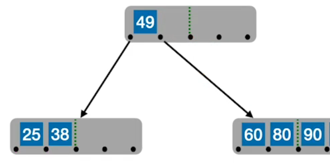

### [B Tree 多路平衡查找树](#)

**介绍**：搜索树数据结构、**自平衡**、 **子树高度相同** 的**n叉查找树**，顺序读和随机读的效率更高。

----

### [1. 概述](#)

一般化的二叉查找树（binary search tree），可以拥有多于2个子节点。与自平衡二叉查找树不同，B树为系统大块数据的读写操作做了优化。B树减少定位记录时所经历的中间过程，从而加快存取速度。B树这种数据结构可以用来描述外部存储。这种数据结构常被应用在数据库和文件系统的实现上。

* B/B+树也经常用做数据库的索引

> 就是大规模数据存储中，实现索引查询这样一个实际背景下，树节点存储的元素数量是有限的（如果元素数量非常多的话，查找就退化成节点内部的线性查找了），这样导致二叉查找树结构由于树的深度过大而造成磁盘I/O读写过于频繁，进而导致查询效率低下,那么如何减少树的深度（当然是不能减少查询的数据量），一个基本的想法就是：采用多叉树结构（由于树节点元素数量是有限的，自然该节点的子树数量也就是有限的）。
>
> 因为磁盘的操作费时费资源，如果过于频繁的多次查找势必效率低下。那么如何提高效率，即如何避免磁盘过于频繁的多次查找呢？根据磁盘查找存取的次数往往由树的高度所决定, 多路查找树。根据平衡二叉树的启发，自然就想到平衡多路查找树结构

#### 1.1 基本概念

B树，又称多路平衡查找树，B树中所有结点的孩子个数的最大值称为B树的阶，通常用m表示。一棵m阶B树或为空树，或为满足如下特性的m叉树:

B-树的阶是指树的所有结点中孩子结点个数的最大值，通常用m表示，从查找效率考虑，一般要求m>=3。一棵m阶B树或者是一棵空树，或者是满足以下条件的m叉树。

1. 每个结点最多有m个分支（子树）,最多存储m-1个关键字；
2. 而最少分支数要看是否为根结点，如果是根结点且不是叶子结点，则至少要有**两个分支**，非根非叶结点至少有 **ceil(m/2)个分支**，**ceil(m/2) - 1个关键字**这里ceil代表向上取整。
3. 如果一个结点有n-1个关键字，那么该结点有n个分支。这n-1个关键字按照递增顺序排列。
4. B-树是自平衡m叉查找树，但限制更强，要求所有叶结点都在同一层，即任一节点，子树在高度相同，**并且不带任何信息**，作为失败节点，但是其本质并不存在，是空指针。
5. B树的高度计算，不包括叶子节点！

 

m的大小取决于操作系统一个页能存储的关键字数量，例如MYSQL 是 16K 一页！

#### 1.2 特性

* 结点存储数据、叶子节点本质是空指针！
* B树查找数据可以在找到叶子节点之前就找到了！

#### 1.3 高度计算

含n个关键字的m阶B树，最小高度、最大高度是多少?

### 2. B树的操作

#### 2.1 B-树的查找操作

B-树的查找很简单，是二叉排序树的扩展，二叉排序树是二路查找，B-树是多路查找，因为B-树结点内的关键字是有序的，在结点内进行查找时**除了顺序查找**外，还可以**用折半查找**来提升效率。B-树的具体查找步骤如下（假设查找的关键字为key）：

* 先让key与根结点中的关键字比较，如果key等于k[i]（k[]为结点内的关键字数组），则查找成功
* 若key<k[1]，则到p[0]所指示的子树中进行继续查找（p[]为结点内的指针数组），这里要注意B-树中每个结点的内部结构。
* 若key>k[n]，则道p[n]所指示的子树中继续查找。
* 若k[i]<key<k[i+1]，则沿着指针p[I]所指示的子树继续查找。
* 如果最后遇到空指针，则证明查找不成功。

### 3. B树的插入

新元素一定是插入到最底层**终端节点**，所以可以用“查找”来确定插入位置。B-树结点的插入总是落在终端结点上。在插入过程中有可能破坏B-树的特征，如新关键字的插入使得结点中关键字的个数超过规定个数，这是要进行**结点的拆分**。

如下插入**90**这个元素：

插入完成后，插入并没有导致原节点关键字超过上限，不需要裂开！

在插入key后，若导致原结点关键字超过上限，则从中间位置 **ceil(m/2) **将其中的关键字分为两部分，左部分包含的关键字放在原节点中，右部分包含的关键字放在新节点中，中间位置 **ceil(m/2)**的节点插入原节点的父节点。

如果继续插入，继续裂开：

裂开：

**如果父节点也满了，就继续向上分裂**：

### 4. B树的删除

查看待删除节点和二插排序树节点的删除类似！

* 若被删除关键字在终端节点，则直接删除该关键字(要注意节点关键字个数是否低于下限 **ceil(m/2)-1** )。
* 如果删除关键在在非终端节点
  * 找直接前驱 or 直接后继来替代被删除的关键字 （想象二叉平衡树）

* 如果删除后导致不平衡，也就是 意节点关键字个数是低于下限 **ceil(m/2)-1** 
  * **兄弟够借**：如果兄弟节点可以借用一个，例如 删除38以后，接一个70
  * **兄弟不够借**：

### 总结

