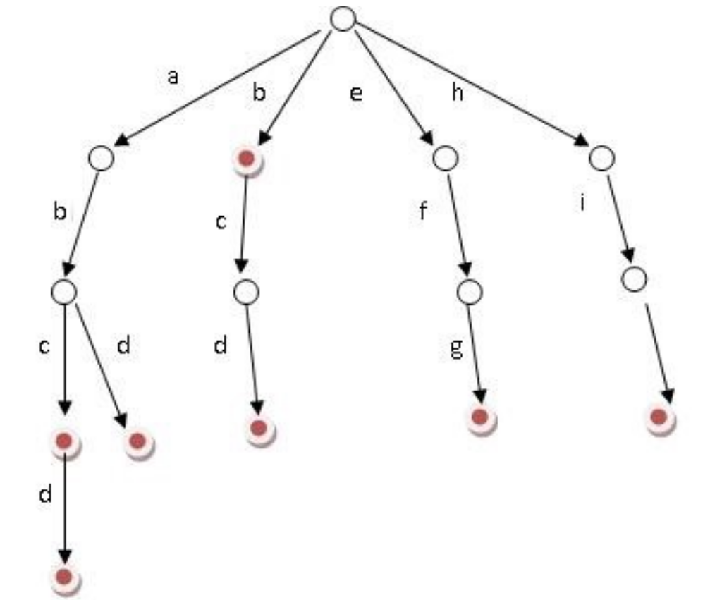

### [Trie 字典树](#)

**介绍**：Trie，又称字典树、单词查找树或键树，是一种树形结构，是一种哈希树的变种。典型应用是用于统计，排序和保存大量的字符串（但不仅限于字符串），所以经常被搜索引擎系统用于文本词频统计。它的优点是：利用字符串的公共前缀来减少查询时间，最大限度地减少无谓的字符串比较，查询效率比哈希树高。

-----


Trie的核心思想是空间换时间。利用字符串的公共前缀来降低查询时间的开销以达到提高效率的目的。

**前缀树的3个基本性质：**

1. 根节点不包含字符，除根节点外每一个节点都只包含一个字符。
2. 从根节点到某一节点，路径上经过的字符连接起来，为该节点对应的字符串。
3. 每个节点的所有子节点包含的字符都不相同。




#### 1. API

```cpp
template <typename V>
class TrieMap {
public:
    // 在 Map 中添加 key
    void put(string key, V val);

    // 删除键 key 以及对应的值
    void remove(string key);

    // 搜索 key 对应的值，不存在则返回 null
    // get("the") -> 4
    // get("tha") -> null
    V get(string key);

    // 判断 key 是否存在在 Map 中
    // containsKey("tea") -> false
    // containsKey("team") -> true
    bool containsKey(string key);

    // 在 Map 的所有键中搜索 query 的最短前缀
    // shortestPrefixOf("themxyz") -> "the"
    string shortestPrefixOf(string query);

    // 在 Map 的所有键中搜索 query 的最长前缀
    // longestPrefixOf("themxyz") -> "them"
    string longestPrefixOf(string query);

    // 搜索所有前缀为 prefix 的键
    // keysWithPrefix("th") -> ["that", "the", "them"]
    vector<string> keysWithPrefix(string prefix);

    // 判断是和否存在前缀为 prefix 的键
    // hasKeyWithPrefix("tha") -> true
    // hasKeyWithPrefix("apple") -> false
    bool hasKeyWithPrefix(string prefix);

    // 通配符 . 匹配任意字符，搜索所有匹配的键
    // keysWithPattern("t.a.") -> ["team", "that"]
    vector<string> keysWithPattern(string pattern);

    // 通配符 . 匹配任意字符，判断是否存在匹配的键
    // hasKeyWithPattern(".ip") -> true
    // hasKeyWithPattern(".i") -> false
    bool hasKeyWithPattern(string pattern);

    // 返回 Map 中键值对的数量
    int size();
};
```

