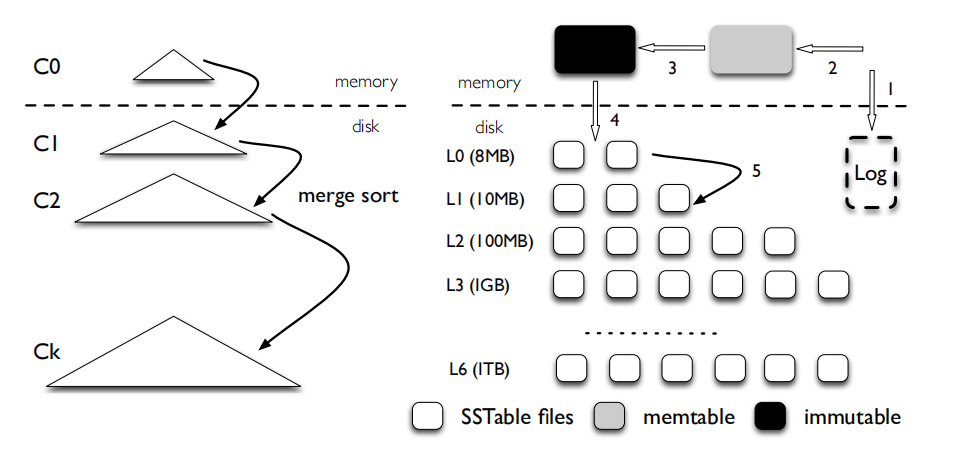
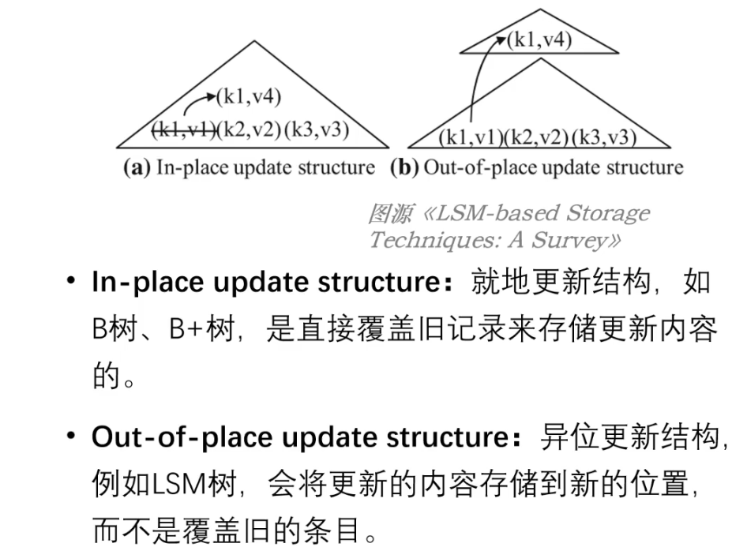

## [LSM树(Log-Structured-Merge-Tree)](#)

**介绍**：常用于KV存储引擎，

#### 参考：

- LSM树详解 [**https://zhuanlan.zhihu.com/p/181498475**](https://zhuanlan.zhihu.com/p/181498475)
- wiscKey论文精读 [**https://hardcore.feishu.cn/docs/doccnxbpzJQ5KJulm5YtGPULRxc#**](https://hardcore.feishu.cn/docs/doccnxbpzJQ5KJulm5YtGPULRxc#)