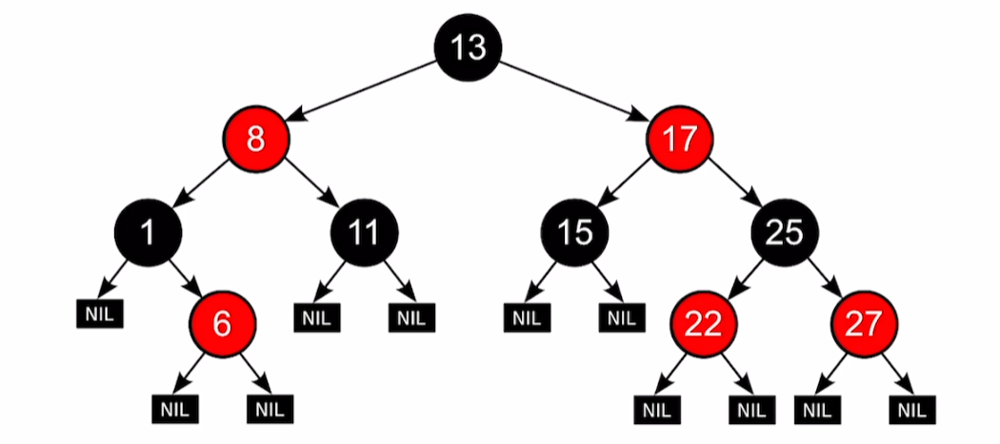
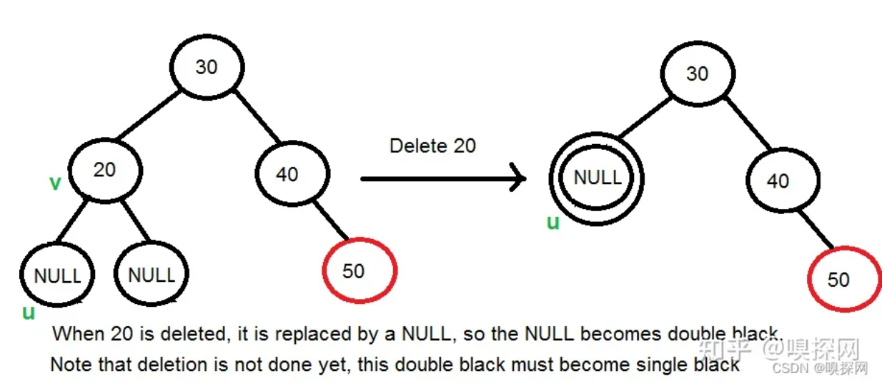
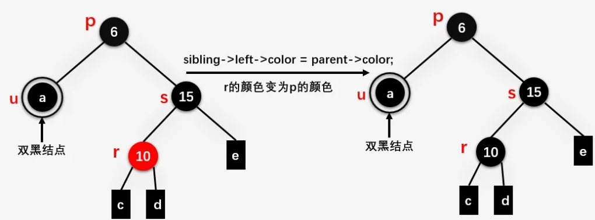

###  [红黑树（*Red Black Tree*）-- 自平衡二叉查找树](3)

**介绍**： AVL树的平衡状态在节点插入和删除的时候可能会被破坏，为了让它重新维持在一个平衡状态，就需要对其进行旋转处理，在频繁进行插入/删除的场景中，频繁的旋转操作使得AVL的性能大打折扣。

动画网站：[https://www.cs.usfca.edu/~galles/visualization/RedBlack.html](https://www.cs.usfca.edu/~galles/visualization/RedBlack.html)

口诀：

* **排序树、根叶黑、不红红、黑路同**
* **插入调整看叔叔**
* **删除调整看兄弟**

#### 一、红黑树简介

红黑树是一种自平衡的二叉排序树，是一种高效的排序树，它可在**O(logN)** 时间内完成查找、增加、删除等操作。**黑树通过牺牲严格的平衡，换取插入/删除时少量的旋转操作，整体性能优于AVL。**

* 红黑树插入时的不平衡，不超过两次旋转就可以解决；
* 删除时的不平衡，不超过三次旋转就能解决
* 红黑树的红黑规则，保证最坏的情况下， 也能如下时间内完成查找操作。

$$
\log _{2}^{\,\,N}
$$

**使用场景：**

* 红黑树适用于频繁插入、删除场景。
* 平衡二叉树适用于查找为主，少量频繁插入、删除场景。
* 红黑树整体性能略优于AVL树。

[参考资料 01](https://blog.csdn.net/zhengguofeng0328/article/details/121408364) 、[参考资料 02](https://zhuanlan.zhihu.com/p/145006031)。

#### [1.1 红黑规则与性质](#)

**红黑树是一种接近平衡的二叉树**（说它是接近平衡因为它并没有像AVL树的平衡因子的概念，它只是靠着满足红黑节点的5条性质来维持一种接近平衡的结构，进而提升整体的性能，并没有严格的卡定某个平衡因子来维持绝对平衡）。

1. **节点**不是黑色，就是红色（**非黑即红**）
2. **根**节点为**黑色**
3. **叶**节点为**黑色**（叶节点是指末梢的**空节点 `Nil`或`Null`**）
4. 从根节点到叶子节点的所有路径上不能有 2 个连续的红色节点
   1. 红色节点的子节点都是黑色、红色节点的父节点都是黑色
5. 从任一节点到其下方叶子节点的所有路径都包含相同数目的黑色节点 

```cpp
template<typename T>
struct RBTreeNode{
    T key;//关键字
    RBTreeNode *parent; //父节点指针
    RBTreeNode *left; //左孩子
    RBTreeNode *right; //右孩子
    int color ; //节点颜色 0/1 黑/红 也可以使用枚举
};
```



NIL节点是查找失败节点。

**排序树、根叶黑、不红红、黑路同**


[**黑高**](#) ：从某个节点出发（不含该节点）到达任一空叶节点的路径上黑节点的个数。

* 13 到 5(6的左孩子) 为 2
* 17 到 27的左孩子  为 2
* 13 到 27的左孩子 为 3

[**性质**](#) 

* **约束4和5，保证了红黑树的大致平衡：根到叶子的所有路径中，最长路径不会超过最短路径的2倍**。
  * 解释：因为从根到也经过的黑节点个数相同、因为**不红红**，所以有红必然上下为黑，多红就多黑，最长路径只可能是红黑相间，最短路径只能是只有黑。

* 有n个内部节点的红黑树高度满足如下条件

$$
h\leqslant 2\log _2\left( n+1 \right)
$$

* 左子树和右子树的黑节点的层数是相等的。因此我们称红黑树的这种平衡为**黑色完美平衡**。
* **如果一个节点存在黑子节点，那么该节点肯定有两个子节点**。如果一个节点只有一个子节点，那么其一定是黑色，子节点一定为红色。
* 任意节点到每个叶子节点的路径都有相同的黑节点个数。
* [红黑树左右子树高度差不会超过两倍！](#)

#### 1.3 红黑树的应用

- Java中，TreeMap、TreeSet都使用红黑树作为底层数据结构
- JDK 1.8开始，HashMap也引入了红黑树：当冲突的链表长度超过8时，自动转为红黑树
- Linux底层的CFS进程调度算法中，vruntime使用红黑树进行存储。
- **多路复用技术的Epoll，其核心结构是红黑树 + 双向链表**。

### 二、查找和插入操作

#### 2.1 红黑树的查找

红黑树的查找和二叉排序树的查找是一样的，可在**O(logN)** 时间内完成查找。


#### 2.2 红黑树的插入

[**对于非根节点的“插入”只需要关注是否引发“不红红”，而其他三个原则是一定不被破坏的**](#)。

* 先查找，确定插入的位置，插入新节点
  * 如果是根节点，直接染为黑色
  * 如果是非根节点，默认染成红色


插入人`0005`如下情况：

先进行右旋，然后将父爷节点染色(红变黑、黑变红)。


将叔父爷染色(红变黑、黑变红)，将爷变成新节点来处理。


### 三、 红黑树的删除

红黑树中删除指定节点的处理方式和**删除排序二叉树中的指定节点的操作大体是一样的**，只不过红黑树相比二叉排序树多了一些关于颜色上的操作而且在删除完之后我们需要对颜色进行调整来使得删除后的红黑树重新满足红黑树的五条性质。


红黑树中插入一个结点最容易出现两个连续的红色结点，违背红黑树的性质3（红黑树中不存在两个相邻的红色结点）。

红黑树删除操作，**最容易造成子树黑高（Black Height）的变化（删除黑色结点可能导致根结点到叶结点黑色结点的数目减少，即黑高降低）**


**删除操作总体上分为三步**，首先我们假定要 **删除的结点为 v** ，**u 是用来替换 v 的孩子结点**（注意，当 v 是叶结点时， u 是 NULL结点，且NULL结点我们还是当做黑色结点处理）。

1. 执行标准的 BST 的删除操作
2. 简单情况：v 或者 u 是红色，不存在双方都是红色节点的情况。 **红+黑**、**黑+红**。
3. 复杂情况：v 和 u 都是黑色结点。 则称u为双黑节点， **黑+黑**。


（a）和（c）又分别包含 4 种和 2 种情况需要处理。


概念：当删除结点 v 是黑色结点，且其被其黑色子节点替换时，其子结点就被标记为 **双黑**。


#### 3.1  执行标准的BST删除操作

[**先要查找到待删除节点的位置, 然后再进行删除，定义 current 为待删除的元素, 定义 parent 为待删除元素的父节点。**](https://gitee.com/cicer/moon/blob/master/skeleton/contents/Tree/BinaryTree/cpp/sortTree.md#)

删除步骤需要分成以下几种情况:

- **被删除结点为叶子结点**，叶子节点直接删除
- 被删除结点D仅有一个孩子
  - 要删除的节点没有左子树
  - 要删除的节点没有右子树
- 要删除的节点左右子树均存在

在标准的 BST 删除操作中，我们最终都会以删除一个叶子结点或者只有一个孩子的结点而结束（对于内部节点，就是要删除结点左右孩子都存在的情况，最终都会退化到删除结点是叶子结点或者是只有一个孩子的情况）。


#### 删除 2. 简单情况：u 或者 v 是红色

首先看 [**2. 简单情况：u 或者 v 是红色**](#)。 **如果 u 或者 v 是红色**，我们将替换结点 v 的结点 u 标记为黑色结点（这样黑高就不会变化）。注意这里是 u 或者 v 是红色结点，因为在一棵红黑树中，是不允许有两个相邻的红色结点的，**而结点 v 是结点 u 的父结点，因此只能是 u 或者 v 是红色结点**。

* 替换节点u是红色的
  * 将 u **标记为黑色结点**（这样黑高就不会变化），v删除


* 被删除节点是红色节点， 删除结点 **v** 为红色结点 **20** ，替换结点 **v** 的结点 **u** 为黑色NULL结点 **h** 的情况
  * 替换，然后标记为黑色结点


#### [**删除  3. 复杂情况：u 和 v 都是黑色结点**](#),

当 u 和 v 都是黑色结点时，分为三种情况进行处理：


#### 删除 3.1 结点 u 是双黑结点

将 u 标记为双黑。现在我们的任务减少到将这个双黑转换为单黑。

> 概念：当删除结点 v 是黑色结点，且其被其黑色子节点替换时，其子结点就被标记为 **双黑**。

请注意，如果 v 是叶子，那么 u 是 NULL，并且 NULL 的颜色被认为是黑色。所以删除黑叶也会导致双黑。




#### 删除 3.2 当前结点 u 是双黑结点且不是根结点

当前结点 **u** 是双黑结点且不是根结点，又包含三种情况进行处理。说先我们约定结点 **u** 的兄弟结点为 **s** .


#### 删除 3.2 a 在当前节点 u 为双黑且不是根节点时，令该节点的兄弟节点为s。

如果兄弟节点**s是黑色**并且<span style="color:red" >**s的子节点至少一个是红色**</span>，则执行**旋转**。让 s 的红色子节点成为 **r**。**根据 s 和 r 的位置**，这种情况可以分为**四个子情况**（LL、LR、RR、RL）。

#### 删除 3.2 a LL 左左

s是u的兄弟，s 是其父 p 的左子，r 是 s 的左子，或者 s 的两个子节点都是红色的。


删除结点 **25** ，用结点 **25** 的NULL结点 **a** 替换结点 **25** ，产生一个双黑结点 **u** ，双黑结点 **u** 的兄弟结点 **s** 为 **15** ，结点 **s** 是其父结点 **20（p）** 的左孩子，其左孩子 **18（r）** 正好是红色结点。即为 **LL** 情况。


**s 的左孩子 r 颜色设置为 s 的颜色，s 的颜色设置为父结点 p 的颜色：**


**右旋结点20(p):**


将结点 p的颜色设置为黑色，双黑结点变为单黑结点：


#### 删除 3.2 a LR 左右

**LR（s 是 p 的左孩子，r 是 s 的右孩子，或者 s 的两个孩子都是红色结点）：**

删除结点 **25** ，不过结点 **25** 的兄弟结点 **15** 只有一个右孩子 **18** ；


**将结点 r 的颜色设置为 p 的颜色**


**左旋结点15（s）**


**右旋结点20（p），p的颜色设置为黑色，双黑变单黑**


#### 删除 3.2 a RR 右右

**RR（s 是 p 的右孩子，r 是 s 的右孩子，或者 s 的两个孩子都是红色结点）：**

删除结点 **2** ，用结点 **2** 的NULL结点 **a** 替换结点 **2** ，产生一个双黑结点 **u** ，双黑结点 **u** 的兄弟结点 **s** 为 **15** ，结点 **s** 是其父结点 **6（p）** 的右孩子，其右孩子 **18（r）** 正好是红色结点。即为 **RR** 情况（仔细观察其实和 **LL** 情况是对称的）。


**r的颜色变为s的颜色，s的颜色变为p的颜色**


**左旋p，p的颜色设置为黑色，双黑变单黑**


#### 删除 3.2 a RL 右左 

s 是 p 的右孩子，r 是 s 的左孩子，或者 s 的两个孩子都是红色结点），该情况与 **LR情况是对称的**。


**结点 r 的颜色变为 p 的颜色**



**右旋结点15（s）**


**左旋结点6（p），p的颜色设置为黑色，双黑变单黑**


#### 删除 3.2 b -  u 的兄弟结点 s 是黑色且 s 的两个孩子结点都是黑色

对于这种情况需要递归地进行处理，如果删除结点后得到的双黑结点的父结点此时为黑色，则结点 **u** 变单黑，且结点 **u** 的父结点 **p** 变双黑，然后对结点 **u** 的父结点 **p** 继续进行处理，直到当前处理的双黑结点的父结点为红色结点，此时将双黑结点的父结点设置为黑色，双黑结点变为单黑结点（红色 + 双黑 = 单黑）。

[**父节点为黑节点**](#)

假设以 **10** 为根结点的子树为整棵树的左子树，删除结点 **9** ，产生双黑结点 **c** 且其兄弟结点 **12（s）** 为黑色，兄弟结点的左右孩子均为黑色。


此时双黑结点的兄弟结点 **12** 变为红色结点，然后将 **u** 的父结点 **10** 变为双黑结点，一直向上判断，将u作为双黑节点递归运行调整函数(调整函数是在删除操作完成之后才运行的)。


至于这一过程何时结束，我们再看下面一个例子。


[**父节点为红节点**](#)

删除下图中的结点 **12** ，得到一个双黑结点 **u** ，双黑结点的兄弟结点 **31** 及兄弟结点的孩子结点均为黑色，且双黑结点的父结点 **19** 为红色结点，刚好是不再继续向上判断的情况。


此时只需要将结点 **u** 的兄弟结点 **31** 的颜色变为红色，双黑结点 **u** 的父结点 **19** 由红色变为黑色结点，双黑结点 **u** 变为单黑结点。


#### 删除 3.2 c - u 的兄弟结点 s 是红色结点

当前 u 的兄弟结点 s 是红色结点时，通过旋转操作将 u 当前的兄弟结点向上移动，并对 u 的父结点和其旋转前的兄弟结点重新着色，接着继续对结点 u 旋转后的兄弟结点 s 进行判断，确定相应的平衡操作。旋转操作将 u 的兄弟结点情况又会转换为前面刚提到的3.2（a）和（b）的情况。

* 根据兄弟结点 s 是父结点 p 的左右孩子又分为两种情况。

[**情况1：**](#) **u 的兄弟结点 s 是父结点 p 的左孩子 ,对结点 p 进行右旋操作：**


删除结点 **18** ，产生一个双黑结点 **u** ，且 **u** 的兄弟结点 **s** 是红色，兄弟结点 **s** 是其父结点的左孩子，接着就是对其父结点 **15** 进行右旋操作。


对结点 **15** 进行右旋操作，并且对旋转前的 **p** 和 **s** 进行重新着色后，继续对双黑结点旋转后的兄弟结点进行判断，发现此时正好和3.2（b）的情况是一样，进行相应处理，如下图所示。


[**情况2：**](#) **u 的兄弟结点 s 是父结点 p 的左孩子 ,对结点 p 进行左旋操作（这种情况与上面的是对称的）：**


删除结点 **6** ，产生一个双黑结点 **u** ，且 **u** 的兄弟结点 **s** 为黑色，**s** 是父结点 **p** 的右孩子，左旋P


对双黑结点 **u** 旋转后的兄弟结点继续判断：


#### 删除 3.3 当前结点 u 是双黑结点且是根结点

当前结点 **u** 是双黑结点且是根结点时，直接将双黑结点变为单黑结点，整颗红黑树的黑高减 1.
