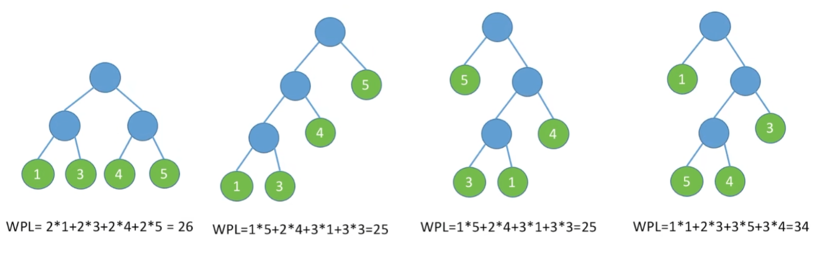
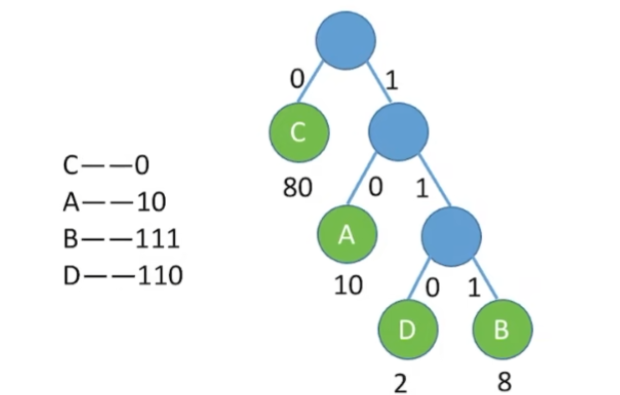

### [哈弗曼树](#)

**介绍**：又叫**最优二叉树**，给定 n 个权值作为 n 个叶子节点，构造一棵二叉树，若该树的带权路径长度（Weighted Path Length of Tree）达到最小， 称这样的二叉树为最优二叉树，也称为哈夫曼树（Huffman Tree）。

#### [1. 带权路径长度（Weighted Path Length of Tree）](#)

**结点的带权路径长度**为：从根结点到该结点之间的路径长度与该结点的权的乘积，树的带权路径长度规定为所有叶子结点的带权路径长度之和。

* 权值越大的结点离根结点越近的二叉树才是最优二叉树。

#### [2. 哈夫曼树的创建思路](#)

* 从小到大进行排序, 将每一个数据，每个数据都是一个节点 ， 每个节点可以看成是一颗最简单的二叉树
* 取出根节点权值最小的两颗二叉树
* 组成一颗新的二叉树, 该新的二叉树的根节点的权值是前面两颗二叉树根节点权值的和
* 再将这颗新的二叉树，以根节点的权值大小 再次排序， 不断重复 1-2-3-4 的步骤，直到数列中，所有的数据都被处理，就得到一颗赫夫曼树

特性：

* **每个初始节点都是叶节点**

* **n 个值创建的哈夫曼树有2n-1个节点**
* **不存在度为1的节点**
* **哈夫曼树不唯一**

### [3. 应用：哈弗曼编码](#)

找出存放一串字符所需的最少的二进制编码， 首先统计出每种字符出现的频率！

利用频率和字符标识一个字符，创建哈夫曼树。

然后左子树为0，右子树为1。路径就是编码。

**出现得越多**的字母，他的***\*编码越短\**** ，出现**频率越少**的字母，他的**编码越长**， **且保证长编码的不与短编码的字母冲突。**

