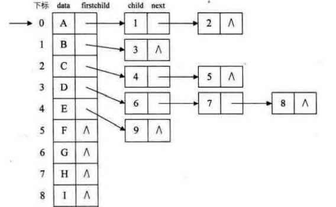
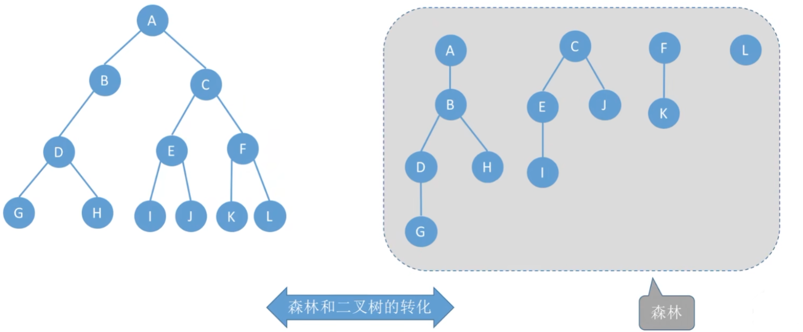
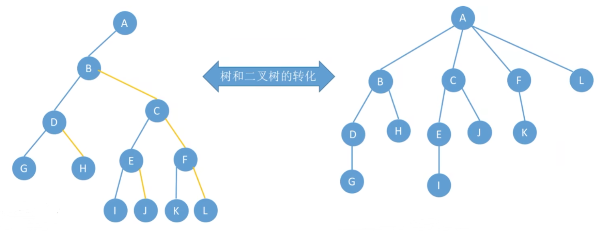

### [1. 双亲表示法](#)

我们假设以一组连续空间存储树的结点，同时**在每个结点中，附设一个指示器指示其双亲结点到链表中的位置**。也就是说，每个结点除了知道自已是谁以外，还知道它的双亲在哪里。

```cpp
/* 萌萌 */
template<typename T>
struct TreeNode{
    T data{};  //数据域
    struct TreeNode *parent; //father
    TreeNode():parent(nullptr){};
    explicit TreeNode(const T& val): data(val), parent(nullptr){};
    TreeNode(const T& val, TreeNode* p): data(val), parent(p){};
};
```

使用例子：

```cpp
TreeNode<double> tree(997.12);

TreeNode<double> left(15.12, &tree);
TreeNode<double> middle(275.12, &tree);
TreeNode<double> right(18.72, &tree);

TreeNode<double> leftSon(95.15,  &left);
TreeNode<double> rightSon(115.47, &right);
```

* 我们可以根据结点的parent 指针很容易找到它的双亲结点，所用的时间复杂度为0(1)。
* **缺点**： 如果我们要知道结点的孩子是什么，需要遍历整个结构才行。

### [2. 孩子表示法](#)

具体办法是，**把每个结点的孩子结点排列起来，以单链表作存储结构，则n个结点有n个孩子链表，如果是叶子结点则此单链表为空。然后n个头指针又组成-一个线性表，采用顺序存储结构，存放进一个一维数组中**，如图所示。




```cpp
/* 花花 */
template<typename T>
struct TreeNode{
    T data{};  //数据域
    std::list<TreeNode*> sonNodes;  //孩子节点指针列表
    TreeNode() = default;
    explicit TreeNode(const T& x) : data(x){ };
    TreeNode(const T& x, std::initializer_list<TreeNode*> sons):  data(x),sonNodes(sons) { };
};
```

使用例子：

```cpp
TreeNode<double> node01(15.12);
TreeNode<double> node02(18.72);
TreeNode<double> node03(95.15);
TreeNode<double> node04(115.47);

TreeNode<double> tree(994.48 ,{ &node01, &node02, &node03, &node04 });
```


### [3. 孩子兄弟表示法](#)

**任意一棵树， 它的结点的第一个孩子如果存在就是唯一的，它的右兄弟如果存在也是唯一的。 因此，我们设置两个指针，分别指向该结点的第一个孩子和此结点的右兄弟**。

```cpp
/* 萌兰 */
template<typename T>
struct TreeNode{
    T data;  //数据域
    struct TreeNode *firstChild; //嫡子
    struct TreeNode *nextSibling; //兄弟
    TreeNode():firstChild(nullptr), nextSibling(nullptr){};
    explicit TreeNode(const T& x) : data(x), firstChild(nullptr), nextSibling(nullptr)  { };
    TreeNode(T& x, TreeNode *first, TreeNode *next) :  T(x),firstChild(first), nextSibling(next) { };
};
```

使用例子：

```cpp
TreeNode<double> head(75.85);
head.firstChild = new TreeNode<double>(14.50);
head.nextSibling = new TreeNode<double>(19.82);

free(head.firstChild);
head.firstChild = nullptr;
free(head.nextSibling);
head.nextSibling = nullptr;
```


### [4. 森林转二叉树](#)




### [5. 二叉树转树](#)


